# Component Architecture

<cite>
**Referenced Files in This Document**   
- [PropertyCard.tsx](file://src/react-app/components/PropertyCard.tsx)
- [BookingModal.tsx](file://src/react-app/components/BookingModal.tsx)
- [PaymentModal.tsx](file://src/react-app/components/PaymentModal.tsx)
- [ReviewModal.tsx](file://src/react-app/components/ReviewModal.tsx)
- [ChatBot.tsx](file://src/react-app/components/ChatBot.tsx)
- [Navbar.tsx](file://src/react-app/components/Navbar.tsx)
- [Footer.tsx](file://src/react-app/components/Footer.tsx)
- [types.ts](file://src/shared/types.ts)
- [ChatContext.tsx](file://src/react-app/contexts/ChatContext.tsx)
- [ErrorBoundary.tsx](file://src/react-app/components/ErrorBoundary.tsx) - *Added in recent commit*
- [LoadingStates.tsx](file://src/react-app/components/LoadingStates.tsx) - *Added in recent commit*
</cite>

## Update Summary
**Changes Made**   
- Added new section on ErrorBoundary component and its implementation
- Added new section on LoadingStates component suite and usage patterns
- Updated introduction to reflect new global error and loading state patterns
- Enhanced accessibility and responsive design section with new loading state considerations
- Updated component composition section to include ErrorBoundary wrapping pattern
- Added references to new files in document sources and relevant sections

## Table of Contents
1. [Introduction](#introduction)
2. [Core Components Overview](#core-components-overview)
3. [PropertyCard Component](#propertycard-component)
4. [BookingModal Component](#bookingmodal-component)
5. [PaymentModal Component](#paymentmodal-component)
6. [ReviewModal Component](#reviewmodal-component)
7. [ChatBot Component](#chatbot-component)
8. [Layout Components](#layout-components)
9. [Component Composition and Integration](#component-composition-and-integration)
10. [ErrorBoundary Component](#errorboundary-component)
11. [LoadingStates Component Suite](#loadingstates-component-suite)
12. [Accessibility and Responsive Design](#accessibility-and-responsive-design)
13. [Best Practices and Extension Guidelines](#best-practices-and-extension-guidelines)

## Introduction
This document provides a comprehensive analysis of the reusable UI component architecture in HabibiStay's frontend application. The system is built using React with TypeScript, leveraging functional components and React hooks for state management. The component architecture follows a modular design pattern, with clearly defined responsibilities and reusable patterns across the application. This documentation covers the design principles, implementation details, and integration patterns of key components that form the foundation of the user interface. Recent updates have introduced global ErrorBoundary and comprehensive LoadingStates components that establish new patterns for error handling and UX feedback across the application.

## Core Components Overview
The HabibiStay frontend architecture is centered around a collection of reusable, self-contained components that handle specific UI patterns and user interactions. These components are designed with TypeScript interfaces to ensure type safety and are styled using Tailwind CSS for responsive design. The architecture follows React best practices with proper separation of concerns, state management through hooks, and clear prop interfaces.

The core components can be categorized into:
- **PropertyCard**: Displays property listings with multiple variants
- **BookingModal**: Manages the reservation flow with multi-step process
- **PaymentModal**: Handles transaction initiation and payment processing
- **ReviewModal**: Collects guest feedback and ratings
- **ChatBot**: Provides AI-powered interaction and assistance
- **Navbar and Footer**: Layout components for consistent site navigation
- **ErrorBoundary**: Global error handling component
- **LoadingStates**: Suite of components for various loading scenarios

These components work together to create a cohesive user experience while maintaining independence and reusability.

## PropertyCard Component

### Design and Implementation
The PropertyCard component serves as the primary interface for displaying property listings throughout the application. It is a versatile component that supports multiple display variants through the `variant` prop, allowing for different use cases and contexts.

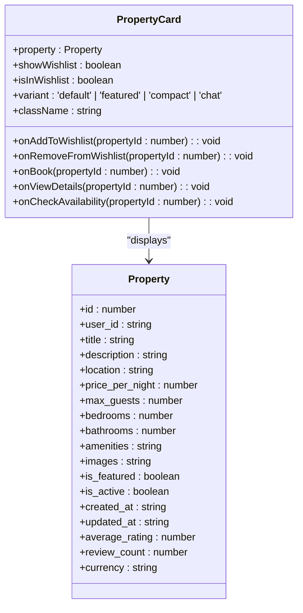

**Diagram sources**
- [PropertyCard.tsx](file://src/react-app/components/PropertyCard.tsx#L0-L425)
- [types.ts](file://src/shared/types.ts#L0-L50)

**Section sources**
- [PropertyCard.tsx](file://src/react-app/components/PropertyCard.tsx#L0-L425)
- [types.ts](file://src/shared/types.ts#L0-L50)

### Props and Configuration
The PropertyCard component accepts several props that define its behavior and appearance:

**PropertyCardProps**
- `property`: The property data object containing all relevant information
- `showWishlist`: Controls visibility of the wishlist button (default: true)
- `isInWishlist`: Indicates if the property is currently in the user's wishlist
- `onAddToWishlist`: Callback function triggered when adding to wishlist
- `onRemoveFromWishlist`: Callback function triggered when removing from wishlist
- `onBook`: Callback function for booking initiation
- `onViewDetails`: Callback function for viewing property details
- `onCheckAvailability`: Optional callback for checking availability
- `variant`: Display variant ('default', 'featured', 'compact', 'chat')
- `className`: Additional CSS classes for styling

### Variants and Usage Patterns
The component supports four distinct variants through exported wrapper components:

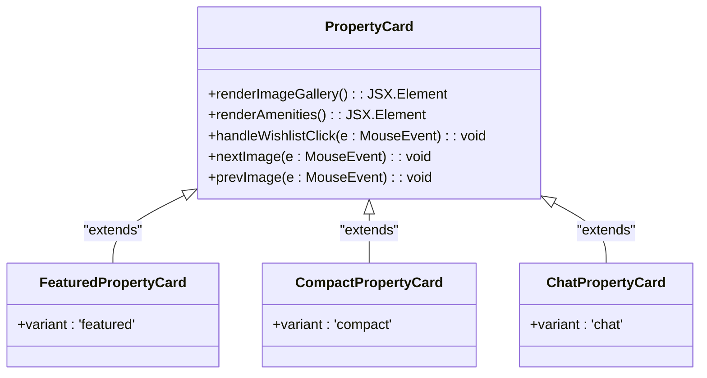

**Diagram sources**
- [PropertyCard.tsx](file://src/react-app/components/PropertyCard.tsx#L385-L425)

The variants serve different purposes:
- **Default**: Standard property listing card used in search results
- **Featured**: Enhanced version with additional contact information for premium properties
- **Compact**: Simplified version for space-constrained layouts
- **Chat**: Optimized for display within the AI chat interface with minimal actions

### Key Features
1. **Image Gallery**: Supports multiple images with navigation controls and indicators
2. **Amenity Display**: Maps amenity strings to icons with fallback text display
3. **Wishlist Integration**: Interactive heart button for managing favorites
4. **Responsive Design**: Adapts layout and content based on variant
5. **Event Handling**: Proper event propagation control with `stopPropagation()`

The component uses React hooks (`useState`, `useMemo`) for managing internal state and optimizing performance. The `useMemo` hook is particularly important for parsing JSON strings from the property data into arrays for images and amenities.

## BookingModal Component

### Workflow and State Management
The BookingModal component implements a multi-step booking process that guides users through reservation creation. It manages complex state transitions between different steps of the booking flow.

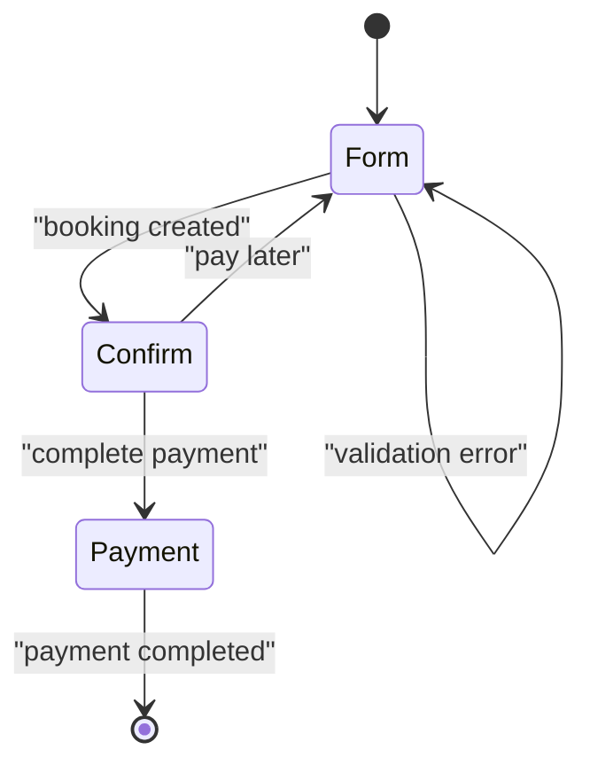

**Diagram sources**
- [BookingModal.tsx](file://src/react-app/components/BookingModal.tsx#L0-L473)

**Section sources**
- [BookingModal.tsx](file://src/react-app/components/BookingModal.tsx#L0-L473)

### Component Structure
The BookingModal is a controlled component that displays different content based on the current step in the booking process:

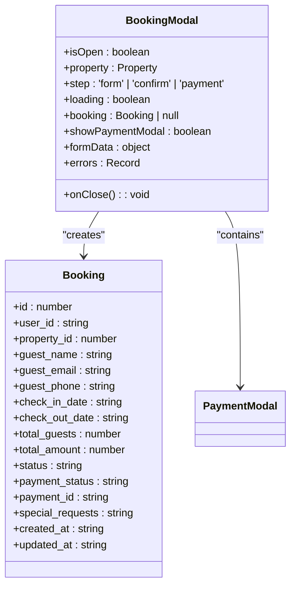

**Diagram sources**
- [BookingModal.tsx](file://src/react-app/components/BookingModal.tsx#L0-L473)
- [types.ts](file://src/shared/types.ts#L50-L100)

### Booking Process Flow
The component implements a three-step process:

1. **Form Step**: Collects guest information and booking details
2. **Confirmation Step**: Displays booking summary and confirmation
3. **Payment Step**: Integrates with PaymentModal for transaction processing

The state transitions are managed through the `step` state variable, which controls which content is displayed. The component also manages form validation, error handling, and API communication for booking creation.

### Key Implementation Details
- **Form Validation**: Comprehensive client-side validation for all required fields
- **Date Validation**: Ensures check-in is not in the past and check-out is after check-in
- **Guest Limit**: Validates guest count against property maximum capacity
- **Price Calculation**: Dynamically calculates total amount with service fees and taxes
- **Error Handling**: Displays user-friendly error messages for validation and API errors

The component integrates with the ChatContext to provide an alternative booking flow through the AI assistant, demonstrating the flexibility of the component architecture.

## PaymentModal Component

### Payment Processing Workflow
The PaymentModal component handles the final step of the booking process by initiating payment transactions. It provides a clean interface for payment initiation with proper error handling and loading states.

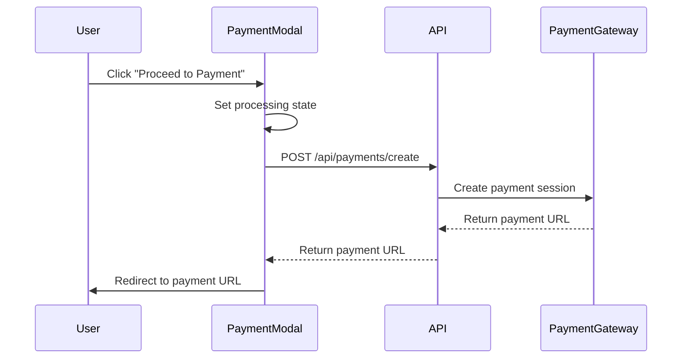

**Diagram sources**
- [PaymentModal.tsx](file://src/react-app/components/PaymentModal.tsx#L0-L166)

**Section sources**
- [PaymentModal.tsx](file://src/react-app/components/PaymentModal.tsx#L0-L166)

### Implementation and Integration
The PaymentModal component is designed to be simple yet robust, focusing on the core functionality of payment initiation:

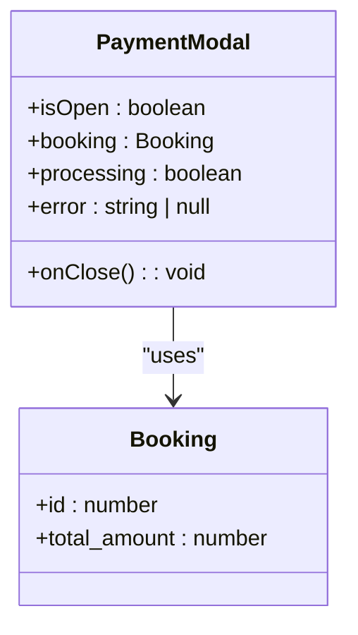

**Diagram sources**
- [PaymentModal.tsx](file://src/react-app/components/PaymentModal.tsx#L0-L166)
- [types.ts](file://src/shared/types.ts#L50-L100)

### Key Features
1. **Payment Initiation**: Sends booking details to the payment API
2. **Loading State**: Displays spinner during processing
3. **Error Handling**: Shows user-friendly error messages
4. **External Redirect**: Redirects to MyFatoorah payment page upon success
5. **Terms Agreement**: Includes links to Terms of Service and Privacy Policy

The component uses the `fetch` API to communicate with the backend payment service, creating a payment session and redirecting the user to the external payment gateway. This approach keeps sensitive payment information out of the client application while providing a seamless user experience.

## ReviewModal Component

### Feedback Collection Design
The ReviewModal component provides a structured interface for guests to submit feedback about their stay. It manages the review submission process with proper validation and error handling.

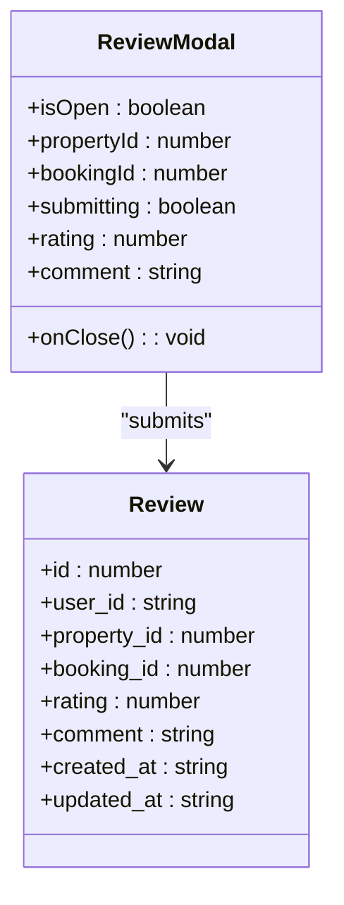

**Diagram sources**
- [ReviewModal.tsx](file://src/react-app/components/ReviewModal.tsx#L0-L185)
- [types.ts](file://src/shared/types.ts#L100-L150)

**Section sources**
- [ReviewModal.tsx](file://src/react-app/components/ReviewModal.tsx#L0-L185)
- [types.ts](file://src/shared/types.ts#L100-L150)

### Implementation Details
The component implements a simple form interface for collecting review data:

1. **Star Rating**: Interactive star rating system (1-5 stars)
2. **Comment Field**: Text area for detailed feedback
3. **Form Validation**: Ensures rating is provided before submission
4. **Loading State**: Shows spinner during submission
5. **Error Handling**: Displays submission errors to the user

The component integrates with the API to submit reviews and provides appropriate feedback to the user upon success or failure.

## ChatBot Component

### AI Interaction Architecture
The ChatBot component provides an AI-powered interface for users to interact with the HabibiStay platform through natural language. It integrates with the ChatContext to manage conversation state and AI responses.

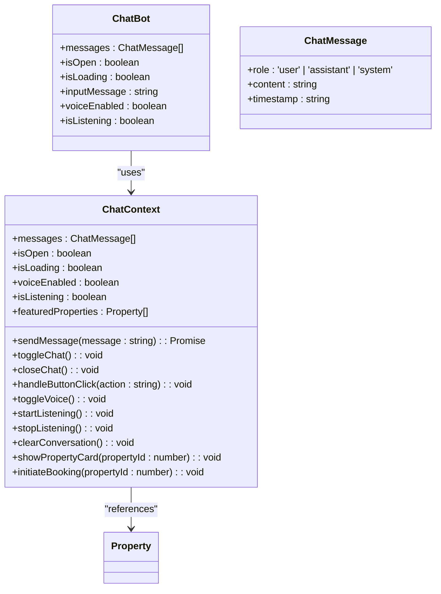

**Diagram sources**
- [ChatBot.tsx](file://src/react-app/components/ChatBot.tsx#L0-L282)
- [ChatContext.tsx](file://src/react-app/contexts/ChatContext.tsx#L0-L50)

**Section sources**
- [ChatBot.tsx](file://src/react-app/components/ChatBot.tsx#L0-L282)
- [ChatContext.tsx](file://src/react-app/contexts/ChatContext.tsx#L0-L50)

### Key Features
1. **Conversational Interface**: Real-time chat with AI assistant "Sara"
2. **Voice Support**: Speech recognition for voice input and text-to-speech for responses
3. **Quick Actions**: Predefined buttons for common tasks (browse properties, check availability, etc.)
4. **Property Integration**: Displays property cards within the chat interface
5. **Booking Initiation**: Can start the booking process directly from chat
6. **Featured Properties**: Shows recommended properties in the initial greeting

The component uses the Web Speech API for voice recognition and synthesis, providing an accessible interface for users who prefer voice interaction. It also implements proper keyboard navigation and ARIA labels for accessibility.

## Layout Components

### Navbar Component
The Navbar component provides consistent site navigation across all pages. It implements responsive design with a mobile-friendly hamburger menu.

```mermaid
classDiagram
class Navbar {
+isOpen : boolean
+navigation : Array<{name : string, href : string}>
+user : User | null
}
class User {
+id : string
+email : string
+google_user_data : object
}
Navbar --> User : "auth state"
```

**Diagram sources**
- [Navbar.tsx](file://src/react-app/components/Navbar.tsx#L0-L220)

**Section sources**
- [Navbar.tsx](file://src/react-app/components/Navbar.tsx#L0-L220)

Key features:
- **Responsive Design**: Desktop navigation and mobile hamburger menu
- **Authentication Integration**: Shows user avatar and login/logout options
- **Active State**: Highlights current page in navigation
- **Sticky Position**: Remains visible during scrolling

### Footer Component
The Footer component provides consistent site-wide information and navigation links.

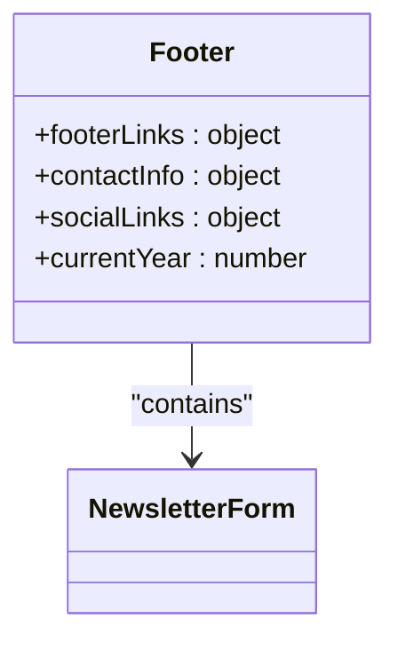

**Diagram sources**
- [Footer.tsx](file://src/react-app/components/Footer.tsx#L0-L282)

**Section sources**
- [Footer.tsx](file://src/react-app/components/Footer.tsx#L0-L282)

Key features:
- **Multi-column Layout**: Organized links for company, services, support, and legal
- **Contact Information**: Phone, email, and address
- **Social Media Links**: Icons for social platforms
- **Newsletter Subscription**: Form for email signup
- **Vision 2030 Badge**: Branding element supporting Saudi Arabia's national vision

## Component Composition and Integration

### Parent-Child Relationships
The components are designed to work together in a hierarchical structure, with parent components passing data and callbacks to child components:

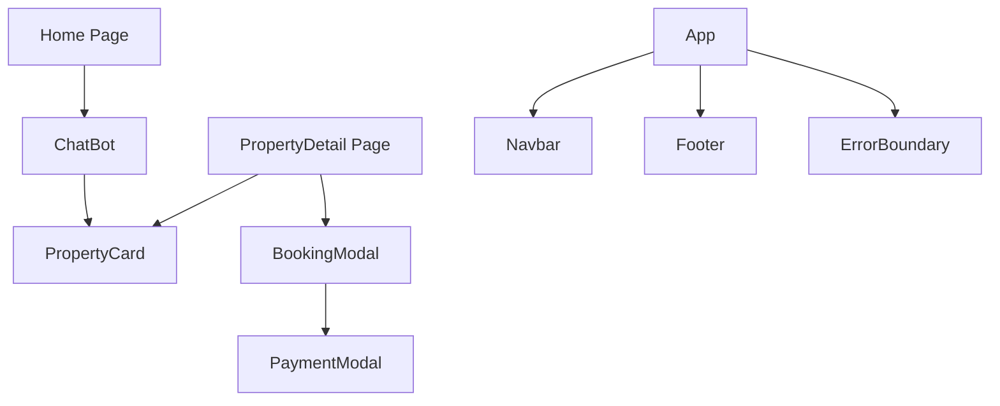

**Diagram sources**
- [PropertyCard.tsx](file://src/react-app/components/PropertyCard.tsx#L0-L425)
- [BookingModal.tsx](file://src/react-app/components/BookingModal.tsx#L0-L473)
- [PaymentModal.tsx](file://src/react-app/components/PaymentModal.tsx#L0-L166)
- [ChatBot.tsx](file://src/react-app/components/ChatBot.tsx#L0-L282)
- [Navbar.tsx](file://src/react-app/components/Navbar.tsx#L0-L220)
- [Footer.tsx](file://src/react-app/components/Footer.tsx#L0-L282)
- [ErrorBoundary.tsx](file://src/react-app/components/ErrorBoundary.tsx#L0-L146)

### Prop Drilling Patterns
The application uses prop drilling to pass data and callbacks through component hierarchies. Key patterns include:

1. **Callback Propagation**: Parent components pass callback functions to children
2. **State Lifting**: Child components trigger state changes in parents through callbacks
3. **Conditional Rendering**: Parent components control which children are rendered
4. **Data Transformation**: Parent components transform data before passing to children

### Event Handling Mechanisms
The components implement consistent event handling patterns:

1. **Event Propagation Control**: Using `stopPropagation()` to prevent unwanted event bubbling
2. **Form Submission**: Handling form submission with proper validation
3. **Click Handlers**: Managing user interactions with buttons and links
4. **Keyboard Events**: Supporting keyboard navigation and accessibility

## ErrorBoundary Component

### Global Error Handling Architecture
The ErrorBoundary component provides a robust error handling mechanism for the entire application, catching JavaScript errors anywhere in the component tree and displaying a fallback UI instead of crashing the app.

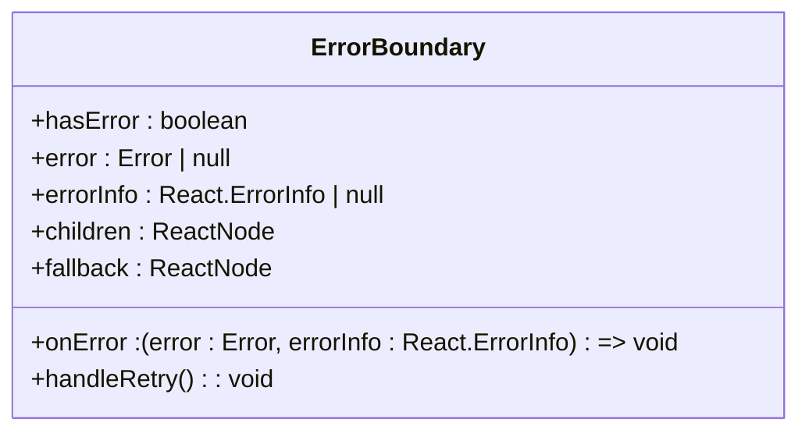

**Diagram sources**
- [ErrorBoundary.tsx](file://src/react-app/components/ErrorBoundary.tsx#L0-L146)

**Section sources**
- [ErrorBoundary.tsx](file://src/react-app/components/ErrorBoundary.tsx#L0-L146)
- [App.tsx](file://src/react-app/App.tsx#L26-L31)

### Implementation and Integration
The ErrorBoundary is implemented as a class component that wraps the entire application in App.tsx, providing global error protection:

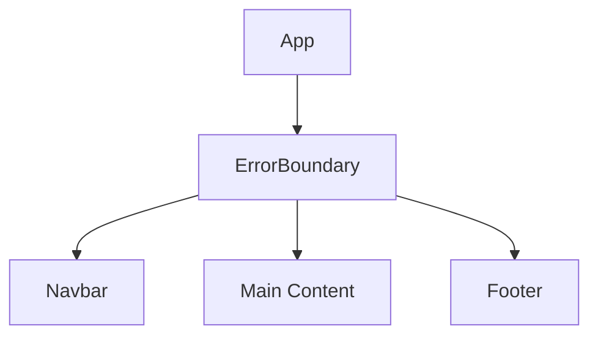

**Diagram sources**
- [App.tsx](file://src/react-app/App.tsx#L26-L31)
- [ErrorBoundary.tsx](file://src/react-app/components/ErrorBoundary.tsx#L0-L146)

### Key Features
1. **Error Isolation**: Prevents application crashes by containing errors within the boundary
2. **Fallback UI**: Displays user-friendly error message with retry options
3. **Development Details**: Shows error stack trace in development environment
4. **Error Logging**: Captures and logs error information for debugging
5. **Retry Mechanism**: Allows users to attempt recovery without reloading the page
6. **Custom Fallbacks**: Supports custom error UIs through the fallback prop

The component uses React's lifecycle methods `getDerivedStateFromError` and `componentDidCatch` to detect and handle errors. It provides both a default error UI and the ability to specify custom fallback content. The error boundary is strategically placed at the root level in App.tsx to catch errors from all child components.

## LoadingStates Component Suite

### Loading State Architecture
The LoadingStates component suite provides a comprehensive set of components for handling various loading scenarios throughout the application, ensuring consistent UX patterns for asynchronous operations.

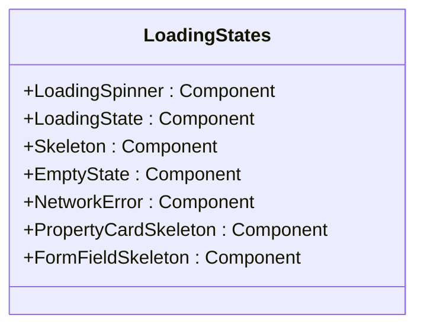

**Diagram sources**
- [LoadingStates.tsx](file://src/react-app/components/LoadingStates.tsx#L0-L325)

**Section sources**
- [LoadingStates.tsx](file://src/react-app/components/LoadingStates.tsx#L0-L325)
- [Dashboard.tsx](file://src/react-app/pages/Dashboard.tsx#L18)
- [PropertyDetail.tsx](file://src/react-app/pages/PropertyDetail.tsx#L27)
- [Stays.tsx](file://src/react-app/pages/Stays.tsx#L4)

### Component Types and Usage
The LoadingStates suite includes several specialized components for different scenarios:

1. **LoadingSpinner**: Animated spinner for indicating processing
2. **LoadingState**: Container components for different loading contexts (page, section, overlay, inline)
3. **Skeleton**: Content placeholders that mimic the final UI layout
4. **EmptyState**: UI for when data exists but no records are found
5. **NetworkError**: Specialized error state for connectivity issues
6. **PropertyCardSkeleton**: Pre-configured skeleton for property listings
7. **FormFieldSkeleton**: Pre-configured skeleton for form fields

### Implementation Details
The components are designed with flexibility and consistency in mind:

- **Type Safety**: All components use TypeScript interfaces for props
- **Theming**: Colors and sizes follow the application's design system
- **Accessibility**: Proper ARIA attributes and keyboard navigation
- **Responsive Design**: Adapts to different screen sizes
- **Performance**: Lightweight implementations with minimal re-renders

The components are widely used throughout the application, particularly in data-intensive pages like Dashboard, PropertyDetail, and Stays, where they provide immediate visual feedback during data fetching operations.

## Accessibility and Responsive Design

### Accessibility Considerations
The components implement several accessibility features:

1. **Semantic HTML**: Using appropriate HTML elements for content
2. **ARIA Labels**: Providing accessible names for interactive elements
3. **Keyboard Navigation**: Ensuring all functionality is accessible via keyboard
4. **Focus Management**: Proper focus handling for modals and interactive elements
5. **Color Contrast**: Ensuring sufficient contrast for text and interactive elements
6. **Screen Reader Support**: Proper landmarks and roles for navigation
7. **Error Announcements**: ARIA live regions for dynamic content updates

### Responsive Design Implementation
The components use Tailwind CSS for responsive design, implementing the following patterns:

1. **Mobile-First Approach**: Designing for mobile devices first, then enhancing for larger screens
2. **Flexible Layouts**: Using flexbox and grid for adaptable layouts
3. **Responsive Typography**: Adjusting font sizes based on screen size
4. **Breakpoint-Specific Styling**: Applying different styles at different breakpoints
5. **Touch-Friendly Targets**: Ensuring interactive elements are large enough for touch
6. **Adaptive Loading States**: Different loading patterns for different device capabilities
7. **Network-Aware Components**: Optimized behavior based on connection quality

The design system uses consistent spacing, typography, and color schemes across all components to maintain visual harmony and brand identity. The new LoadingStates components enhance the responsive experience by providing appropriate feedback patterns for different network conditions and device capabilities.

## Best Practices and Extension Guidelines

### Component Extension Patterns
When extending or customizing components, follow these best practices:

1. **Preserve Core Functionality**: Ensure existing features continue to work
2. **Use Composition**: Wrap components rather than modifying them directly
3. **Maintain Type Safety**: Use TypeScript interfaces for new props
4. **Follow Naming Conventions**: Use consistent naming patterns
5. **Document Changes**: Add comments for complex logic or non-obvious decisions

### Customization Guidelines
To maintain consistency across the application:

1. **Use Existing Variants**: Leverage the variant system before creating new components
2. **Extend with Props**: Add new functionality through props rather than hardcoding
3. **Follow Design System**: Adhere to established color, typography, and spacing guidelines
4. **Test Responsiveness**: Ensure new features work across all device sizes
5. **Consider Accessibility**: Ensure new features are accessible to all users

### Performance Optimization
The components are designed with performance in mind:

1. **Memoization**: Using `useMemo` for expensive calculations
2. **Event Delegation**: Minimizing event listeners
3. **Conditional Rendering**: Only rendering what is needed
4. **Efficient State Updates**: Batching state updates when possible
5. **Lazy Loading**: Deferring non-critical resources
6. **Skeleton Loading**: Using content placeholders to improve perceived performance
7. **Error Boundary Placement**: Strategically placing error boundaries to minimize impact

By following these guidelines, developers can extend the component library while maintaining consistency, performance, and accessibility across the HabibiStay platform.