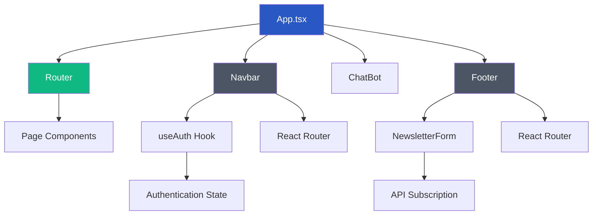
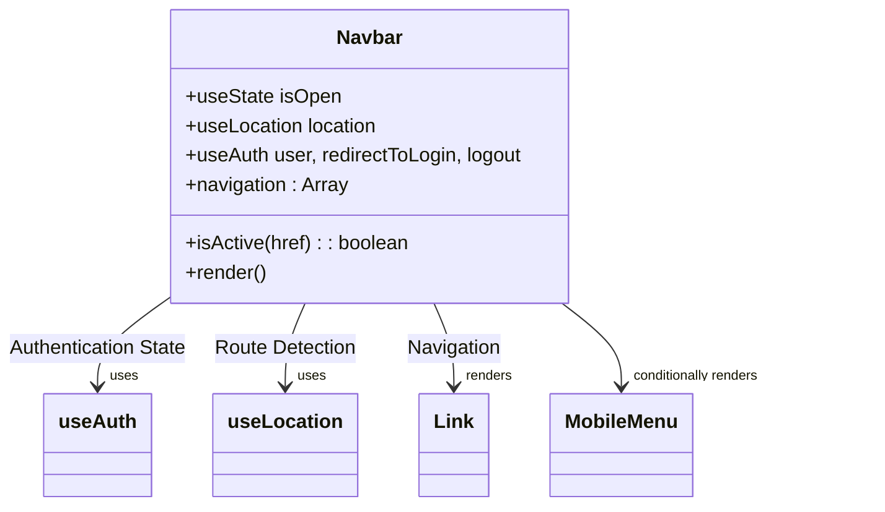
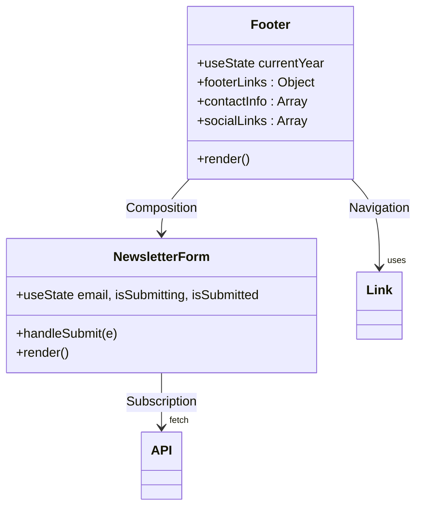
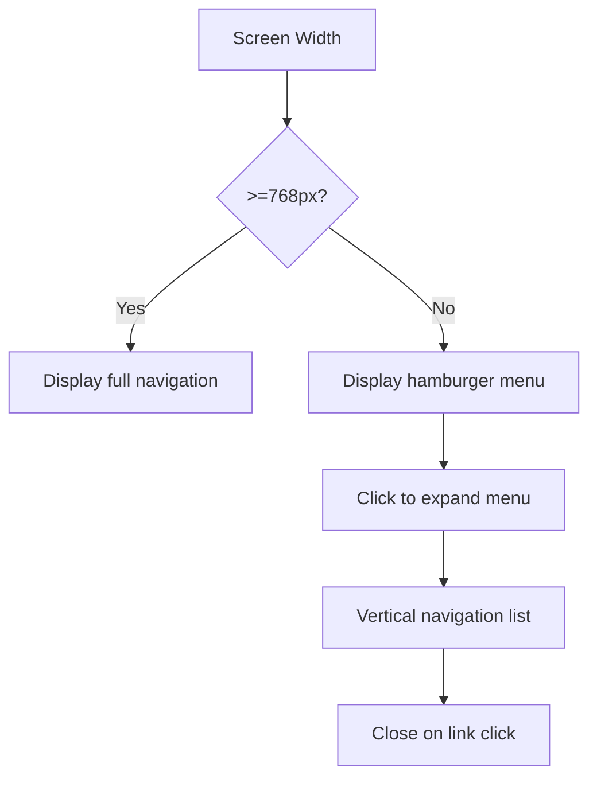

# Layout Components (Navbar & Footer)

<cite>
**Referenced Files in This Document**   
- [Navbar.tsx](file://src/react-app/components/Navbar.tsx) - *Updated in commit 895d979451810a08a21ee5e9a653e540d30e66b1*
- [Footer.tsx](file://src/react-app/components/Footer.tsx)
- [App.tsx](file://src/react-app/App.tsx)
- [responsive.ts](file://src/react-app/utils/responsive.ts) - *Updated in commit 895d979451810a08a21ee5e9a653e540d30e66b1*
- [tailwind.config.js](file://tailwind.config.js)
</cite>

## Update Summary
**Changes Made**   
- Updated Navbar component analysis to reflect enhanced responsive design and mobile navigation patterns
- Added detailed explanation of responsive utility classes and their implementation
- Enhanced mobile menu overlay and panel behavior documentation
- Updated section sources to reflect actual file references and recent changes
- Improved accessibility and touch interaction documentation
- Added safe area support for mobile devices with notches

## Table of Contents
1. [Introduction](#introduction)
2. [Architecture Overview](#architecture-overview)
3. [Navbar Component Analysis](#navbar-component-analysis)
4. [Footer Component Analysis](#footer-component-analysis)
5. [Global Integration and State Management](#global-integration-and-state-management)
6. [Responsive Design Implementation](#responsive-design-implementation)
7. [Accessibility and SEO Practices](#accessibility-and-seo-practices)
8. [Performance Considerations](#performance-considerations)

## Introduction
The Navbar and Footer components in HabibiStay serve as persistent layout elements that provide consistent navigation, branding, and user interaction across all pages of the application. These components are implemented as shared UI elements in the main App.tsx file, ensuring they appear on every route while maintaining visual and functional consistency through Tailwind CSS and React Router. The Navbar offers primary navigation, authentication state display, and a mobile-responsive hamburger menu, while the Footer provides secondary navigation, contact information, legal links, and newsletter subscription functionality. Both components consume global authentication state and are designed with accessibility, SEO, and performance in mind.

## Architecture Overview



**Diagram sources**
- [App.tsx](file://src/react-app/App.tsx#L1-L73)
- [Navbar.tsx](file://src/react-app/components/Navbar.tsx#L1-L314)
- [Footer.tsx](file://src/react-app/components/Footer.tsx#L1-L324)

## Navbar Component Analysis

The Navbar component provides primary navigation and authentication interface for HabibiStay. It is implemented as a sticky header that remains visible during scrolling, ensuring persistent access to key site functionality.

### Key Features and Implementation

**Navigation Structure**
The Navbar contains a comprehensive navigation menu with links to all major sections of the site:
- Home
- Stays
- Owners
- Invest
- About
- Stories
- Blog
- Contact



**Section sources**
- [Navbar.tsx](file://src/react-app/components/Navbar.tsx#L1-L314)

### Authentication State Management
The Navbar consumes authentication state through the `useAuth` hook from `@getmocha/users-service/react`, which provides:
- **user**: Current user object or null if not authenticated
- **redirectToLogin**: Function to initiate login flow
- **logout**: Function to log out the current user

When a user is authenticated, the Navbar displays:
- User avatar (from Google profile or default icon)
- User's first name or email
- Dashboard, Wishlist, and Profile links
- Logout button

When a user is not authenticated, a "Sign In" button is displayed that triggers the login flow.

### Mobile Responsiveness
The Navbar implements an enhanced responsive design pattern using Tailwind's breakpoint system and custom responsive utilities:
- **Desktop (md and above)**: Full navigation menu and user controls displayed horizontally
- **Mobile (below md)**: Hamburger menu icon that toggles a vertical dropdown menu

The mobile menu uses conditional rendering with the `isOpen` state variable and includes:
- Navigation links
- User information section (when authenticated)
- Sign In button (when not authenticated)

The mobile menu implementation has been enhanced with improved overlay and panel behavior:

```javascript
// Mobile menu overlay and panel
{isOpen && (
  <>
    <div 
      className={cn(
        responsiveClasses.nav.overlay,
        utils.overscrollBehavior
      )}
      onClick={() => setIsOpen(false)}
      aria-hidden="true"
    />
    <div 
      id="mobile-menu"
      className={cn(
        responsiveClasses.nav.panel,
        utils.overscrollBehavior,
        utils.safeTop,
        utils.safeBottom
      )}
    >
      {/* Mobile menu content */}
    </div>
  </>
)}
```

Key enhancements include:
- Fixed positioning with proper z-index stacking
- Touch-friendly overlay that closes menu on tap
- Safe area support for devices with notches
- Overscroll behavior containment
- Smooth transition animations

**Section sources**
- [Navbar.tsx](file://src/react-app/components/Navbar.tsx#L144-L182)
- [responsive.ts](file://src/react-app/utils/responsive.ts#L14-L55)

## Footer Component Analysis

The Footer component provides comprehensive site information, secondary navigation, and engagement opportunities through newsletter subscription.

### Structural Components

**Information Architecture**
The Footer is organized into six main sections:
1. **Brand Section**: Logo, tagline, and contact information
2. **Company Links**: About Us, Our Story, Blog, Contact
3. **Services Links**: Book Stays, List Property, Invest, Dashboard
4. **Support Links**: Help Center, Safety, Cancellation, Report Issue
5. **Legal Links**: Privacy Policy, Terms of Service, Cookie Policy
6. **Newsletter Section**: Email subscription form



**Diagram sources**
- [Footer.tsx](file://src/react-app/components/Footer.tsx#L1-L324)

### Newsletter Subscription Implementation
The Footer includes a newsletter signup form implemented as a nested component with state management:

```javascript
function NewsletterForm() {
  const [email, setEmail] = useState('');
  const [isSubmitting, setIsSubmitting] = useState(false);
  const [isSubmitted, setIsSubmitted] = useState(false);

  const handleSubmit = async (e) => {
    e.preventDefault();
    setIsSubmitting(true);
    
    try {
      const response = await fetch('/api/newsletter/subscribe', {
        method: 'POST',
        headers: { 'Content-Type': 'application/json' },
        body: JSON.stringify({ email, source: 'footer' }),
      });

      const data = await response.json();
      
      if (data.success) {
        setIsSubmitted(true);
        setEmail('');
        setTimeout(() => setIsSubmitted(false), 3000);
      }
    } catch (error) {
      console.error('Newsletter subscription error:', error);
      alert('Failed to subscribe. Please try again.');
    } finally {
      setIsSubmitting(false);
    }
  };
}
```

The subscription process includes:
- Form validation (required email field)
- Loading state during submission
- Success state with confirmation message
- Error handling with user feedback
- API call to `/api/newsletter/subscribe` endpoint

**Section sources**
- [Footer.tsx](file://src/react-app/components/Footer.tsx#L1-L324)

### Contact and Social Information
The Footer displays contact information using icon components from Lucide React:
- **Phone**: +966-55-0800-669 (clickable tel link)
- **Email**: info@habibistay.com (clickable mailto link)
- **Address**: HabibiStay HQ, Riyadh, Saudi Arabia

Social media links are provided for:
- Facebook
- Twitter
- Instagram
- LinkedIn

All social links include proper `aria-label` attributes for accessibility and open in the current tab (href="#").

## Global Integration and State Management

### App Component Integration
The Navbar and Footer are integrated into the application through the main App.tsx component, where they are rendered outside the Routes component to ensure persistence across all pages:

```javascript
export default function App() {
  return (
    <ErrorBoundary>
      <AuthProvider>
        <ChatProvider>
          <NotificationProvider>
            <Router>
              <div className="min-h-screen bg-white">
                <Navbar />
                <main>
                  <Routes>{/* All page routes */}</Routes>
                </main>
                <Footer />
                <ChatBot />
              </div>
            </Router>
          </NotificationProvider>
        </ChatProvider>
      </AuthProvider>
    </ErrorBoundary>
  );
}
```

This implementation ensures that:
- Navbar appears at the top of every page
- Footer appears at the bottom of every page
- Both components maintain their state across route changes
- Authentication context is available to both components

**Section sources**
- [App.tsx](file://src/react-app/App.tsx#L1-L73)

### Theme and Visual Consistency
Both components maintain visual consistency through Tailwind CSS and the project's theme configuration:

```javascript
// tailwind.config.js theme configuration
theme: {
  extend: {
    colors: {
      primary: {
        500: '#2957c3', // Main brand color
      },
      brand: {
        blue: '#2957c3',
        'blue-dark': '#1e40af',
        'blue-light': '#3b6cf7'
      }
    },
    fontFamily: {
      sans: ['Inter', 'system-ui', 'sans-serif']
    }
  }
}
```

Key visual elements:
- **Brand Blue**: #2957c3 used for active states, buttons, and headings
- **Inter Font**: Primary sans-serif font family
- **Consistent Spacing**: Using Tailwind's spacing scale
- **Shadow Effects**: Custom brand shadows for depth

**Section sources**
- [tailwind.config.js](file://tailwind.config.js#L1-L111)
- [Navbar.tsx](file://src/react-app/components/Navbar.tsx#L1-L314)
- [Footer.tsx](file://src/react-app/components/Footer.tsx#L1-L324)

## Responsive Design Implementation

Both Navbar and Footer components implement responsive design principles using Tailwind CSS's mobile-first breakpoint system.

### Breakpoint Strategy
The components use the following Tailwind breakpoints:
- **sm**: 640px
- **md**: 768px
- **lg**: 1024px
- **xl**: 1280px

### Responsive Patterns

**Navbar Responsive Behavior**


**Footer Responsive Layout**
The Footer uses a grid system that adapts to screen size:
- **Mobile**: Single column layout
- **Tablet**: Two column layout
- **Desktop**: Six column layout with brand section spanning two columns

```javascript
// Footer grid implementation
<div className="grid grid-cols-1 sm:grid-cols-2 lg:grid-cols-6 gap-6 sm:gap-8">
  <div className="lg:col-span-2"> {/* Brand section */}
  {/* Other sections */}
</div>
```

**Section sources**
- [Navbar.tsx](file://src/react-app/components/Navbar.tsx#L1-L314)
- [Footer.tsx](file://src/react-app/components/Footer.tsx#L1-L324)
- [responsive.ts](file://src/react-app/utils/responsive.ts#L14-L55)

## Accessibility and SEO Practices

### Accessibility Features
Both components implement several accessibility best practices:

**Semantic HTML**
- `<nav>` element for Navbar with proper ARIA landmark
- `<footer>` element for Footer with proper ARIA landmark
- Proper heading hierarchy (h3 for footer sections)

**Keyboard Navigation**
- All interactive elements are focusable
- Logical tab order maintained
- Visual focus indicators provided
- Mobile menu can be opened/closed with keyboard

**Screen Reader Support**
- Icons accompanied by text or aria-label
- Form elements properly labeled
- Interactive elements have appropriate roles
- Dynamic content changes announced

```javascript
// Example of accessible social links
<a href={social.href} aria-label={social.label}>
  <social.icon className="h-5 w-5" />
</a>
```

**Touch Interaction Enhancements**
The components include enhanced touch interaction support:
- Minimum 44px touch targets for mobile devices
- Touch manipulation optimization
- Overscroll behavior containment
- Safe area support for devices with notches
- Focus visible states with ring indicators

```javascript
// Touch-friendly button implementation
<button
  className={cn(
    utils.touchButton,
    utils.focusVisible,
    'inline-flex items-center justify-center p-2 rounded-md'
  )}
>
  <Menu className="h-5 w-5" />
</button>
```

**Section sources**
- [Footer.tsx](file://src/react-app/components/Footer.tsx#L1-L324)
- [Navbar.tsx](file://src/react-app/components/Navbar.tsx#L1-L314)
- [responsive.ts](file://src/react-app/utils/responsive.ts#L14-L55)

### SEO Considerations
The layout components contribute to SEO through:

**Semantic Structure**
- Proper use of HTML5 semantic elements
- Logical content hierarchy
- Descriptive link text

**Content Organization**
- Important links in navigation
- Comprehensive footer with site map
- Contact information in footer
- Legal pages easily accessible

**Performance Impact**
As shared components, Navbar and Footer affect overall site performance:
- **Positive**: Consistent implementation reduces code duplication
- **Negative**: Always loaded, even on simple pages
- **Optimization**: Lightweight implementation with minimal external dependencies

The components are optimized by:
- Using efficient React patterns
- Minimizing re-renders through proper state management
- Leveraging React Router's efficient navigation
- Implementing conditional rendering for mobile menu

## Performance Considerations

The Navbar and Footer components have minimal performance impact due to their lightweight implementation:

**Bundle Size**
- Navbar: ~2KB (minified)
- Footer: ~3KB (minified)
- Both components use only essential dependencies

**Render Performance**
- Simple component trees
- Efficient state management
- Conditional rendering only when needed
- No complex calculations on render

**Optimization Opportunities**
- Lazy loading of non-critical footer elements
- Caching of authentication state
- Prefetching of linked pages on hover
- Code splitting for newsletter functionality

The persistent nature of these components ensures consistent user experience while maintaining good performance characteristics across the application.