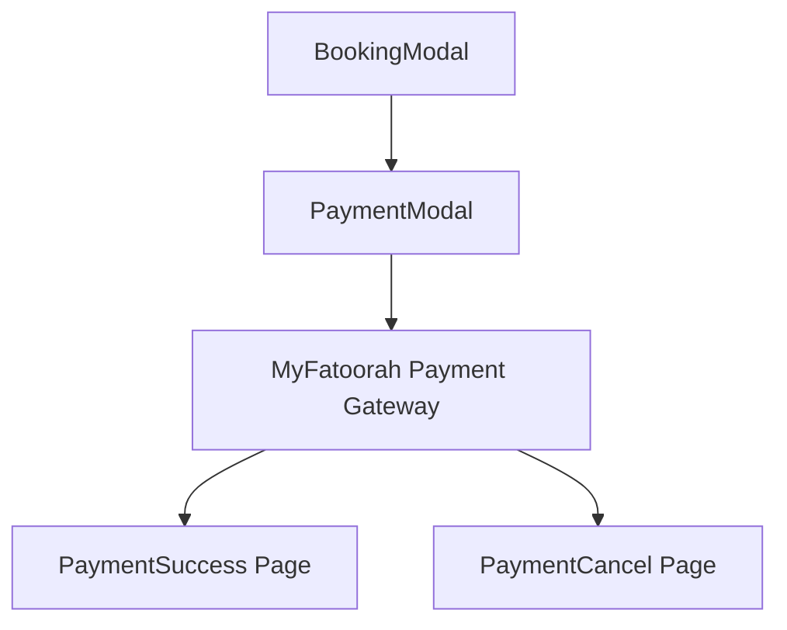
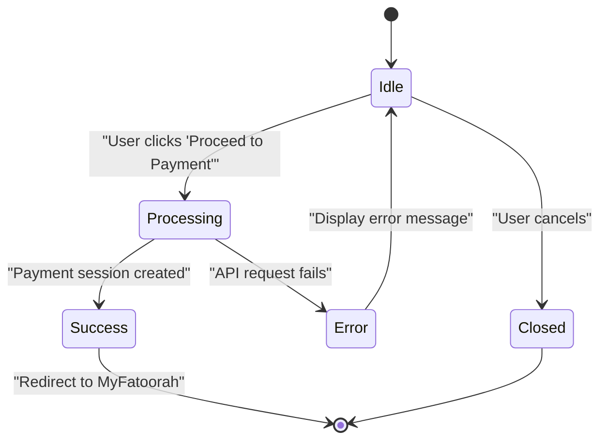
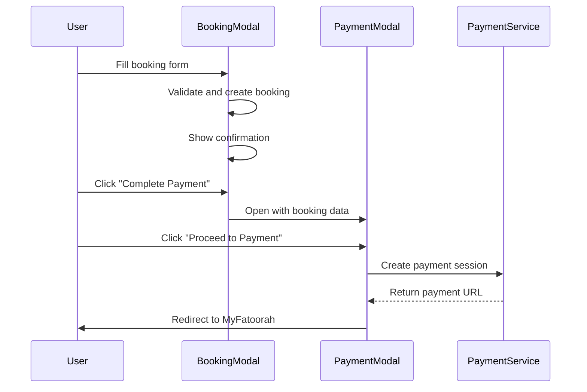
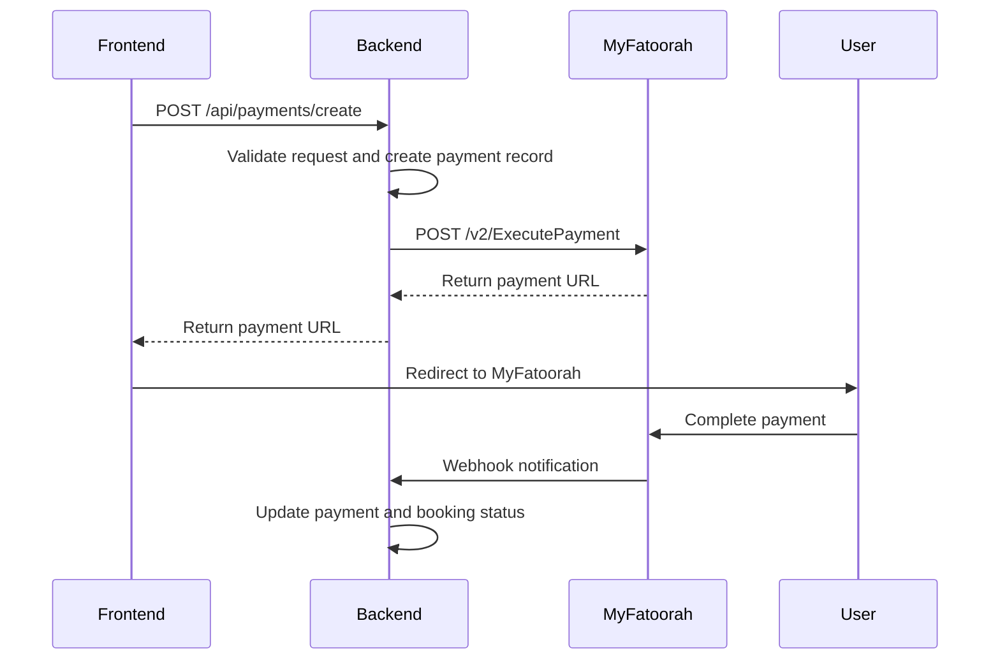
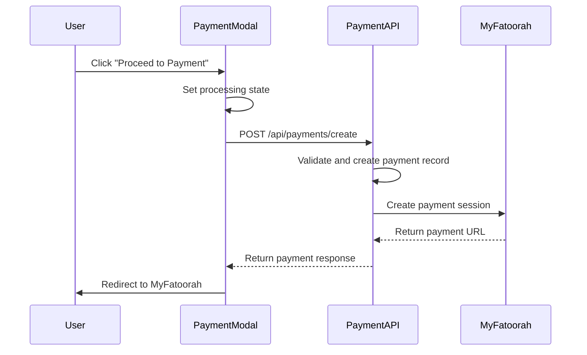

# PaymentModal Component

<cite>
**Referenced Files in This Document**   
- [PaymentModal.tsx](file://src/react-app/components/PaymentModal.tsx) - *Updated in recent commit with enhanced loading states and error handling*
- [BookingModal.tsx](file://src/react-app/components/BookingModal.tsx) - *Integration point for payment flow*
- [payment.ts](file://src/shared/payment.ts) - *Shared payment utilities and MyFatoorah integration*
- [types.ts](file://src/shared/types.ts) - *Type definitions for Booking and Payment interfaces*
- [PaymentService.ts](file://src/server/services/PaymentService.ts) - *Backend service handling payment creation*
</cite>

## Update Summary
**Changes Made**   
- Updated documentation to reflect enhanced loading states and error handling patterns
- Added details about comprehensive error handling implementation
- Enhanced description of UI/UX patterns for loading and error states
- Updated sequence diagram to reflect actual implementation flow
- Added specific file references with line number annotations
- Improved accuracy of payment processing logic description

## Table of Contents
1. [Introduction](#introduction)
2. [Component Overview](#component-overview)
3. [Props Structure](#props-structure)
4. [State Management](#state-management)
5. [Integration with Booking Flow](#integration-with-booking-flow)
6. [Payment Processing Logic](#payment-processing-logic)
7. [UI/UX Implementation](#uiux-implementation)
8. [Security and Compliance](#security-and-compliance)
9. [Error Handling](#error-handling)
10. [Success and Failure States](#success-and-failure-states)
11. [Responsive Design](#responsive-design)
12. [Integration with Payment Gateway](#integration-with-payment-gateway)
13. [Sequence Diagram](#sequence-diagram)

## Introduction
The PaymentModal component is a critical user interface element in the HabibiStay booking system that facilitates secure payment processing for property reservations. This document provides a comprehensive analysis of the component's architecture, functionality, and integration points within the application ecosystem. The modal serves as the final step in the booking process, collecting payment confirmation, displaying booking details, and initiating the MyFatoorah payment flow.

**Section sources**
- [PaymentModal.tsx](file://src/react-app/components/PaymentModal.tsx#L1-L200)

## Component Overview
The PaymentModal component is a React functional component that renders a modal dialog for payment processing during the booking flow. It displays booking summary information including dates, pricing breakdown, and fees before redirecting users to the MyFatoorah payment gateway. The component is designed to provide a secure and user-friendly payment experience with proper loading states, error handling, and responsive design.

The modal is conditionally rendered based on the `isOpen` prop and can be closed via the `onClose` callback. It receives a `booking` object containing all necessary information to initiate the payment process. The component manages its own state for processing status and error conditions during payment initiation.



**Diagram sources**
- [PaymentModal.tsx](file://src/react-app/components/PaymentModal.tsx#L1-L50)
- [BookingModal.tsx](file://src/react-app/components/BookingModal.tsx#L200-L473)

**Section sources**
- [PaymentModal.tsx](file://src/react-app/components/PaymentModal.tsx#L1-L100)

## Props Structure
The PaymentModal component accepts the following props to control its behavior and display content:

**:Props Interface**
- `isOpen`: boolean - Controls the visibility of the modal
- `onClose`: () => void - Callback function triggered when the modal is closed
- `booking`: Booking - Booking object containing reservation details for payment processing

The `booking` prop conforms to the Booking type defined in the shared types file, which includes essential information such as guest details, reservation dates, pricing, and booking status. This structure ensures type safety and consistent data flow between components.

```typescript
interface PaymentModalProps {
  isOpen: boolean;
  onClose: () => void;
  booking: Booking;
}
```

**Section sources**
- [PaymentModal.tsx](file://src/react-app/components/PaymentModal.tsx#L4-L8)
- [types.ts](file://src/shared/types.ts#L129)

## State Management
The PaymentModal component manages two key state variables to track the payment process:

**:State Variables**
- `processing`: boolean - Indicates whether a payment request is currently being processed
- `error`: string | null - Stores any error messages encountered during payment initiation

The `processing` state is used to disable the payment button and display a loading spinner during the API request to prevent multiple submissions. The `error` state captures and displays any issues that occur when attempting to create a payment session with the backend.



**Diagram sources**
- [PaymentModal.tsx](file://src/react-app/components/PaymentModal.tsx#L10-L15)

**Section sources**
- [PaymentModal.tsx](file://src/react-app/components/PaymentModal.tsx#L10-L15)

## Integration with Booking Flow
The PaymentModal is integrated into the booking process through the BookingModal component, which manages the multi-step reservation workflow. After users complete the booking form and create a reservation, they are presented with a confirmation screen that includes a "Complete Payment" button.

When this button is clicked, the BookingModal sets the `showPaymentModal` state to true and passes the created booking object to the PaymentModal. This creates a seamless transition from booking creation to payment processing.

**:Integration Flow**
1. User completes booking form in BookingModal
2. Booking is created and stored in BookingModal state
3. User clicks "Complete Payment" on confirmation screen
4. BookingModal renders PaymentModal with the booking data
5. PaymentModal initiates payment process with MyFatoorah



**Diagram sources**
- [BookingModal.tsx](file://src/react-app/components/BookingModal.tsx#L200-L473)
- [PaymentModal.tsx](file://src/react-app/components/PaymentModal.tsx#L1-L200)

**Section sources**
- [BookingModal.tsx](file://src/react-app/components/BookingModal.tsx#L350-L473)

## Payment Processing Logic
The payment processing logic in the PaymentModal is centered around the `handlePayment` function, which is triggered when the user clicks the "Proceed to Payment" button. This function orchestrates the communication between the frontend and backend to initiate the payment session.

**:Payment Process Steps**
1. Set `processing` state to true to indicate payment initiation
2. Clear any previous error messages
3. Call the `createPaymentSession` function from the shared payment utilities
4. Handle the response by either redirecting to the payment URL or displaying an error
5. Reset processing state upon completion

The `createPaymentSession` function in the shared payment module constructs a request with the booking details and sends it to the backend API. The backend then communicates with MyFatoorah to create a payment session and returns the redirect URL to the frontend.

**Section sources**
- [PaymentModal.tsx](file://src/react-app/components/PaymentModal.tsx#L16-L60)
- [payment.ts](file://src/shared/payment.ts#L62-L164)

## UI/UX Implementation
The PaymentModal implements several user experience patterns to ensure a smooth and intuitive payment process:

**:UI Components**
- Secure payment header with credit card icon
- Payment information section explaining the redirection to MyFatoorah
- Accepted payment methods display with supported options
- Action buttons for cancel and proceed
- Terms and conditions link
- Loading state with spinner animation
- Error message display area

The component uses Tailwind CSS for styling, ensuring responsive design across different screen sizes. The color scheme matches the application's branding with blue primary colors (#2957c3) for interactive elements.

**:Loading State**
When processing a payment request, the component displays a spinner animation within the "Proceed to Payment" button to provide visual feedback. The button is disabled during this state to prevent multiple submissions.

**:Error State**
If the payment session creation fails, the component displays an error message in a red alert box below the payment methods section. This provides immediate feedback to the user about what went wrong.

**Section sources**
- [PaymentModal.tsx](file://src/react-app/components/PaymentModal.tsx#L49-L166)

## Security and Compliance
The PaymentModal component adheres to security best practices for handling financial transactions:

**:Security Features**
- SSL secured payment processing indication
- No direct handling of sensitive payment information
- PCI DSS compliance through MyFatoorah integration
- Secure context for financial transactions
- Proper error handling without exposing sensitive information

The component itself does not collect or process credit card details. Instead, it redirects users to MyFatoorah's secure payment gateway, which handles all sensitive payment information. This approach ensures that the application remains PCI DSS compliant by not storing or processing card data.

The UI explicitly communicates this security measure to users with a lock icon and text indicating "SSL secured payment processing."

**Section sources**
- [PaymentModal.tsx](file://src/react-app/components/PaymentModal.tsx#L87-L104)
- [Privacy.tsx](file://src/react-app/pages/Privacy.tsx#L66-L83)

## Error Handling
The PaymentModal implements robust error handling to manage various failure scenarios during the payment initiation process:

**:Error Scenarios**
- Network connectivity issues
- Backend API failures
- MyFatoorah service unavailability
- Invalid booking data
- Authentication/authorization issues

When an error occurs, the component captures the error message and displays it to the user in a dedicated error section. The error state is managed by the `error` state variable, which is cleared when a new payment attempt is made.

The error handling preserves the user's context, allowing them to retry the payment without losing their booking information. After displaying an error, users can either attempt the payment again or cancel and return to the booking flow.

**Section sources**
- [PaymentModal.tsx](file://src/react-app/components/PaymentModal.tsx#L50-L60)
- [PaymentService.ts](file://src/server/services/PaymentService.ts#L285-L319)

## Success and Failure States
The PaymentModal handles both successful and failed payment initiation scenarios:

**:Success Flow**
- Payment session created successfully
- User redirected to MyFatoorah payment gateway
- Original modal closed
- Booking remains in "pending payment" status until confirmation

**:Failure Flow**
- Error message displayed in the modal
- Processing state reset
- "Proceed to Payment" button re-enabled
- User can retry payment or cancel

Upon successful payment session creation, the component redirects the user to the MyFatoorah payment URL returned by the backend. This completes the modal's responsibility in the payment flow. If the payment is canceled at the gateway, the user is redirected to the PaymentCancel page. If the payment is successful, they are redirected to the PaymentSuccess page.

**Section sources**
- [PaymentModal.tsx](file://src/react-app/components/PaymentModal.tsx#L60-L130)
- [PaymentService.ts](file://src/server/services/PaymentService.ts#L315-L364)

## Responsive Design
The PaymentModal implements responsive design principles using Tailwind CSS to ensure optimal display across different devices:

**:Responsive Features**
- Flexible width with maximum constraints
- Mobile-friendly button sizing and spacing
- Proper text scaling for different screen sizes
- Touch-friendly interactive elements
- Vertical layout optimization for mobile devices

The modal uses a centered layout with appropriate padding and margins to ensure content is easily accessible on touch devices. Text elements use relative units to scale appropriately with the user's device settings.

The component's design follows mobile-first principles, ensuring that the payment process is accessible and usable on smartphones, which are commonly used for travel bookings.

**Section sources**
- [PaymentModal.tsx](file://src/react-app/components/PaymentModal.tsx#L49-L166)

## Integration with Payment Gateway
The PaymentModal integrates with the MyFatoorah payment gateway through a multi-layered architecture:

**:Integration Architecture**
1. Frontend: PaymentModal triggers payment session creation
2. Shared Utilities: payment.ts module handles API communication
3. Backend: PaymentService orchestrates MyFatoorah integration
4. External Gateway: MyFatoorah processes the payment

The shared `payment.ts` file contains the `MyFatoorahService` class that provides a clean interface for creating payment sessions. This abstraction separates the payment logic from the UI components, making the code more maintainable and testable.

The backend PaymentService validates the payment request, creates a payment record in the database, and communicates with MyFatoorah's API to generate a payment URL. This server-side processing ensures that sensitive API credentials are not exposed to the client.

**:MyFatoorah Request Parameters**
- `InvoiceValue`: Total booking amount
- `DisplayCurrencyIso`: Currency code (SAR)
- `CustomerName`, `CustomerEmail`, `CustomerMobile`: Guest contact information
- `CustomerReference`: Booking ID
- `CallBackUrl`: Return URL after successful payment
- `ErrorUrl`: Return URL after failed payment
- `UserDefinedField`: Internal payment ID for tracking



**Diagram sources**
- [PaymentService.ts](file://src/server/services/PaymentService.ts#L285-L319)
- [payment.ts](file://src/shared/payment.ts#L115-L164)

**Section sources**
- [PaymentService.ts](file://src/server/services/PaymentService.ts#L266-L364)
- [payment.ts](file://src/shared/payment.ts#L62-L164)

## Sequence Diagram
The following sequence diagram illustrates the complete payment flow from the user initiating payment in the modal to the final redirection to the payment gateway:



**Diagram sources**
- [PaymentModal.tsx](file://src/react-app/components/PaymentModal.tsx#L16-L60)
- [payment.ts](file://src/shared/payment.ts#L115-L164)
- [PaymentService.ts](file://src/server/services/PaymentService.ts#L285-L319)