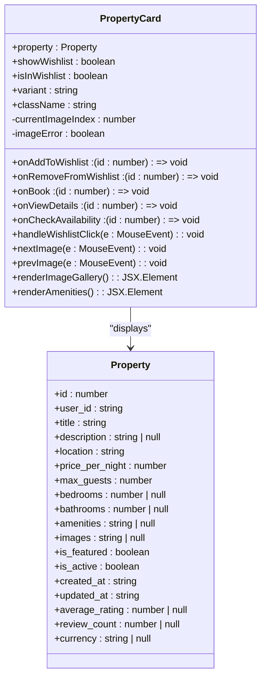
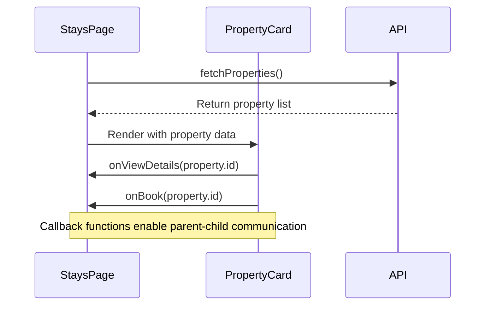
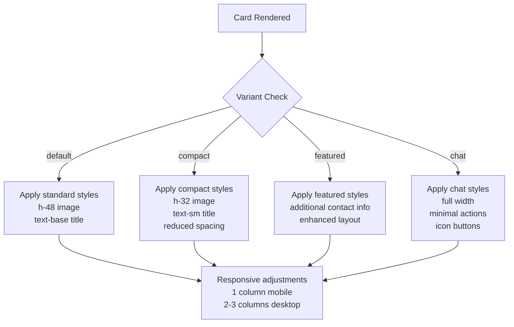
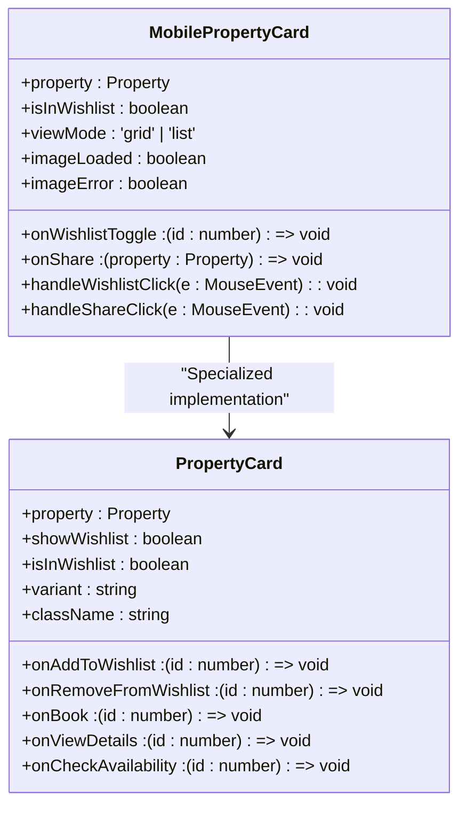
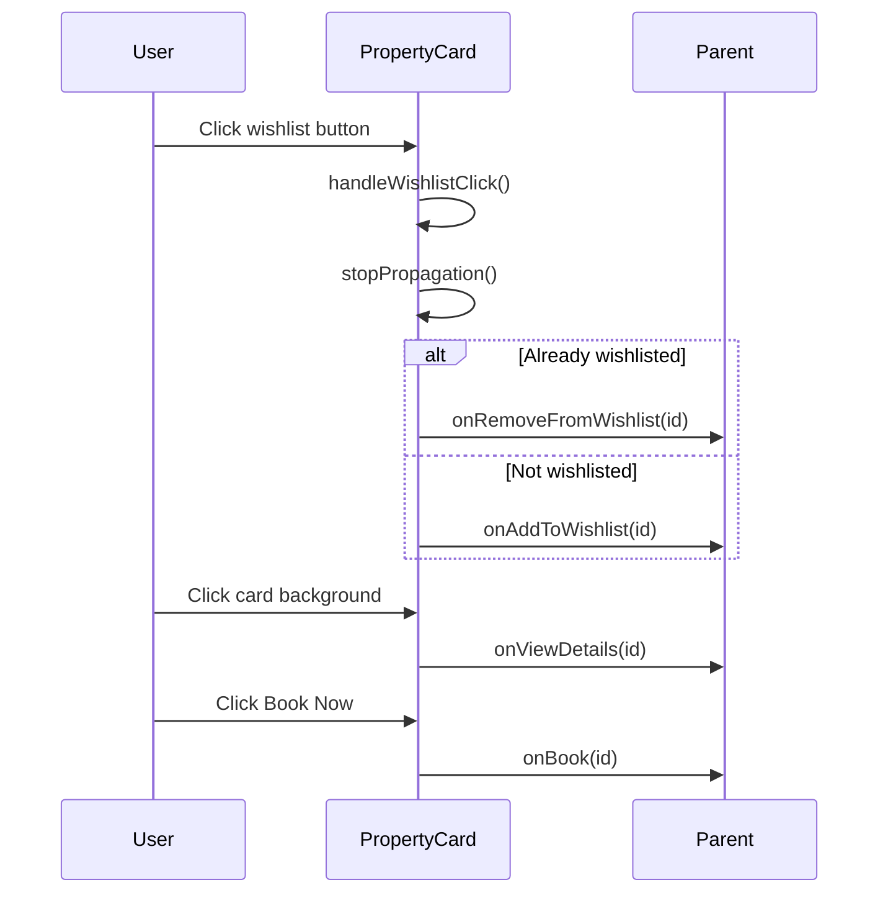
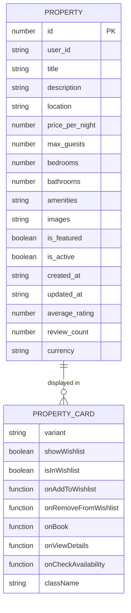

# PropertyCard Component

<cite>
**Referenced Files in This Document**   
- [PropertyCard.tsx](file://src/react-app/components/PropertyCard.tsx) - *Updated with mobile optimization patterns*
- [MobilePropertyCard.tsx](file://src/react-app/components/MobilePropertyCard.tsx) - *Added in recent commit*
- [types.ts](file://src/shared/types.ts) - *Shared type definitions*
- [Stays.tsx](file://src/react-app/pages/Stays.tsx) - *Integration example*
- [Wishlist.tsx](file://src/react-app/pages/Wishlist.tsx) - *Usage context*
- [useWishlist.ts](file://src/react-app/hooks/useWishlist.ts) - *State management*
- [WishlistButton.tsx](file://src/react-app/components/WishlistButton.tsx) - *Related component*
</cite>

## Update Summary
**Changes Made**   
- Added comprehensive documentation for the new MobilePropertyCard component
- Updated responsive design section to reflect mobile-first optimization patterns
- Enhanced performance considerations with mobile-specific optimizations
- Added new section on mobile touch target implementation
- Updated implementation details to reflect shared responsive utilities
- Added mobile-specific accessibility considerations

## Table of Contents
1. [Introduction](#introduction)
2. [Core Properties and Interface](#core-properties-and-interface)
3. [Implementation Details](#implementation-details)
4. [Integration with Parent Components](#integration-with-parent-components)
5. [Responsive Design and Tailwind CSS](#responsive-design-and-tailwind-css)
6. [Mobile-Optimized Property Card](#mobile-optimized-property-card)
7. [Usage Examples Across Pages](#usage-examples-across-pages)
8. [Event Handling and User Interactions](#event-handling-and-user-interactions)
9. [Image Optimization and Gallery Features](#image-optimization-and-gallery-features)
10. [Accessibility Standards](#accessibility-standards)
11. [Performance Considerations](#performance-considerations)
12. [Extensibility and Variants](#extensibility-and-variants)
13. [Type Safety with Shared Types](#type-safety-with-shared-types)

## Introduction
The PropertyCard component is a reusable UI element designed to display property listings consistently across multiple pages of the HabibiStay application, including Home, Stays, and Wishlist. Implemented as a React functional component using TypeScript, it provides a flexible and interactive interface for users to browse accommodations. The component supports various display variants and integrates with state management systems to enable wishlist functionality, booking actions, and detailed property views. Its design emphasizes usability, responsiveness, and accessibility while maintaining high performance when rendered in large lists. With the recent addition of the MobilePropertyCard component, the application now features specialized mobile-optimized layouts that enhance touch interactions and performance on mobile devices.

**Section sources**
- [PropertyCard.tsx](file://src/react-app/components/PropertyCard.tsx#L1-L449)
- [MobilePropertyCard.tsx](file://src/react-app/components/MobilePropertyCard.tsx#L1-L294)

## Core Properties and Interface
The PropertyCard component accepts a comprehensive set of props through the PropertyCardProps interface, enabling flexible configuration for different use cases. The primary property data is passed via the property prop, which conforms to the shared Property type definition. Additional boolean flags control the visibility of wishlist functionality, while callback functions handle user interactions such as booking, viewing details, and checking availability.

```typescript
interface PropertyCardProps {
  property: Property;
  showWishlist?: boolean;
  isInWishlist?: boolean;
  onAddToWishlist?: (propertyId: number) => void;
  onRemoveFromWishlist?: (propertyId: number) => void;
  onBook?: (propertyId: number) => void;
  onViewDetails?: (propertyId: number) => void;
  onCheckAvailability?: (propertyId: number) => void;
  variant?: 'default' | 'featured' | 'compact' | 'chat';
  className?: string;
}
```

The component also supports different visual variants through the variant prop, allowing for context-specific presentations such as compact cards for chat interfaces or featured cards with enhanced information. The optional nature of callback props (indicated by the ?) provides greater flexibility in usage contexts where certain actions may not be available.

**Section sources**
- [PropertyCard.tsx](file://src/react-app/components/PropertyCard.tsx#L26-L37)

## Implementation Details
The PropertyCard implementation leverages React's useState and useMemo hooks to manage internal state and optimize performance. It maintains state for image navigation (currentImageIndex) and error handling for image loading (imageError). The component uses React.useMemo to safely parse JSON strings from the property's images and amenities fields, ensuring robust handling of potentially malformed data.



The implementation shares responsive utilities with the MobilePropertyCard component through imported modules like responsiveClasses, utils, and cn, ensuring consistency in responsive behavior and touch target sizing across both components.

**Diagram sources**
- [PropertyCard.tsx](file://src/react-app/components/PropertyCard.tsx#L1-L449)
- [types.ts](file://src/shared/types.ts#L1-L602)

**Section sources**
- [PropertyCard.tsx](file://src/react-app/components/PropertyCard.tsx#L1-L449)
- [MobilePropertyCard.tsx](file://src/react-app/components/MobilePropertyCard.tsx#L1-L294)

## Integration with Parent Components
The PropertyCard component integrates seamlessly with parent components through callback props that enable communication between child and parent. In the Stays page, the component is used within a list rendering pattern, where each property from the fetched data is passed to a PropertyCard instance.



The component's onClick handler navigates to the property details page when the card is clicked, except in the 'chat' variant where this behavior is disabled. The wishlist functionality is managed through the onAddToWishlist and onRemoveFromWishlist callbacks, which are provided by parent components to update application state. The MobilePropertyCard uses a similar pattern but with onWishlistToggle as a unified callback for both adding and removing from wishlist.

**Diagram sources**
- [Stays.tsx](file://src/react-app/pages/Stays.tsx#L1-L515)
- [PropertyCard.tsx](file://src/react-app/components/PropertyCard.tsx#L1-L449)

**Section sources**
- [Stays.tsx](file://src/react-app/pages/Stays.tsx#L1-L515)
- [PropertyCard.tsx](file://src/react-app/components/PropertyCard.tsx#L1-L449)

## Responsive Design and Tailwind CSS
The PropertyCard component implements responsive design principles using Tailwind CSS utility classes. The component adapts its layout and content density based on the variant prop, with different styling for default, featured, compact, and chat contexts. Tailwind's responsive prefixes (e.g., md:, lg:) ensure proper display across device sizes.

The component uses conditional class names through the clsx library to dynamically apply styles based on props and state. For example, the image height varies between h-48 for default cards and h-32 for compact variants. Text sizes are also adjusted, with text-sm for compact views and text-base for standard displays.



The implementation shares responsive utilities with the MobilePropertyCard component, using consistent breakpoints and spacing patterns to maintain a cohesive user experience across different device types.

**Diagram sources**
- [PropertyCard.tsx](file://src/react-app/components/PropertyCard.tsx#L1-L449)

**Section sources**
- [PropertyCard.tsx](file://src/react-app/components/PropertyCard.tsx#L1-L449)

## Mobile-Optimized Property Card
The MobilePropertyCard component is a specialized version designed specifically for mobile devices, implementing enhanced touch targets, optimized layouts, and mobile-specific performance considerations. This component complements the main PropertyCard by providing a superior user experience on touch-based devices.

The component supports two view modes: 'grid' and 'list', allowing for flexible presentation in different mobile contexts. In grid mode, properties are displayed with larger images and prominent action buttons, while list mode provides a more compact, information-dense presentation suitable for browsing.



Key mobile-specific features include:
- Enhanced touch targets using responsiveClasses.touch.press for better finger targeting
- Image loading optimization with skeleton screens and progressive loading
- Mobile-specific actions like sharing functionality
- Context-aware UI elements that appear on hover (simulated as touch interaction)
- Optimized spacing and typography for smaller screens

The component uses responsiveClasses from shared utilities to ensure consistent styling patterns with the main PropertyCard while adapting to mobile constraints.

**Diagram sources**
- [MobilePropertyCard.tsx](file://src/react-app/components/MobilePropertyCard.tsx#L1-L294)

**Section sources**
- [MobilePropertyCard.tsx](file://src/react-app/components/MobilePropertyCard.tsx#L1-L294)

## Usage Examples Across Pages
The PropertyCard component is utilized across multiple pages in the application, demonstrating its reusability and flexibility. On the Stays page, it displays search results in a grid layout, while on the Wishlist page, it shows saved properties with additional metadata.

In the Stays page, the component is rendered within a grid container that adapts from one column on mobile to three columns on large screens:

```tsx
<div className="grid grid-cols-1 md:grid-cols-2 lg:grid-cols-3 gap-8">
  {properties.map((property) => (
    <PropertyCard key={property.id} property={property} />
  ))}
</div>
```

On mobile devices, the MobilePropertyCard is used instead, providing an optimized touch experience:

```tsx
<div className="space-y-4">
  {properties.map((property) => (
    <MobilePropertyCard 
      key={property.id} 
      property={property} 
      viewMode="list"
      onWishlistToggle={handleWishlistToggle}
      onShare={handleShare}
    />
  ))}
</div>
```

This dual approach allows the application to deliver an optimal user experience across different device types while maintaining consistent data presentation patterns.

**Section sources**
- [Stays.tsx](file://src/react-app/pages/Stays.tsx#L1-L515)
- [Wishlist.tsx](file://src/react-app/pages/Wishlist.tsx#L1-L295)
- [MobilePropertyCard.tsx](file://src/react-app/components/MobilePropertyCard.tsx#L1-L294)

## Event Handling and User Interactions
The PropertyCard component implements comprehensive event handling for various user interactions. Click events are carefully managed to prevent event bubbling when interacting with child elements like the wishlist button or action buttons.

The component handles image gallery navigation through nextImage and prevImage methods, which update the currentImageIndex state. The wishlist functionality is managed through the handleWishlistClick method, which stops event propagation and calls the appropriate callback based on the current wishlist state.



All interactive elements include appropriate visual feedback through Tailwind's hover states and transition classes, enhancing the user experience. The MobilePropertyCard extends this with mobile-specific touch feedback using responsiveClasses.touch.press and utils.focusVisible for improved accessibility.

**Diagram sources**
- [PropertyCard.tsx](file://src/react-app/components/PropertyCard.tsx#L1-L449)

**Section sources**
- [PropertyCard.tsx](file://src/react-app/components/PropertyCard.tsx#L1-L449)

## Image Optimization and Gallery Features
The PropertyCard component includes an integrated image gallery with several optimization features. It supports multiple images per property, displaying them in a carousel-like interface with navigation controls that appear on hover.

The component handles image loading errors gracefully by displaying a fallback icon when images fail to load. It also implements image error state management through the imageError state variable, ensuring a consistent user experience even when external image resources are unavailable.

For properties with multiple images, the component displays navigation arrows and indicator dots to show the current image position. The main image is extracted from the property's images field, which may be stored as a JSON string and requires parsing.

```typescript
const images = React.useMemo(() => {
  if (Array.isArray(property.images)) return property.images;
  if (typeof property.images === 'string') {
    try {
      return JSON.parse(property.images) || [];
    } catch {
      return [];
    }
  }
  return [];
}, [property.images]);
```

The MobilePropertyCard implements additional image optimization techniques, including skeleton screens during loading and progressive image loading with opacity transitions to provide visual feedback to users.

**Section sources**
- [PropertyCard.tsx](file://src/react-app/components/PropertyCard.tsx#L1-L449)
- [MobilePropertyCard.tsx](file://src/react-app/components/MobilePropertyCard.tsx#L1-L294)

## Accessibility Standards
The PropertyCard component adheres to web accessibility standards through several implementation choices. Interactive elements include appropriate ARIA labels, such as the wishlist button which has a dynamic aria-label based on its current state.

The component maintains proper color contrast ratios for text and interactive elements, using Tailwind's color palette which is designed with accessibility in mind. All icons are accompanied by text alternatives or are decorative with appropriate aria-hidden attributes.

Keyboard navigation is supported through standard button elements and proper focus management. The image gallery can be navigated using both mouse and keyboard inputs, though explicit keyboard event handlers are not implemented in the current version.

Focus indicators are preserved through Tailwind's default styling, ensuring that keyboard users can clearly see which element has focus. The component also prevents unwanted event propagation, which helps maintain predictable focus behavior in complex layouts.

The MobilePropertyCard enhances accessibility with utils.focusVisible, which provides clear visual focus indicators on mobile devices, and proper touch target sizing to accommodate users with motor impairments.

**Section sources**
- [PropertyCard.tsx](file://src/react-app/components/PropertyCard.tsx#L1-L449)
- [MobilePropertyCard.tsx](file://src/react-app/components/MobilePropertyCard.tsx#L1-L294)

## Performance Considerations
The PropertyCard component is optimized for performance, especially when rendered in large lists. The use of React.useMemo for parsing images and amenities prevents unnecessary re-parsing on every render. The component minimizes re-renders by using stable callback functions and avoiding inline function definitions in the render method.

When displaying large numbers of properties, as on the Stays page, the component's lightweight implementation and efficient state management contribute to smooth scrolling and interaction. The virtualized rendering of property lists is not implemented, but the component's design is compatible with virtualization libraries if needed in the future.

The image loading strategy uses standard img elements with error handling, avoiding more complex lazy loading implementations that could add bundle size. For applications with many high-resolution images, implementing intersection observer-based lazy loading could further improve initial load performance.

The MobilePropertyCard introduces additional performance optimizations for mobile devices, including:
- Skeleton screens to provide immediate visual feedback
- Optimized image loading with progressive opacity transitions
- Reduced re-renders through careful state management
- Efficient touch event handling to prevent jank

These mobile-specific optimizations ensure a smooth user experience even on lower-end devices with limited processing power.

**Section sources**
- [PropertyCard.tsx](file://src/react-app/components/PropertyCard.tsx#L1-L449)
- [Stays.tsx](file://src/react-app/pages/Stays.tsx#L1-L515)
- [MobilePropertyCard.tsx](file://src/react-app/components/MobilePropertyCard.tsx#L1-L294)

## Extensibility and Variants
The PropertyCard component is designed for extensibility through its variant system and exported specialized components. In addition to the main PropertyCard, the file exports three specialized variants:

```typescript
export const FeaturedPropertyCard = (props: Omit<PropertyCardProps, 'variant'>) => (
  <PropertyCard {...props} variant="featured" />
);

export const CompactPropertyCard = (props: Omit<PropertyCardProps, 'variant'>) => (
  <PropertyCard {...props} variant="compact" />
);

export const ChatPropertyCard = (props: Omit<PropertyCardProps, 'variant'>) => (
  <PropertyCard {...props} variant="chat" />
);
```

These variants allow for consistent styling across different contexts while reducing prop repetition. The component can be further extended with new features such as promotional tags, badges, or additional action buttons by modifying the existing structure or creating new variants.

The className prop allows for custom styling injection, enabling teams to adapt the component to new design requirements without modifying the core implementation. The introduction of the MobilePropertyCard represents a new pattern of device-specific component variants that can be extended to other UI elements in the future.

**Section sources**
- [PropertyCard.tsx](file://src/react-app/components/PropertyCard.tsx#L1-L449)

## Type Safety with Shared Types
The PropertyCard component maintains type safety through its integration with shared types defined in src/shared/types.ts. The Property interface is imported from this shared location, ensuring consistency across the application.



The shared types file uses Zod for runtime type checking and TypeScript inference, providing both compile-time and runtime type safety. This approach ensures that data from API responses matches the expected structure before being passed to components like PropertyCard.

By centralizing type definitions, the application maintains consistency across components, API services, and data models, reducing the risk of type-related bugs and making refactoring safer. Both PropertyCard and MobilePropertyCard rely on the same shared Property type, ensuring data consistency across different presentation contexts.

**Diagram sources**
- [types.ts](file://src/shared/types.ts#L1-L602)
- [PropertyCard.tsx](file://src/react-app/components/PropertyCard.tsx#L1-L449)

**Section sources**
- [types.ts](file://src/shared/types.ts#L1-L602)
- [PropertyCard.tsx](file://src/react-app/components/PropertyCard.tsx#L1-L449)