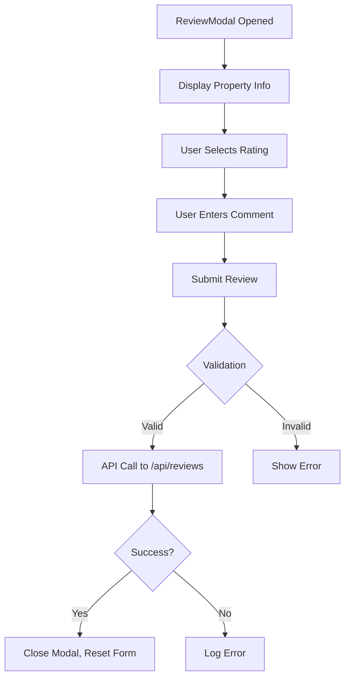
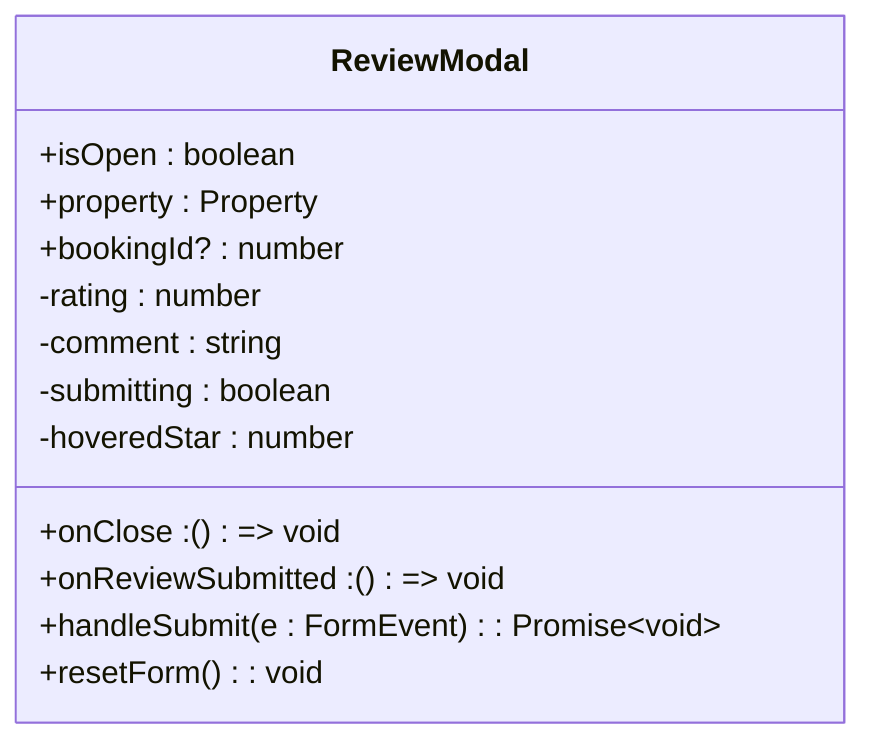
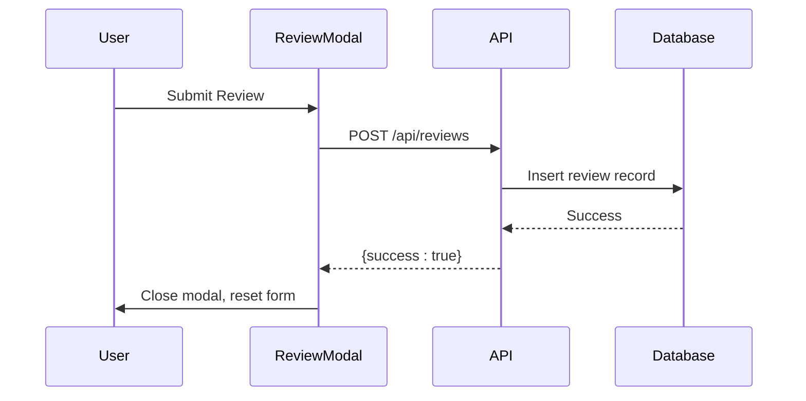

# ReviewModal Component

<cite>
**Referenced Files in This Document**   
- [ReviewModal.tsx](file://src/react-app/components/ReviewModal.tsx#L1-L186)
- [index.ts](file://src/worker/index.ts#L1400-L1450)
- [types.ts](file://src/shared/types.ts#L100-L120)
- [PropertyCard.tsx](file://src/react-app/components/PropertyCard.tsx#L250-L270)
</cite>

## Table of Contents
1. [Introduction](#introduction)
2. [Component Overview](#component-overview)
3. [Props and Configuration](#props-and-configuration)
4. [State Management](#state-management)
5. [User Experience Flow](#user-experience-flow)
6. [Form Validation and Accessibility](#form-validation-and-accessibility)
7. [API Integration and Submission Logic](#api-integration-and-submission-logic)
8. [Responsive Design](#responsive-design)
9. [Integration with PropertyCard Ratings](#integration-with-propertycard-ratings)
10. [Error Handling](#error-handling)

## Introduction
The **ReviewModal** component is a controlled modal dialog used to collect guest feedback and ratings after a stay. It enables users to submit star ratings and written comments, validates input, and communicates with the backend via API calls. This document details its implementation, integration points, user experience flow, and alignment with shared types.

**Section sources**
- [ReviewModal.tsx](file://src/react-app/components/ReviewModal.tsx#L1-L186)

## Component Overview
The **ReviewModal** is implemented as a React functional component that renders a modal when the `isOpen` prop is true. It captures user input for star ratings and comments, ensuring data integrity before submission. The modal displays property information, a rating selector, a comment field, and submission controls.

The component uses Tailwind CSS for styling and Lucide React icons for visual elements. It is designed to be accessible, responsive, and integrated with the authentication context via `useAuth`.



**Diagram sources**
- [ReviewModal.tsx](file://src/react-app/components/ReviewModal.tsx#L1-L186)

**Section sources**
- [ReviewModal.tsx](file://src/react-app/components/ReviewModal.tsx#L1-L186)

## Props and Configuration
The **ReviewModal** accepts the following props to control its behavior and data:

- **isOpen**: `boolean` - Controls modal visibility
- **onClose**: `() => void` - Callback triggered when modal is closed
- **property**: `Property` - The property being reviewed (from shared types)
- **bookingId**: `number | undefined` - Optional booking reference
- **onReviewSubmitted**: `() => void` - Callback after successful review submission

The `property` prop is typed using the `Property` interface from `src/shared/types.ts`, ensuring consistency across the application.

**Section sources**
- [ReviewModal.tsx](file://src/react-app/components/ReviewModal.tsx#L5-L11)
- [types.ts](file://src/shared/types.ts#L10-L30)

## State Management
The component manages several local states using React's `useState` hook:

- **rating**: `number` - Stores the selected star rating (1-5), initialized to 5
- **comment**: `string` - Stores the user's written review
- **submitting**: `boolean` - Tracks submission status to disable buttons during API calls
- **hoveredStar**: `number` - Enables visual feedback during star hover interactions

These states are updated via event handlers and reset upon successful submission using the `resetForm()` function.



**Diagram sources**
- [ReviewModal.tsx](file://src/react-app/components/ReviewModal.tsx#L13-L186)

**Section sources**
- [ReviewModal.tsx](file://src/react-app/components/ReviewModal.tsx#L13-L186)

## User Experience Flow
The user experience begins when the modal is triggered from the booking history page. The flow includes:

1. **Modal Opening**: Triggered by a button in the booking history
2. **Rating Selection**: Users click stars to select a rating (1-5), with hover feedback
3. **Comment Entry**: Optional text input for detailed feedback
4. **Submission**: Form submission via "Submit Review" button
5. **Feedback**: Visual loading indicator during submission
6. **Completion**: Modal closes and form resets upon success

The modal includes review guidelines to encourage constructive feedback and prevent inappropriate content.

**Section sources**
- [ReviewModal.tsx](file://src/react-app/components/ReviewModal.tsx#L1-L186)

## Form Validation and Accessibility
The component enforces validation rules:

- **Rating is required** (1-5 stars)
- **Comment is optional**
- **User must be authenticated** (checked via `useAuth`)

Accessibility features include:
- Proper ARIA labels and semantic HTML
- Keyboard navigation support
- Focus management
- Screen reader-friendly icons with titles
- High contrast color scheme

The form prevents submission if no rating is selected, and disables the submit button during the API call to prevent duplicate submissions.

**Section sources**
- [ReviewModal.tsx](file://src/react-app/components/ReviewModal.tsx#L60-L80)

## API Integration and Submission Logic
The **ReviewModal** submits reviews via a POST request to `/api/reviews`, which is handled by the backend in `src/worker/index.ts`. The request includes:

- **property_id**: From the `property.id`
- **booking_id**: Optional booking reference
- **rating**: Selected star rating
- **comment**: Trimmed user comment or null if empty



**Diagram sources**
- [ReviewModal.tsx](file://src/react-app/components/ReviewModal.tsx#L60-L90)
- [index.ts](file://src/worker/index.ts#L1400-L1450)

**Section sources**
- [ReviewModal.tsx](file://src/react-app/components/ReviewModal.tsx#L60-L90)
- [index.ts](file://src/worker/index.ts#L1400-L1450)

## Responsive Design
The modal is designed to be responsive across devices:

- **Mobile**: Full-screen overlay with vertical layout
- **Tablet/Desktop**: Centered dialog with max width of 40rem
- **Scrollable Content**: Overflow-y auto for long reviews
- **Touch-Friendly**: Large tap targets for star ratings

Tailwind CSS utilities ensure consistent spacing, typography, and layout across breakpoints.

**Section sources**
- [ReviewModal.tsx](file://src/react-app/components/ReviewModal.tsx#L120-L130)

## Integration with PropertyCard Ratings
After a review is submitted, the **PropertyCard** component displays updated ratings. It uses the `average_rating` and `review_count` fields from the `Property` object, which are updated in the database via the analytics system.

```tsx
{property.average_rating && property.average_rating > 0 && (
  <div className="flex items-center">
    <Star className="h-3 w-3 text-yellow-400 fill-current mr-1" />
    <span className="text-xs text-gray-600">
      {property.average_rating.toFixed(1)}
      {property.review_count && property.review_count > 0 && (
        <span className="text-gray-400"> ({property.review_count})</span>
      )}
    </span>
  </div>
)}
```

The backend updates the average rating in the `property_analytics` table whenever a new review is submitted, ensuring real-time accuracy.

**Section sources**
- [PropertyCard.tsx](file://src/react-app/components/PropertyCard.tsx#L250-L270)
- [index.ts](file://src/worker/index.ts#L1420-L1430)

## Error Handling
The component includes robust error handling:

- **Client-Side**: Prevents submission if user is unauthenticated or rating is missing
- **Server-Side**: Logs errors to console and displays generic messages
- **Network Errors**: Caught in try-catch block, with submission state reset in `finally`

The backend validates input and checks for duplicate reviews, returning appropriate HTTP status codes and error messages.

**Section sources**
- [ReviewModal.tsx](file://src/react-app/components/ReviewModal.tsx#L70-L90)
- [index.ts](file://src/worker/index.ts#L1400-L1450)