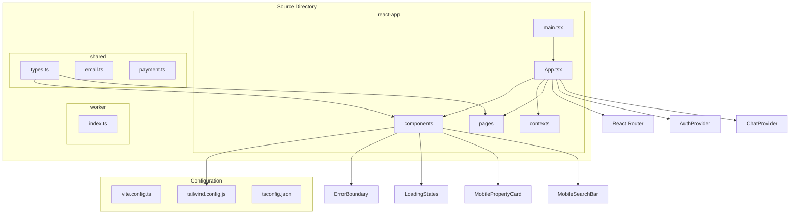
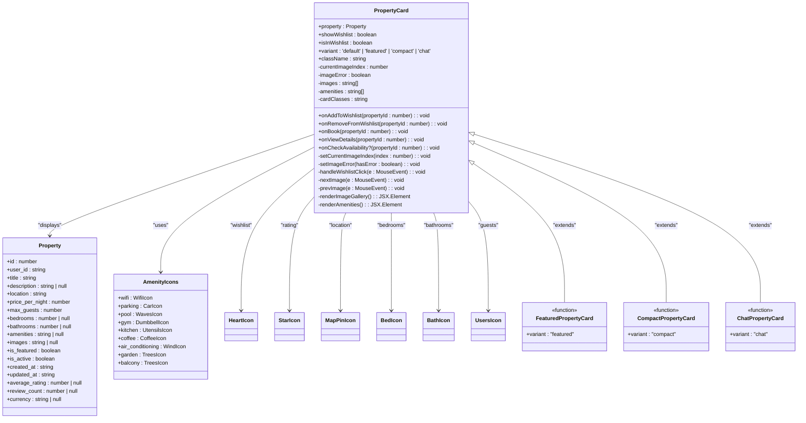
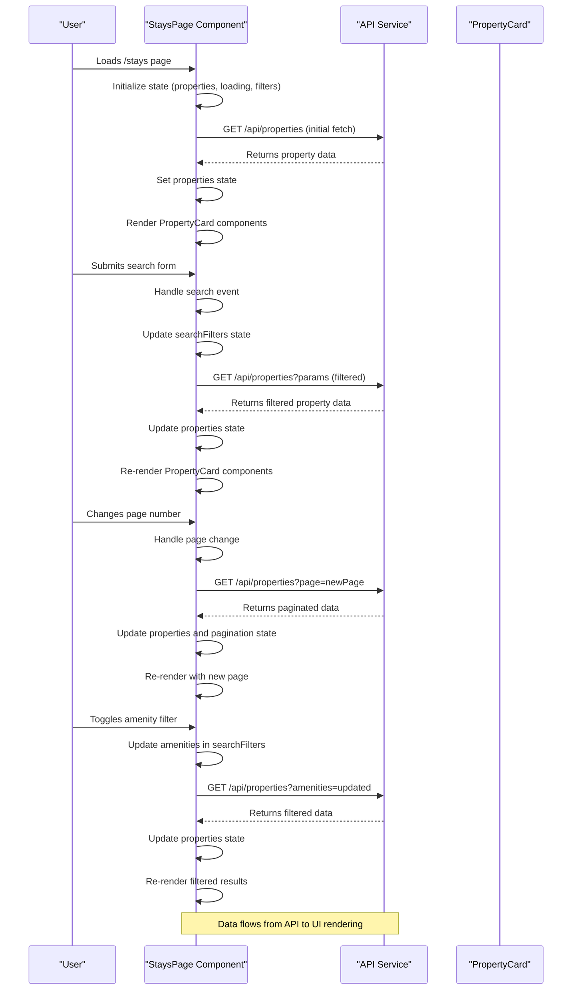
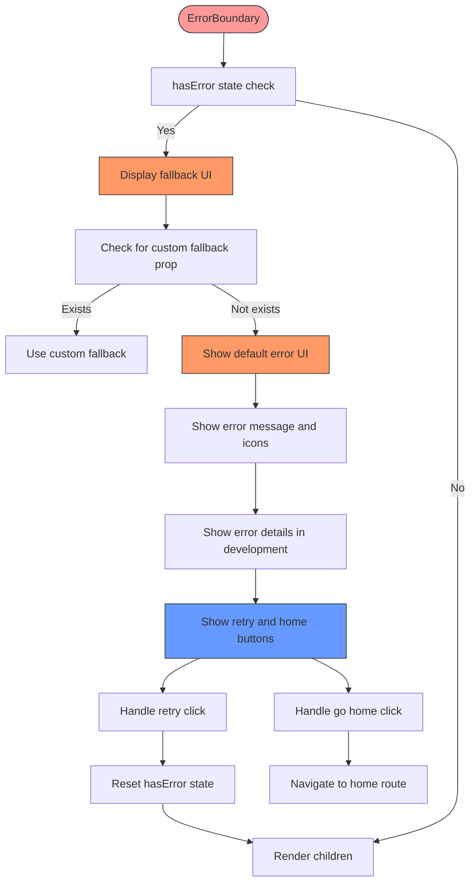
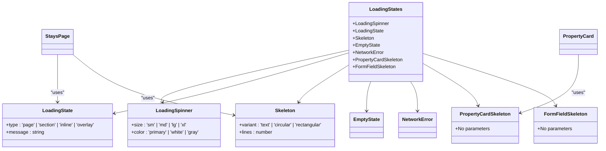
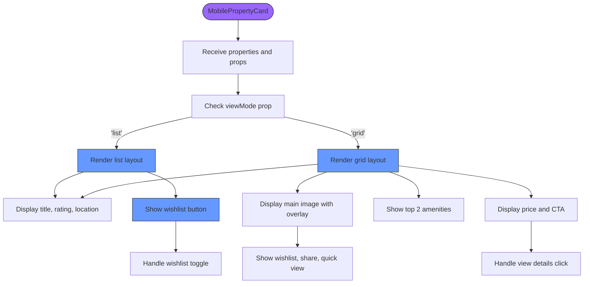
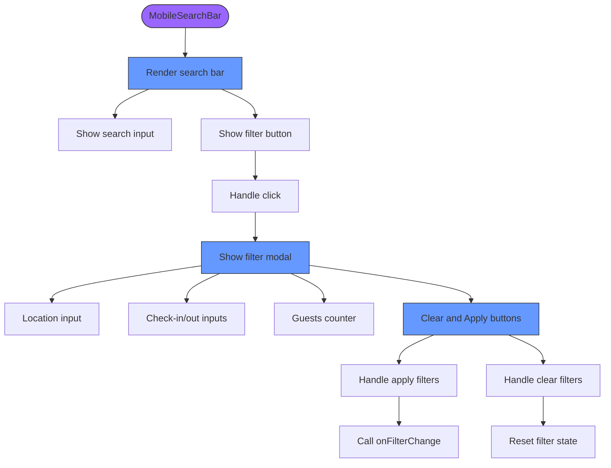
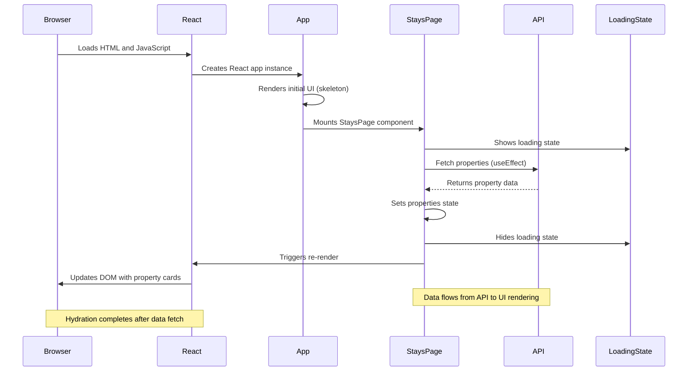

# Frontend Architecture

<cite>
**Referenced Files in This Document**   
- [App.tsx](file://src/react-app/App.tsx#L1-L67)
- [main.tsx](file://src/react-app/main.tsx#L1-L10)
- [PropertyCard.tsx](file://src/react-app/components/PropertyCard.tsx#L1-L425)
- [Stays.tsx](file://src/react-app/pages/Stays.tsx#L1-L515)
- [tailwind.config.js](file://tailwind.config.js#L1-L11)
- [vite.config.ts](file://vite.config.ts#L1-L21)
- [types.ts](file://src/shared/types.ts#L1-L599)
- [ErrorBoundary.tsx](file://src/react-app/components/ErrorBoundary.tsx#L1-L146) - *Added in recent commit*
- [LoadingStates.tsx](file://src/react-app/components/LoadingStates.tsx#L1-L326) - *Added in recent commit*
- [MobilePropertyCard.tsx](file://src/react-app/components/MobilePropertyCard.tsx#L1-L294) - *Added in recent commit*
- [MobileSearchBar.tsx](file://src/react-app/components/MobileSearchBar.tsx#L1-L263) - *Added in recent commit*
</cite>

## Update Summary
**Changes Made**   
- Added new sections for ErrorBoundary, LoadingStates, MobilePropertyCard, and MobileSearchBar components
- Updated Core Components section to include newly added components
- Enhanced Architecture Overview with mobile-specific components and error handling
- Added Dependency Analysis for new components
- Updated Performance Considerations with loading state patterns
- Added new diagrams for error handling and loading states

## Table of Contents
1. [Introduction](#introduction)
2. [Project Structure](#project-structure)
3. [Core Components](#core-components)
4. [Architecture Overview](#architecture-overview)
5. [Detailed Component Analysis](#detailed-component-analysis)
6. [Dependency Analysis](#dependency-analysis)
7. [Performance Considerations](#performance-considerations)

## Introduction
This document provides a comprehensive analysis of the React-based frontend architecture for HabibiStay, a modern property booking platform. The application leverages Vite as a build tool, TypeScript for type safety, and Tailwind CSS for utility-first styling. The architecture follows a component-based design pattern using functional components and React hooks, with React Router managing navigation between key pages. The system is structured to support both guest and host experiences, with specialized dashboards and property management features. Recent updates have introduced enhanced error handling, loading states, and mobile-optimized components to improve user experience across devices.

## Project Structure
The frontend application is organized within the `src/react-app` directory, following a feature-based structure that separates concerns into distinct folders. The architecture emphasizes modularity and reusability, with components, pages, and contexts clearly delineated. Recent additions include dedicated components for error handling, loading states, and mobile-specific UI elements.



**Diagram sources**
- [App.tsx](file://src/react-app/App.tsx#L1-L67)
- [main.tsx](file://src/react-app/main.tsx#L1-L10)
- [vite.config.ts](file://vite.config.ts#L1-L21)
- [ErrorBoundary.tsx](file://src/react-app/components/ErrorBoundary.tsx#L1-L146)
- [LoadingStates.tsx](file://src/react-app/components/LoadingStates.tsx#L1-L326)
- [MobilePropertyCard.tsx](file://src/react-app/components/MobilePropertyCard.tsx#L1-L294)
- [MobileSearchBar.tsx](file://src/react-app/components/MobileSearchBar.tsx#L1-L263)

**Section sources**
- [App.tsx](file://src/react-app/App.tsx#L1-L67)
- [main.tsx](file://src/react-app/main.tsx#L1-L10)
- [vite.config.ts](file://vite.config.ts#L1-L21)
- [ErrorBoundary.tsx](file://src/react-app/components/ErrorBoundary.tsx#L1-L146)
- [LoadingStates.tsx](file://src/react-app/components/LoadingStates.tsx#L1-L326)
- [MobilePropertyCard.tsx](file://src/react-app/components/MobilePropertyCard.tsx#L1-L294)
- [MobileSearchBar.tsx](file://src/react-app/components/MobileSearchBar.tsx#L1-L263)

## Core Components
The frontend architecture is built around several core components that form the foundation of the user interface and application behavior. The `App.tsx` file serves as the root component, orchestrating routing and context providers. The `PropertyCard` component is a reusable UI element for displaying property listings with multiple variants. The `Stays` page implements property search and filtering functionality, while the `main.tsx` file handles the application entry point and root rendering. Recent additions include `ErrorBoundary` for robust error handling, `LoadingStates` for consistent loading experiences, `MobilePropertyCard` for mobile-optimized property displays, and `MobileSearchBar` for enhanced mobile search functionality.

**Section sources**
- [App.tsx](file://src/react-app/App.tsx#L1-L67)
- [PropertyCard.tsx](file://src/react-app/components/PropertyCard.tsx#L1-L425)
- [Stays.tsx](file://src/react-app/pages/Stays.tsx#L1-L515)
- [main.tsx](file://src/react-app/main.tsx#L1-L10)
- [ErrorBoundary.tsx](file://src/react-app/components/ErrorBoundary.tsx#L1-L146)
- [LoadingStates.tsx](file://src/react-app/components/LoadingStates.tsx#L1-L326)
- [MobilePropertyCard.tsx](file://src/react-app/components/MobilePropertyCard.tsx#L1-L294)
- [MobileSearchBar.tsx](file://src/react-app/components/MobileSearchBar.tsx#L1-L263)

## Architecture Overview
The frontend architecture follows a modern React pattern with Vite as the build tool, enabling fast development server startup and optimized production builds. The application uses TypeScript for type safety across components and shared types, with a centralized types system in `shared/types.ts`. The UI is constructed using functional components and React hooks for state management and side effects. The architecture now includes comprehensive error handling through `ErrorBoundary`, standardized loading states, and mobile-optimized components for improved user experience on smaller screens.

```mermaid
graph TD
Client[Client Browser] --> |Loads| HTML[index.html]
HTML --> |Imports| Main[main.tsx]
Main --> |Renders| Root[React Root]
Root --> |Mounts| App[App.tsx]
App --> |Provides| Auth[AuthProvider]
App --> |Provides| Chat[ChatProvider]
App --> |Routes| Router[React Router]
Router --> Home[/]
Router --> Stays[/stays]
Router --> Dashboard[/dashboard]
Router --> Admin[/admin]
Router --> PropertyDetail[/property/:id]
App --> Navbar[Navbar Component]
App --> Footer[Footer Component]
App --> ChatBot[ChatBot Component]
App --> ErrorBoundary[ErrorBoundary]
Stays --> |Fetches| API[/api/properties]
API --> |Returns| Data[Property Data]
Data --> |Renders| PropertyCard[PropertyCard Components]
PropertyCard --> |Displays| Images[Property Images]
PropertyCard --> |Shows| Amenities[Amenity Icons]
PropertyCard --> |Includes| Actions[Action Buttons]
MobileSearchBar --> |Captures| SearchQuery[Search Parameters]
MobileSearchBar --> |Triggers| Stays[Stays Page]
LoadingStates --> |Displays| Spinner[Loading Spinner]
LoadingStates --> |Shows| Skeleton[Content Skeletons]
ErrorBoundary --> |Catches| Errors[Component Errors]
ErrorBoundary --> |Displays| Fallback[Error UI]
style HTML fill:#f9f,stroke:#333
style Main fill:#bbf,stroke:#333
style App fill:#bbf,stroke:#333
style Router fill:#f96,stroke:#333
style API fill:#69f,stroke:#333
style ErrorBoundary fill:#f66,stroke:#333
style LoadingStates fill:#6f9,stroke:#333
style MobileSearchBar fill:#96f,stroke:#333
```

**Diagram sources**
- [App.tsx](file://src/react-app/App.tsx#L1-L67)
- [main.tsx](file://src/react-app/main.tsx#L1-L10)
- [Stays.tsx](file://src/react-app/pages/Stays.tsx#L1-L515)
- [PropertyCard.tsx](file://src/react-app/components/PropertyCard.tsx#L1-L425)
- [ErrorBoundary.tsx](file://src/react-app/components/ErrorBoundary.tsx#L1-L146)
- [LoadingStates.tsx](file://src/react-app/components/LoadingStates.tsx#L1-L326)
- [MobileSearchBar.tsx](file://src/react-app/components/MobileSearchBar.tsx#L1-L263)

## Detailed Component Analysis

### App Component Analysis
The `App.tsx` file serves as the root component of the application, responsible for setting up the global context providers and routing structure. It wraps the entire application in `AuthProvider` and `ChatProvider` to manage authentication and chat functionality across all pages.

```mermaid
flowchart TD
Start([App Component]) --> AuthProvider["AuthProvider"]
AuthProvider --> ChatProvider["ChatProvider"]
ChatProvider --> Router["BrowserRouter"]
Router --> Layout["Layout Structure"]
Layout --> Navbar["Navbar Component"]
Layout --> Main["Main Content Area"]
Layout --> Footer["Footer Component"]
Layout --> ChatBot["ChatBot Component"]
Layout --> ErrorBoundary["ErrorBoundary"]
Main --> Routes["Routes Configuration"]
Routes --> HomeRoute["Route: / → HomePage"]
Routes --> StaysRoute["Route: /stays → StaysPage"]
Routes --> OwnersRoute["Route: /owners → OwnersPage"]
Routes --> InvestRoute["Route: /invest → InvestPage"]
Routes --> AboutRoute["Route: /about → AboutPage"]
Routes --> StoriesRoute["Route: /stories → StoriesPage"]
Routes --> BlogRoute["Route: /blog → BlogPage"]
Routes --> ContactRoute["Route: /contact → ContactPage"]
Routes --> PropertyRoute["Route: /property/:id → PropertyDetailPage"]
Routes --> AuthCallbackRoute["Route: /auth/callback → AuthCallbackPage"]
Routes --> PrivacyRoute["Route: /privacy → PrivacyPage"]
Routes --> TermsRoute["Route: /terms → TermsPage"]
Routes --> CookiesRoute["Route: /cookies → CookiesPage"]
Routes --> DashboardRoute["Route: /dashboard → DashboardPage"]
Routes --> AdminRoute["Route: /admin → AdminDashboardPage"]
Routes --> ProfileRoute["Route: /profile → ProfilePage"]
Routes --> WishlistRoute["Route: /wishlist → WishlistPage"]
Routes --> PropertyFormRoute["Route: /properties/new → PropertyFormPage"]
Routes --> EditPropertyRoute["Route: /properties/:id/edit → PropertyFormPage"]
Routes --> PaymentSuccessRoute["Route: /payment/success → PaymentSuccessPage"]
Routes --> PaymentCancelRoute["Route: /payment/cancel → PaymentCancelPage"]
style Start fill:#f9f,stroke:#333
style AuthProvider fill:#bbf,stroke:#333
style ChatProvider fill:#bbf,stroke:#333
style Router fill:#f96,stroke:#333
style Layout fill:#9f9,stroke:#333
```



**Diagram sources**
- [App.tsx](file://src/react-app/App.tsx#L1-L67)

**Section sources**
- [App.tsx](file://src/react-app/App.tsx#L1-L67)

### PropertyCard Component Analysis
The `PropertyCard` component is a versatile UI element used throughout the application to display property listings. It supports multiple variants (default, featured, compact, chat) and handles complex interactions including image galleries, wishlist management, and booking actions.



**Diagram sources**
- [PropertyCard.tsx](file://src/react-app/components/PropertyCard.tsx#L1-L425)
- [types.ts](file://src/shared/types.ts#L1-L599)

**Section sources**
- [PropertyCard.tsx](file://src/react-app/components/PropertyCard.tsx#L1-L425)
- [types.ts](file://src/shared/types.ts#L1-L599)

### Stays Page Analysis
The `Stays` page implements a comprehensive property search and filtering interface, allowing users to discover accommodations based on location, dates, guests, and various amenities. It manages state for search parameters, handles API requests, and displays results with pagination.



**Diagram sources**
- [Stays.tsx](file://src/react-app/pages/Stays.tsx#L1-L515)
- [PropertyCard.tsx](file://src/react-app/components/PropertyCard.tsx#L1-L425)

**Section sources**
- [Stays.tsx](file://src/react-app/pages/Stays.tsx#L1-L515)

### ErrorBoundary Component Analysis
The `ErrorBoundary` component provides robust error handling for the application, catching JavaScript errors anywhere in the component tree and displaying a fallback UI instead of crashing the entire application. It includes retry functionality and navigation options.



**Diagram sources**
- [ErrorBoundary.tsx](file://src/react-app/components/ErrorBoundary.tsx#L1-L146)

**Section sources**
- [ErrorBoundary.tsx](file://src/react-app/components/ErrorBoundary.tsx#L1-L146)

### LoadingStates Component Analysis
The `LoadingStates` component provides a consistent set of loading indicators and skeletons across the application, including spinners, full-page loaders, and content skeletons that maintain layout during data fetching.



**Diagram sources**
- [LoadingStates.tsx](file://src/react-app/components/LoadingStates.tsx#L1-L326)

**Section sources**
- [LoadingStates.tsx](file://src/react-app/components/LoadingStates.tsx#L1-L326)

### MobilePropertyCard Component Analysis
The `MobilePropertyCard` component is optimized for mobile devices, providing a responsive property listing card with touch-friendly controls, swipe gestures, and condensed information display.



**Diagram sources**
- [MobilePropertyCard.tsx](file://src/react-app/components/MobilePropertyCard.tsx#L1-L294)

**Section sources**
- [MobilePropertyCard.tsx](file://src/react-app/components/MobilePropertyCard.tsx#L1-L294)

### MobileSearchBar Component Analysis
The `MobileSearchBar` component provides a mobile-optimized search interface with a bottom sheet modal for filters, ensuring easy access and usability on smaller screens.



**Diagram sources**
- [MobileSearchBar.tsx](file://src/react-app/components/MobileSearchBar.tsx#L1-L263)

**Section sources**
- [MobileSearchBar.tsx](file://src/react-app/components/MobileSearchBar.tsx#L1-L263)

## Dependency Analysis
The frontend application has a well-defined dependency structure, with clear relationships between components, contexts, and external services. The architecture minimizes circular dependencies and promotes reusability through shared types and utility functions. The new components integrate seamlessly with existing architecture, enhancing functionality without introducing complexity.

```mermaid
graph TD
App[App.tsx] --> AuthProvider[AuthProvider]
App --> ChatProvider[ChatProvider]
App --> Router[React Router]
App --> Navbar[Navbar]
App --> Footer[Footer]
App --> ChatBot[ChatBot]
App --> ErrorBoundary[ErrorBoundary]
Router --> HomePage[HomePage]
Router --> StaysPage[StaysPage]
Router --> OwnersPage[OwnersPage]
Router --> InvestPage[InvestPage]
Router --> AboutPage[AboutPage]
Router --> StoriesPage[StoriesPage]
Router --> BlogPage[BlogPage]
Router --> ContactPage[ContactPage]
Router --> PropertyDetailPage[PropertyDetailPage]
Router --> AuthCallbackPage[AuthCallbackPage]
Router --> PrivacyPage[PrivacyPage]
Router --> TermsPage[TermsPage]
Router --> CookiesPage[CookiesPage]
Router --> DashboardPage[DashboardPage]
Router --> AdminDashboardPage[AdminDashboardPage]
Router --> ProfilePage[ProfilePage]
Router --> WishlistPage[WishlistPage]
Router --> PropertyFormPage[PropertyFormPage]
Router --> PaymentSuccessPage[PaymentSuccessPage]
Router --> PaymentCancelPage[PaymentCancelPage]
StaysPage --> PropertyCard[PropertyCard]
StaysPage --> MobilePropertyCard[MobilePropertyCard]
StaysPage --> LoadingState[LoadingState]
StaysPage --> PropertyCardSkeleton[PropertyCardSkeleton]
PropertyDetailPage --> PropertyCard[PropertyCard]
DashboardPage --> PropertyCard[PropertyCard]
AdminDashboardPage --> PropertyCard[PropertyCard]
PropertyCard --> types[shared/types.ts]
StaysPage --> types
PropertyDetailPage --> types
PropertyFormPage --> types
main[main.tsx] --> App
main --> index.css
App --> tailwind[tailwind.config.js]
PropertyCard --> tailwind
StaysPage --> tailwind
App --> vite[vite.config.ts]
main --> vite
ErrorBoundary --> responsive[responsive utilities]
LoadingStates --> responsive
MobilePropertyCard --> responsive
MobileSearchBar --> responsive
MobileSearchBar --> StaysPage
style App fill:#bbf,stroke:#333
style StaysPage fill:#9f9,stroke:#333
style PropertyCard fill:#9f9,stroke:#333
style types fill:#f96,stroke:#333
style tailwind fill:#69f,stroke:#333
style vite fill:#69f,stroke:#333
style ErrorBoundary fill:#f66,stroke:#333
style LoadingStates fill:#6f9,stroke:#333
style MobilePropertyCard fill:#96f,stroke:#333
style MobileSearchBar fill:#96f,stroke:#333
```



**Diagram sources**
- [App.tsx](file://src/react-app/App.tsx#L1-L67)
- [Stays.tsx](file://src/react-app/pages/Stays.tsx#L1-L515)
- [PropertyCard.tsx](file://src/react-app/components/PropertyCard.tsx#L1-L425)
- [types.ts](file://src/shared/types.ts#L1-L599)
- [tailwind.config.js](file://tailwind.config.js#L1-L11)
- [vite.config.ts](file://vite.config.ts#L1-L21)
- [ErrorBoundary.tsx](file://src/react-app/components/ErrorBoundary.tsx#L1-L146)
- [LoadingStates.tsx](file://src/react-app/components/LoadingStates.tsx#L1-L326)
- [MobilePropertyCard.tsx](file://src/react-app/components/MobilePropertyCard.tsx#L1-L294)
- [MobileSearchBar.tsx](file://src/react-app/components/MobileSearchBar.tsx#L1-L263)

**Section sources**
- [App.tsx](file://src/react-app/App.tsx#L1-L67)
- [Stays.tsx](file://src/react-app/pages/Stays.tsx#L1-L515)
- [PropertyCard.tsx](file://src/react-app/components/PropertyCard.tsx#L1-L425)
- [ErrorBoundary.tsx](file://src/react-app/components/ErrorBoundary.tsx#L1-L146)
- [LoadingStates.tsx](file://src/react-app/components/LoadingStates.tsx#L1-L326)
- [MobilePropertyCard.tsx](file://src/react-app/components/MobilePropertyCard.tsx#L1-L294)
- [MobileSearchBar.tsx](file://src/react-app/components/MobileSearchBar.tsx#L1-L263)

## Performance Considerations
The frontend architecture incorporates several performance optimizations to ensure a responsive user experience. The application leverages React's built-in optimization patterns, including memoization of expensive computations and efficient state management. The new components enhance performance by providing optimized mobile experiences and reducing loading times through skeleton screens.

### Code Splitting and Lazy Loading
While not explicitly implemented in the current codebase, the routing structure is conducive to code splitting. Each page component could be lazy-loaded to reduce initial bundle size:

```mermaid
flowchart TD
InitialBundle["Initial Bundle (150KB)"] --> App[App.tsx]
InitialBundle --> main[main.tsx]
InitialBundle --> Router[React Router]
InitialBundle --> Shared[Shared Types]
InitialBundle --> ErrorBoundary[ErrorBoundary]
HomeChunk["Home Chunk (80KB)"] --> HomePage[HomePage]
HomeChunk --> Hero[Hero Section]
HomeChunk --> Features[Features]
StaysChunk["Stays Chunk (120KB)"] --> StaysPage[StaysPage]
StaysChunk --> Search[Search Form]
StaysChunk --> Filters[Filter Components]
StaysChunk --> PropertyCard[PropertyCard]
StaysChunk --> MobilePropertyCard[MobilePropertyCard]
StaysChunk --> LoadingState[LoadingState]
DashboardChunk["Dashboard Chunk (100KB)"] --> DashboardPage[DashboardPage]
DashboardChunk --> Bookings[Bookings]
DashboardChunk --> Properties[Properties]
AdminChunk["Admin Chunk (140KB)"] --> AdminDashboardPage[AdminDashboardPage]
AdminChunk --> Analytics[Analytics]
AdminChunk --> UserManagement[User Management]
User->>Client: Requests /
Client->>CDN: Downloads InitialBundle
Client->>App: Renders App
App->>CDN: Dynamically imports HomeChunk
CDN --> >Client: Returns HomeChunk
Client->>HomeChunk: Executes and renders
User->>Client: Navigates to /stays
Client->>App: Route change detected
App->>CDN: Dynamically imports StaysChunk
CDN --> >Client: Returns StaysChunk
Client->>StaysChunk: Executes and renders
style InitialBundle fill:#f99,stroke:#333
style HomeChunk fill:#9f9,stroke:#333
style StaysChunk fill:#9f9,stroke:#333
style DashboardChunk fill:#9f9,stroke:#333
style AdminChunk fill:#9f9,stroke:#333
```

### Data Flow and Hydration Timing
The application follows a standard React hydration pattern, with data fetching occurring after component mount. The `Stays` page demonstrates this pattern with its `useEffect` hook that fetches properties when the component mounts:



**Diagram sources**
- [Stays.tsx](file://src/react-app/pages/Stays.tsx#L1-L515)
- [main.tsx](file://src/react-app/main.tsx#L1-L10)
- [LoadingStates.tsx](file://src/react-app/components/LoadingStates.tsx#L1-L326)

**Section sources**
- [Stays.tsx](file://src/react-app/pages/Stays.tsx#L1-L515)
- [main.tsx](file://src/react-app/main.tsx#L1-L10)
- [LoadingStates.tsx](file://src/react-app/components/LoadingStates.tsx#L1-L326)