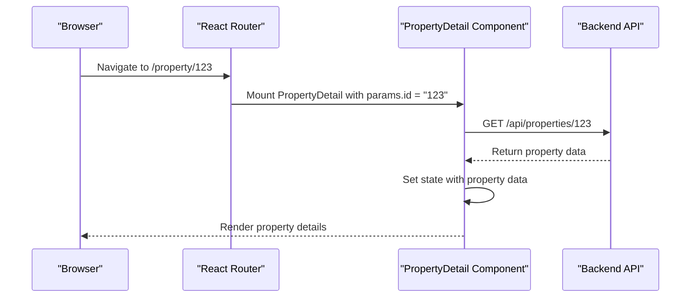
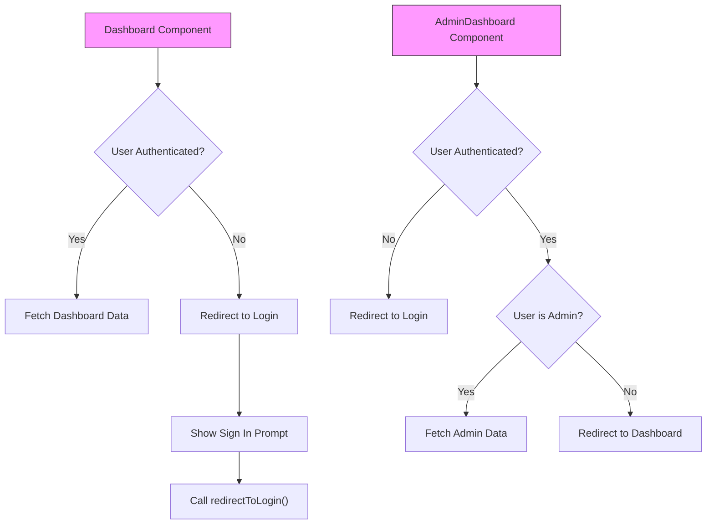
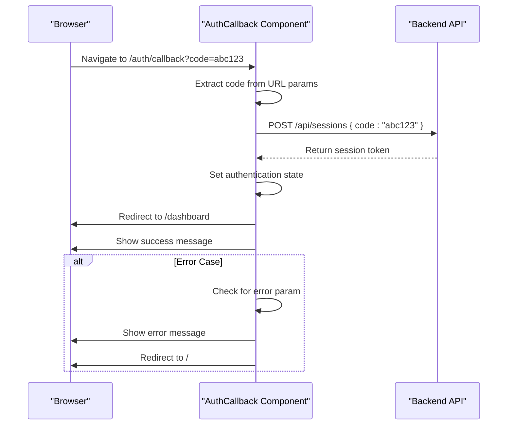
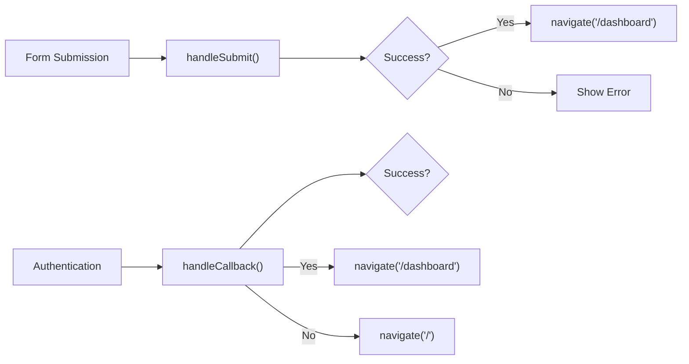
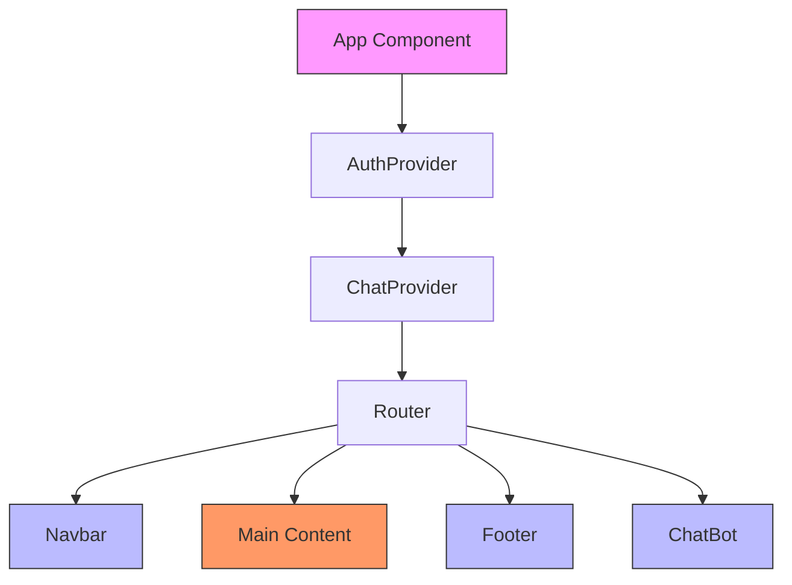
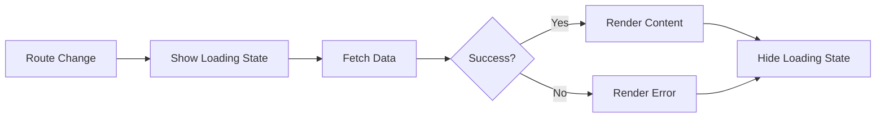
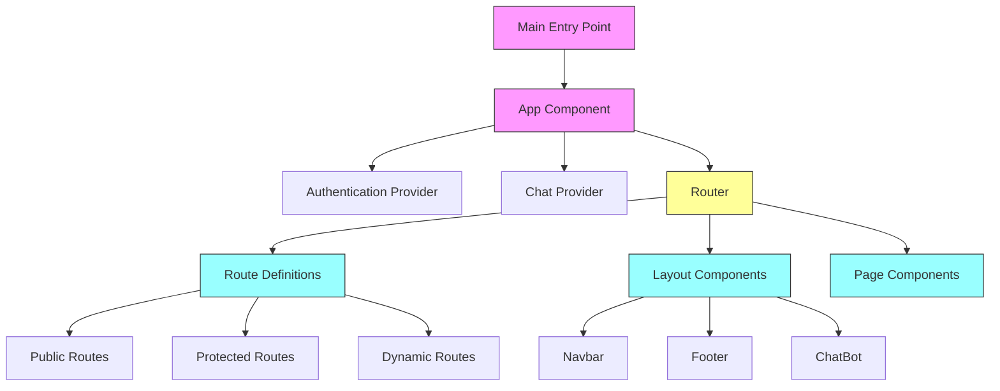

# Routing & Navigation

<cite>
**Referenced Files in This Document**   
- [App.tsx](file://src/react-app/App.tsx)
- [AuthCallback.tsx](file://src/react-app/pages/AuthCallback.tsx)
- [Dashboard.tsx](file://src/react-app/pages/Dashboard.tsx)
- [AdminDashboard.tsx](file://src/react-app/pages/AdminDashboard.tsx)
- [PropertyDetail.tsx](file://src/react-app/pages/PropertyDetail.tsx)
- [PropertyForm.tsx](file://src/react-app/pages/PropertyForm.tsx)
- [Navbar.tsx](file://src/react-app/components/Navbar.tsx)
- [main.tsx](file://src/react-app/main.tsx)
</cite>

## Table of Contents
1. [Introduction](#introduction)
2. [Route Definitions and Structure](#route-definitions-and-structure)
3. [Dynamic Routing Implementation](#dynamic-routing-implementation)
4. [Protected Routes and Authentication Guards](#protected-routes-and-authentication-guards)
5. [OAuth Callback Handling](#oauth-callback-handling)
6. [Navigation Patterns](#navigation-patterns)
7. [Layout and Component Orchestration](#layout-and-component-orchestration)
8. [Error Handling and Undefined Routes](#error-handling-and-undefined-routes)
9. [Performance and SEO Considerations](#performance-and-seo-considerations)
10. [Architecture Overview](#architecture-overview)

## Introduction
The HabibiStay application implements a client-side routing system using React Router to manage navigation between different views and pages. The routing architecture supports static pages, dynamic property detail routes, protected authenticated areas, and OAuth callback handling. This document details the implementation of the routing system, including route definitions, navigation patterns, authentication guards, and performance considerations.

## Route Definitions and Structure
The application defines all routes in the App.tsx file using React Router's Routes and Route components. The routing structure includes both public and protected routes, with a clear hierarchy of page components.

```mermaid
flowchart TD
A["App Component"] --> B["Router"]
B --> C["Routes"]
C --> D["Home: /"]
C --> E["Stays: /stays"]
C --> F["Owners: /owners"]
C --> G["Invest: /invest"]
C --> H["About: /about"]
C --> I["Stories: /stories"]
C --> J["Blog: /blog"]
C --> K["Contact: /contact"]
C --> L["Property Detail: /property/:id"]
C --> M["Auth Callback: /auth/callback"]
C --> N["Privacy: /privacy"]
C --> O["Terms: /terms"]
C --> P["Cookies: /cookies"]
C --> Q["Dashboard: /dashboard"]
C --> R["Admin Dashboard: /admin"]
C --> S["Profile: /profile"]
C --> T["Wishlist: /wishlist"]
C --> U["Property Form: /properties/new"]
C --> V["Property Edit: /properties/:id/edit"]
C --> W["Payment Success: /payment/success"]
C --> X["Payment Cancel: /payment/cancel"]
style A fill:#f9f,stroke:#333
style B fill:#ff9,stroke:#333
style C fill:#9ff,stroke:#333
```



**Diagram sources**
- [App.tsx](file://src/react-app/App.tsx#L1-L67)

**Section sources**
- [App.tsx](file://src/react-app/App.tsx#L1-L67)

## Dynamic Routing Implementation
The application implements dynamic routing for property details using URL parameters. The PropertyDetail component extracts the property ID from the URL and fetches the corresponding property data.



The dynamic routing is implemented using the useParams hook from React Router:

```typescript
const { id } = useParams<{ id: string }>();
```

This allows the PropertyDetail component to access the ID parameter from the URL and use it to fetch the appropriate property data from the backend API. The component also implements loading states during data fetching and handles cases where the property data is not found.

**Diagram sources**
- [PropertyDetail.tsx](file://src/react-app/pages/PropertyDetail.tsx#L1-L199)

**Section sources**
- [PropertyDetail.tsx](file://src/react-app/pages/PropertyDetail.tsx#L1-L199)

## Protected Routes and Authentication Guards
The application implements protected routes for authenticated areas such as the Dashboard and AdminDashboard. Instead of using a custom ProtectedRoute component, the protection is implemented within the page components themselves using the useAuth hook.



The authentication guard logic is implemented as follows:

1. The component checks if the user is authenticated using the useAuth hook
2. If not authenticated, it displays a sign-in prompt and provides a button to trigger redirectToLogin()
3. If authenticated, it proceeds to fetch user-specific data
4. For admin routes, additional role-based checks are performed

This approach ensures that sensitive data is not exposed to unauthenticated users and provides a seamless redirect experience.

**Diagram sources**
- [Dashboard.tsx](file://src/react-app/pages/Dashboard.tsx#L1-L199)
- [AdminDashboard.tsx](file://src/react-app/pages/AdminDashboard.tsx#L1-L199)

**Section sources**
- [Dashboard.tsx](file://src/react-app/pages/Dashboard.tsx#L1-L199)
- [AdminDashboard.tsx](file://src/react-app/pages/AdminDashboard.tsx#L1-L199)

## OAuth Callback Handling
The AuthCallback component handles the OAuth callback flow after a user authenticates with a third-party provider. It processes the authorization code and exchanges it for a session token.



The AuthCallback component implements the following logic:

1. Extracts the authorization code from the URL parameters using useSearchParams
2. Validates the presence of the code parameter
3. Sends the code to the backend API to exchange for a session token
4. Handles success and error cases with appropriate user feedback
5. Implements automatic redirects after a delay

The component also provides visual feedback during the authentication process, showing loading spinners, success messages, or error notifications based on the outcome of the authentication flow.

**Diagram sources**
- [AuthCallback.tsx](file://src/react-app/pages/AuthCallback.tsx#L1-L106)

**Section sources**
- [AuthCallback.tsx](file://src/react-app/pages/AuthCallback.tsx#L1-L106)

## Navigation Patterns
The application implements various navigation patterns including declarative linking, programmatic navigation, and navigation guards.

### Declarative Navigation
The application uses React Router's Link component for declarative navigation in the Navbar and other UI elements:

```typescript
<Link to="/stays" className="nav-link">Stays</Link>
```

### Programmatic Navigation
Programmatic navigation is implemented using the useNavigate hook for post-action redirects:



Key examples of programmatic navigation include:
- Redirecting to the dashboard after successful property form submission
- Redirecting to the home page after failed authentication
- Navigating back to the properties list after editing a property

The useNavigate hook is imported and used as follows:
```typescript
const navigate = useNavigate();
// ...
navigate('/dashboard?tab=properties');
```

**Diagram sources**
- [PropertyForm.tsx](file://src/react-app/pages/PropertyForm.tsx#L1-L199)
- [AuthCallback.tsx](file://src/react-app/pages/AuthCallback.tsx#L1-L106)

**Section sources**
- [PropertyForm.tsx](file://src/react-app/pages/PropertyForm.tsx#L1-L199)
- [AuthCallback.tsx](file://src/react-app/pages/AuthCallback.tsx#L1-L106)

## Layout and Component Orchestration
The App component orchestrates the overall layout and routing structure of the application. It provides a consistent layout with shared components across all routes.



The layout structure includes:
- **Navbar**: Persistent navigation bar visible on all pages
- **Main Content**: Route-specific content rendered by React Router
- **Footer**: Persistent footer visible on all pages
- **ChatBot**: Persistent chat interface visible on all pages

The App component wraps the entire application with necessary context providers (AuthProvider and ChatProvider) and the Router component, ensuring that all child components have access to authentication state, chat functionality, and routing capabilities.

**Diagram sources**
- [App.tsx](file://src/react-app/App.tsx#L1-L67)
- [main.tsx](file://src/react-app/main.tsx#L1-L10)

**Section sources**
- [App.tsx](file://src/react-app/App.tsx#L1-L67)
- [main.tsx](file://src/react-app/main.tsx#L1-L10)

## Error Handling and Undefined Routes
The application currently does not implement explicit handling for undefined routes. When a user navigates to a non-existent route, the application will not render any content within the main section, as there is no catch-all route defined.

However, the application implements error handling within individual route components:

1. **Loading States**: Components show loading spinners while fetching data
2. **Data Fetching Errors**: Components handle API errors gracefully without crashing
3. **Form Validation**: Form components validate input before submission
4. **Authentication Errors**: AuthCallback component handles OAuth errors

For improved user experience, the application could implement a dedicated 404 page for undefined routes:

```typescript
<Route path="*" element={<NotFoundPage />} />
```

This would provide a consistent experience when users navigate to non-existent pages.

**Section sources**
- [App.tsx](file://src/react-app/App.tsx#L1-L67)
- [PropertyDetail.tsx](file://src/react-app/pages/PropertyDetail.tsx#L1-L199)

## Performance and SEO Considerations
The client-side routing implementation has implications for both performance and SEO.

### Performance Characteristics
- **Initial Load**: The entire application bundle is loaded on first visit
- **Route Transitions**: Subsequent navigation is fast as only component code is loaded
- **Code Splitting**: The current implementation does not appear to use code splitting
- **Hydration**: The application hydrates on the client side after initial render

### SEO Implications
Client-side routing can negatively impact SEO as search engine crawlers may not execute JavaScript to discover all routes. To improve SEO, the application could implement:

1. **Server-Side Rendering (SSR)**: Render pages on the server for better crawler visibility
2. **Static Site Generation (SSG)**: Pre-render pages at build time
3. **Dynamic Sitemap**: Generate a sitemap.xml with all available routes
4. **Meta Tags**: Implement proper meta tags for each route

### Loading States
The application implements loading states during navigation and data fetching:



Components like Dashboard and PropertyDetail show skeleton loaders while data is being fetched, providing visual feedback to users.

**Section sources**
- [Dashboard.tsx](file://src/react-app/pages/Dashboard.tsx#L1-L199)
- [PropertyDetail.tsx](file://src/react-app/pages/PropertyDetail.tsx#L1-L199)
- [App.tsx](file://src/react-app/App.tsx#L1-L67)

## Architecture Overview
The routing architecture of HabibiStay follows a centralized approach with all routes defined in a single location (App.tsx). This provides clear visibility into the application's navigation structure and makes it easy to manage route configurations.



The architecture leverages React Router for client-side navigation while integrating with the application's authentication system to protect sensitive routes. The use of context providers ensures that authentication and chat state are available to all components that need them.

**Diagram sources**
- [App.tsx](file://src/react-app/App.tsx#L1-L67)
- [main.tsx](file://src/react-app/main.tsx#L1-L10)