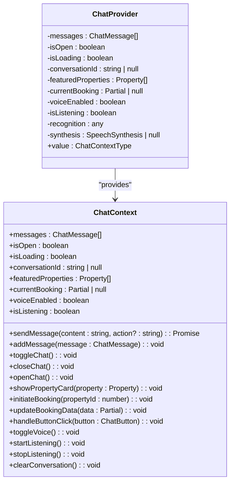
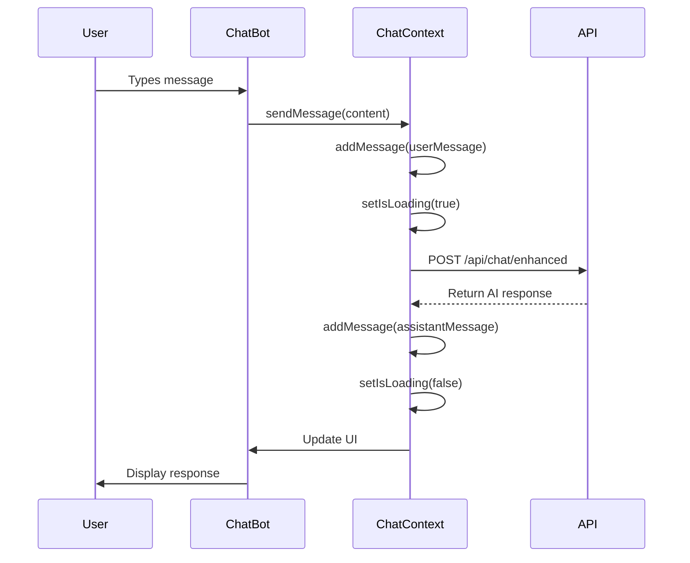
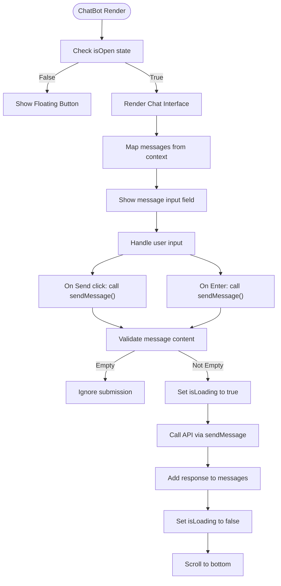
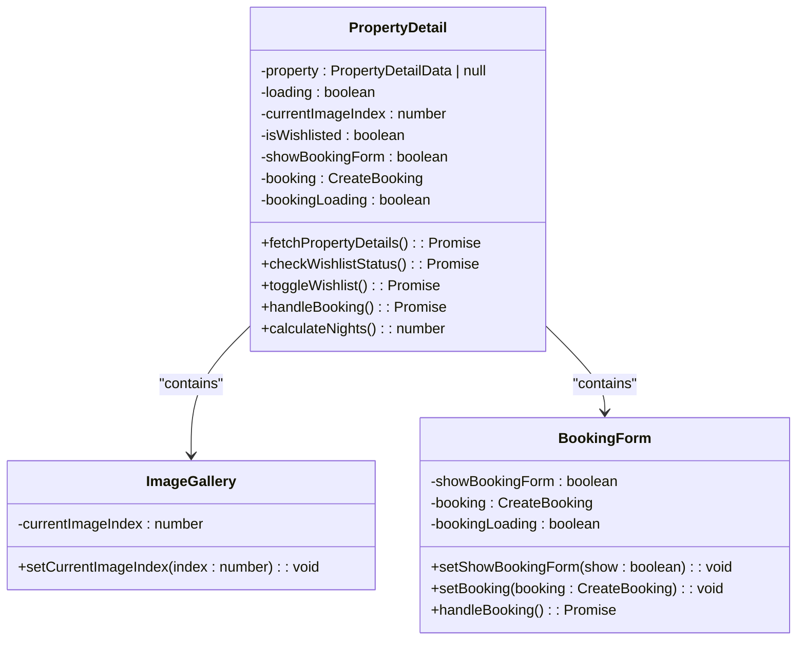
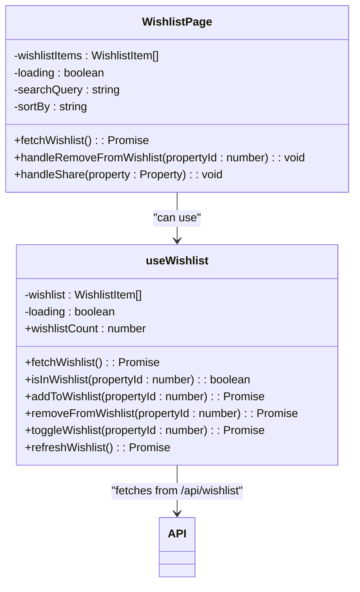

# State Management

<cite>
**Referenced Files in This Document**   
- [ChatContext.tsx](file://src/react-app/contexts/ChatContext.tsx)
- [ChatBot.tsx](file://src/react-app/components/ChatBot.tsx)
- [PropertyDetail.tsx](file://src/react-app/pages/PropertyDetail.tsx)
- [useWishlist.ts](file://src/react-app/hooks/useWishlist.ts)
- [Wishlist.tsx](file://src/react-app/pages/Wishlist.tsx)
</cite>

## Table of Contents
1. [Global State with React Context API](#global-state-with-react-context-api)
2. [ChatContext Implementation](#chatcontext-implementation)
3. [ChatBot Component Consumption](#chatbot-component-consumption)
4. [Local State in PropertyDetail](#local-state-in-propertydetail)
5. [Wishlist State Management](#wishlist-state-management)
6. [Performance Considerations](#performance-considerations)

## Global State with React Context API

The HabibiStay frontend employs React Context API as its primary mechanism for global state management, particularly for the AI chatbot functionality. This approach enables state sharing across deeply nested components without prop drilling, making it ideal for features like the chatbot that need to be accessible from multiple pages and components throughout the application.

React Context is used to manage the state of the AI assistant "Sara", including conversation history, loading states, voice interaction flags, and booking data. The decision to use Context API aligns with React's recommended patterns for state that is truly global to the application or major sections of it.

**Section sources**
- [ChatContext.tsx](file://src/react-app/contexts/ChatContext.tsx#L0-L47)

## ChatContext Implementation

The ChatContext implementation demonstrates a comprehensive use of React's built-in state management hooks to maintain the chatbot's state. Rather than using useReducer for complex state logic, the implementation relies on multiple useState hooks to manage discrete pieces of state.



**Diagram sources**
- [ChatContext.tsx](file://src/react-app/contexts/ChatContext.tsx#L45-L62)

The ChatContext maintains several state variables using useState:

- **messages**: Array of ChatMessage objects representing the conversation history
- **isOpen**: Boolean indicating whether the chat interface is visible
- **isLoading**: Boolean flag for API request states
- **conversationId**: String identifier for the current conversation
- **featuredProperties**: Array of Property objects for recommendations
- **currentBooking**: Partial booking data being collected
- **voiceEnabled** and **isListening**: Flags for voice interaction states

The context also implements persistence by saving conversation state to localStorage with a 30-minute timeout, ensuring users don't lose their chat history when navigating the site.



**Diagram sources**
- [ChatContext.tsx](file://src/react-app/contexts/ChatContext.tsx#L189-L219)
- [ChatContext.tsx](file://src/react-app/contexts/ChatContext.tsx#L102-L139)

**Section sources**
- [ChatContext.tsx](file://src/react-app/contexts/ChatContext.tsx#L45-L62)
- [ChatContext.tsx](file://src/react-app/contexts/ChatContext.tsx#L102-L139)
- [ChatContext.tsx](file://src/react-app/contexts/ChatContext.tsx#L189-L219)

## ChatBot Component Consumption

The ChatBot component consumes the ChatContext to access and manipulate the chat state. It uses the useChat() hook to access all context values, including messages, loading states, and action methods.

The component renders the conversation history by mapping over the messages array from context, displaying timestamps and message content. It handles user input by calling the sendMessage function from context when the user submits a message or presses Enter.



**Diagram sources**
- [ChatBot.tsx](file://src/react-app/components/ChatBot.tsx#L327-L344)

The component also manages UI-specific state like the input field value, but delegates all business logic and state persistence to the context. This separation of concerns keeps the component focused on presentation while the context handles data management.

**Section sources**
- [ChatBot.tsx](file://src/react-app/components/ChatBot.tsx#L327-L344)

## Local State in PropertyDetail

For UI-specific interactions, the PropertyDetail component uses local component state with useState. This approach is appropriate for state that is not shared with other components and is specific to the user interface of a single page.

The component manages several local state variables:

- **property**: The property data fetched from the API
- **loading**: Loading state during data fetch
- **currentImageIndex**: Current image in the gallery carousel
- **isWishlisted**: Whether the property is in the user's wishlist
- **showBookingForm**: Whether the booking form is expanded
- **booking**: Form data for the booking request
- **bookingLoading**: Loading state during booking submission



**Diagram sources**
- [PropertyDetail.tsx](file://src/react-app/pages/PropertyDetail.tsx#L0-L561)

The image gallery functionality uses currentImageIndex to track which image is displayed, with navigation buttons that update this state. The booking form expands and collapses based on showBookingForm, and collects user input in the booking state object.

This local state management approach is optimal for the PropertyDetail page because the state is ephemeral and specific to the user's interaction with a single property page.

**Section sources**
- [PropertyDetail.tsx](file://src/react-app/pages/PropertyDetail.tsx#L0-L561)

## Wishlist State Management

The wishlist functionality demonstrates a hybrid approach to state management, combining local state with custom hooks and API integration. The application uses a custom useWishlist hook that encapsulates the logic for managing wishlist state.



**Diagram sources**
- [useWishlist.ts](file://src/react-app/hooks/useWishlist.ts#L0-L121)
- [Wishlist.tsx](file://src/react-app/pages/Wishlist.tsx#L0-L83)

The useWishlist hook manages state with useState for the wishlist array and loading status. It provides functions to add, remove, and toggle items in the wishlist, with all changes synchronized with the backend API.

The Wishlist page component also maintains its own local state for UI controls like search queries and sorting preferences, while using the hook for the core wishlist data.

This separation allows multiple components to share wishlist functionality while maintaining their own UI-specific state.

**Section sources**
- [useWishlist.ts](file://src/react-app/hooks/useWishlist.ts#L0-L121)
- [Wishlist.tsx](file://src/react-app/pages/Wishlist.tsx#L0-L83)

## Performance Considerations

The state management implementation in HabibiStay includes several performance optimizations to prevent unnecessary re-renders and maintain responsiveness.

The ChatContext uses useCallback to memoize all function references, ensuring that consumer components do not receive new function instances on every render:

```typescript
const sendMessage = useCallback(async (content: string, action?: string) => {
  // implementation
}, [isLoading]);

const toggleChat = useCallback(() => {
  setIsOpen(prev => !prev);
}, []);
```

This prevents downstream components from re-rendering when the parent re-renders but the function references remain stable.

For the PropertyDetail component, the image gallery could benefit from additional memoization. Currently, the entire component re-renders when currentImageIndex changes, but this could be optimized by extracting the gallery into a separate memoized component:

```mermaid
flowchart TD
A[PropertyDetail] --> B[ImageGallery]
B --> C[ImageDisplay]
B --> D[ThumbnailStrip]
B --> E[NavigationButtons]
style B fill:#f9f,stroke:#333,stroke-width:2px
style C fill:#bbf,stroke:#333,stroke-width:1px
style D fill:#bbf,stroke:#333,stroke-width:1px
style E fill:#bbf,stroke:#333,stroke-width:1px
note right of B
React.memo() applied
Only re-renders when
images or currentImageIndex
actually change
end note
```

**Diagram sources**
- [PropertyDetail.tsx](file://src/react-app/pages/PropertyDetail.tsx#L0-L561)

The useWishlist hook could also be enhanced with useMemo to prevent recalculation of derived values like wishlistCount when the wishlist array hasn't changed.

While the current implementation is functional, for larger applications with deeper component trees, migrating the ChatContext to useReducer might provide better performance by allowing more granular control over state updates and reducing the number of individual state setters.

**Section sources**
- [ChatContext.tsx](file://src/react-app/contexts/ChatContext.tsx#L382-L451)
- [PropertyDetail.tsx](file://src/react-app/pages/PropertyDetail.tsx#L0-L561)