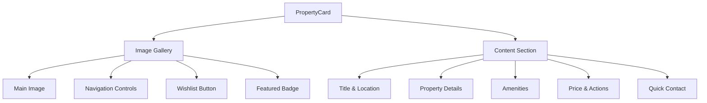
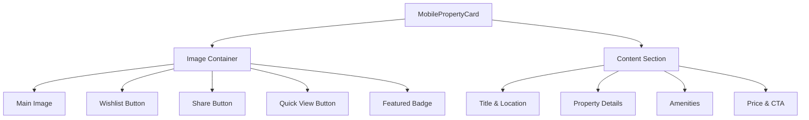
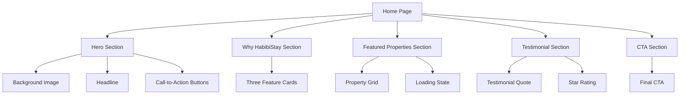

# Styling Strategy

<cite>
**Referenced Files in This Document**   
- [tailwind.config.js](file://tailwind.config.js) - *Updated with mobile safe areas and animations*
- [index.css](file://src/react-app/index.css)
- [PropertyCard.tsx](file://src/react-app/components/PropertyCard.tsx)
- [Home.tsx](file://src/react-app/pages/Home.tsx)
- [brand-system.ts](file://src/shared/brand-system.ts)
- [responsive-design.ts](file://src/shared/responsive-design.ts)
- [vite.config.ts](file://vite.config.ts)
- [MobilePropertyCard.tsx](file://src/react-app/components/MobilePropertyCard.tsx) - *Added in recent commit*
- [MobileSearchBar.tsx](file://src/react-app/components/MobileSearchBar.tsx) - *Added in recent commit*
- [responsive.ts](file://src/react-app/utils/responsive.ts) - *Enhanced with mobile components*
</cite>

## Update Summary
**Changes Made**   
- Added new section on mobile-optimized components and bottom sheet patterns
- Updated responsive design section with mobile-specific utilities
- Enhanced component analysis with MobilePropertyCard and MobileSearchBar details
- Added documentation for pull handles, safe areas, and touch targets
- Updated source references to reflect new and modified files

## Table of Contents
1. [Introduction](#introduction)
2. [Tailwind CSS Configuration](#tailwind-css-configuration)
3. [Global Styles and Base Reset](#global-styles-and-base-reset)
4. [Responsive Design Implementation](#responsive-design-implementation)
5. [Component-Level Styling Analysis](#component-level-styling-analysis)
6. [Conditional and Dynamic Styling Patterns](#conditional-and-dynamic-styling-patterns)
7. [Performance Optimization and Build Configuration](#performance-optimization-and-build-configuration)
8. [Best Practices and Recommendations](#best-practices-and-recommendations)

## Introduction
HabibiStay employs a modern, utility-first styling architecture using Tailwind CSS to enable rapid UI development with minimal custom CSS. This approach allows developers to build consistent, responsive interfaces directly within JSX/TSX components using atomic classes. The styling system is designed for scalability, maintainability, and performance, leveraging Tailwind's powerful configuration capabilities and integration with Vite for optimized production builds. This document explores the complete styling architecture, from global configuration to component-level implementation patterns.

## Tailwind CSS Configuration

The Tailwind configuration in `tailwind.config.js` extends the default theme with custom brand colors, typography, shadows, gradients, and animations that reflect HabibiStay's visual identity.

### Theme Extensions
The configuration extends the default theme with the following customizations:

**Custom Colors**
- **Primary Brand Palette**: A comprehensive blue-based color scale (`primary`) from 50 (lightest) to 950 (darkest), with `#2957c3` as the main brand color.
- **Brand Color Aliases**: Simplified references like `brand.blue`, `brand.blue-dark`, and `brand.blue-light` for consistent usage across components.

```js
colors: {
  primary: {
    50: '#eff6ff',
    100: '#dbeafe', 
    200: '#bfdbfe',
    300: '#93c5fd',
    400: '#60a5fa',
    500: '#2957c3', // Main brand color
    600: '#1e40af',
    700: '#1d4ed8',
    800: '#1e3a8a',
    900: '#1e3a8a',
    950: '#172554'
  },
  brand: {
    blue: '#2957c3',
    'blue-dark': '#1e40af',
    'blue-light': '#3b6cf7'
  }
}
```

**Typography**
- **Font Family**: Custom sans-serif stack using Inter as the primary font, followed by system fonts for optimal rendering.
```js
fontFamily: {
  sans: ['Inter', 'system-ui', 'sans-serif']
}
```

**Shadows and Gradients**
- **Brand Shadows**: Custom shadow utilities (`brand` and `brand-lg`) with brand blue transparency for consistent elevation.
- **Brand Gradient**: A 135-degree linear gradient from `#2957c3` to `#1e40af` for premium visual elements.

**Animations and Keyframes**
- **Custom Animations**: Predefined animations like `fade-in` and `slide-up` with associated keyframes for smooth transitions.
- **Reusable Keyframes**: Configured for opacity and transform transitions, enabling consistent animation behavior.

### Content Configuration for Purge
The `content` array specifies file paths to scan for class usage, enabling Tailwind to purge unused classes in production:
```js
content: [
  "./index.html",
  "./src/react-app/**/*.{js,ts,jsx,tsx}",
]
```
This ensures only classes actually used in the application are included in the final CSS bundle, significantly reducing file size.

**Section sources**
- [tailwind.config.js](file://tailwind.config.js#L1-L58)

## Global Styles and Base Reset

The global styles are defined in `index.css`, which serves as the entry point for Tailwind's styling system.

### Tailwind Layers
The file imports the three core Tailwind layers in the correct order:
```css
@tailwind base;
@tailwind components;
@tailwind utilities;
```
- **base**: Applies default styles for native HTML elements.
- **components**: Reserved for component classes (not heavily used in this utility-first approach).
- **utilities**: Contains all Tailwind's atomic utility classes.

### Custom Base Styles
A minimal custom style is applied to set the default font family:
```css
:root {
  font-family: Inter, system-ui, Avenir, Helvetica, Arial, sans-serif;
}
```
This ensures consistent typography across the application while allowing Tailwind classes to handle specific text styling.

**Section sources**
- [index.css](file://src/react-app/index.css#L1-L7)

## Responsive Design Implementation

HabibiStay implements a comprehensive responsive design system using Tailwind's breakpoint prefixes and shared utility modules.

### Breakpoint Strategy
The application uses Tailwind's default breakpoints:
- `sm`: 640px
- `md`: 768px
- `lg`: 1024px
- `xl`: 1280px

### Responsive Layout Patterns
The `responsive-design.ts` file contains predefined responsive classes for consistent implementation:

**Grid Layouts**
- Property listings use responsive grids that adapt to screen size:
```tsx
<div className="grid grid-cols-1 md:grid-cols-2 gap-8">
  {properties.map(property => (
    <PropertyCard key={property.id} property={property} />
  ))}
</div>
```

**Container Sizing**
- Consistent container widths with responsive padding:
```tsx
<div className="max-w-7xl mx-auto px-4 sm:px-6 lg:px-8">
```

### Responsive Typography
Text sizes adapt to screen size using breakpoint prefixes:
```tsx
<h1 className="text-4xl md:text-6xl font-bold">...</h1>
<p className="text-sm md:text-base">...</p>
```

### Mobile-First Approach
Components are designed mobile-first, with enhancements added at larger breakpoints:
- Hero section buttons stack vertically on mobile, display horizontally on larger screens
- Property cards display one per row on mobile, two per row on medium screens

### Mobile-Specific Components
New mobile-optimized components introduce specialized styling patterns:

**Bottom Sheets**
- Implemented in `MobileSearchBar` for filter modal:
```tsx
<div className={cn(
  responsiveClasses.mobile.bottomSheet,
  utils.safeBottom,
  'z-50 animate-slide-up'
)}>
```
- Features rounded top corners, shadow, and maximum height constraints

**Pull Handles**
- Visual indicator for draggable bottom sheets:
```tsx
<div className={responsiveClasses.mobile.pullHandle} />
```
- Centered thin bar using width, height, and rounded classes

**Safe Areas**
- Support for mobile device notches and rounded corners:
```js
spacing: {
  'safe-top': 'env(safe-area-inset-top)',
  'safe-bottom': 'env(safe-area-inset-bottom)'
}
```
- Applied via `utils.safeBottom` and `utils.safeTop` for proper spacing

**Touch Targets**
- Minimum 44px touch targets for accessibility:
```tsx
utils.touchButton: 'min-h-[44px] min-w-[44px] flex items-center justify-center'
```

**Section sources**
- [responsive-design.ts](file://src/shared/responsive-design.ts#L1-L54)
- [MobileSearchBar.tsx](file://src/react-app/components/MobileSearchBar.tsx#L1-L263)
- [responsive.ts](file://src/react-app/utils/responsive.ts#L1-L297)

## Component-Level Styling Analysis

### PropertyCard Component
The `PropertyCard` component demonstrates advanced Tailwind usage with multiple variants and dynamic styling.

#### Variant System
The component supports four variants through a prop-based system:
- **default**: Standard card with full details
- **featured**: Enhanced version with contact information
- **compact**: Space-efficient version for lists
- **chat**: Optimized for chat interfaces

```tsx
export const FeaturedPropertyCard = (props: Omit<PropertyCardProps, 'variant'>) => (
  <PropertyCard {...props} variant="featured" />
);
```

#### Responsive Design
The card adapts its layout based on variant and screen size:
- Image height adjusts (`h-32` vs `h-48`)
- Text size changes with variant
- Amenities display limited items in compact mode

#### Interactive Elements
- **Image Gallery**: Supports multiple images with navigation controls that appear on hover
- **Wishlist Button**: Conditionally rendered with heart icon that changes color when active
- **Featured Badge**: Displays "Featured" badge with brand blue background

#### Layout Structure
Uses a combination of:
- **Flexbox**: For horizontal alignment of details and actions
- **Grid**: For amenity icons layout
- **Positioning**: Absolute positioning for gallery controls and badges



**Diagram sources**
- [PropertyCard.tsx](file://src/react-app/components/PropertyCard.tsx#L1-L425)

**Section sources**
- [PropertyCard.tsx](file://src/react-app/components/PropertyCard.tsx#L1-L425)

### MobilePropertyCard Component
The `MobilePropertyCard` component is optimized for touch interfaces with two display modes.

#### View Modes
- **grid**: Full-featured card with image overlay actions
- **list**: Compact horizontal layout for dense listings

```tsx
{viewMode === 'list' ? (
  // Horizontal list layout
) : (
  // Grid layout with image overlay
)}
```

#### Mobile-Specific Features
- **Touch-Optimized Controls**: 44px minimum touch targets
- **Image Loading States**: Skeleton loaders with `animate-pulse`
- **Action Overlays**: Quick view button appears on hover with fade-in
- **Content Truncation**: `line-clamp` utilities for text overflow

#### Responsive Design
- Uses `responsiveClasses` from shared utilities
- Adapts padding, text size, and layout based on screen size
- Implements mobile-specific spacing and typography



**Diagram sources**
- [MobilePropertyCard.tsx](file://src/react-app/components/MobilePropertyCard.tsx#L1-L294)

**Section sources**
- [MobilePropertyCard.tsx](file://src/react-app/components/MobilePropertyCard.tsx#L1-L294)

### Home Page Component
The `Home` component showcases page-level layout patterns and section organization.

#### Hero Section
- Full-screen background with gradient overlay
- Centered content with responsive typography
- Call-to-action buttons with hover effects and subtle animations

#### Why HabibiStay Section
- Three-column grid on desktop, single column on mobile
- Card components with hover effects (scale and shadow)
- Icon containers with brand blue background

#### Featured Properties Section
- Conditional rendering for loading state with skeleton screens
- Grid layout that adapts to screen size
- Fallback content when no properties are available

#### Testimonial Section
- Full-width blue background with white text
- Star rating display using Lucide icons
- Quote styling with large, emphasized text

#### CTA Section
- Dark background with white text
- Button styling consistent with brand guidelines
- Centered layout with balanced spacing



**Diagram sources**
- [Home.tsx](file://src/react-app/pages/Home.tsx#L1-L225)

**Section sources**
- [Home.tsx](file://src/react-app/pages/Home.tsx#L1-L225)

## Conditional and Dynamic Styling Patterns

HabibiStay employs several patterns for conditional and dynamic styling while maintaining Tailwind's utility-first philosophy.

### clsx for Conditional Classes
The `clsx` utility is used extensively to conditionally apply classes based on props and state:

```tsx
const cardClasses = clsx(
  'bg-white border border-gray-200 rounded-lg shadow-sm overflow-hidden',
  {
    'hover:shadow-md': variant !== 'chat',
    'cursor-pointer': variant !== 'chat',
    'max-w-sm': variant === 'compact',
    'w-full': variant === 'chat',
  },
  className
);
```

This pattern allows for:
- **Conditional application**: Classes applied based on boolean conditions
- **Variant handling**: Different styles for different component variants
- **External class injection**: Support for custom className prop

### Template Literals for Dynamic Values
For dynamic color values, template literals are used with consistent hex codes:

```tsx
<div className="bg-[#2957c3] text-white">...</div>
```

This approach maintains brand consistency while allowing direct color application.

### Shared Design System
The `brand-system.ts` and `responsive-design.ts` files provide a centralized source of truth for styling:

**Brand Utilities**
- `getButtonClasses()`: Generates consistent button styles
- `getInputClasses()`: Standardizes input field appearance
- `getResponsiveTextClasses()`: Creates responsive typography

**Layout Utilities**
- Predefined grid configurations
- Consistent spacing and padding
- Responsive container patterns

These utilities ensure design consistency while reducing repetitive class combinations.

**Section sources**
- [PropertyCard.tsx](file://src/react-app/components/PropertyCard.tsx#L1-L425)
- [brand-system.ts](file://src/shared/brand-system.ts#L1-L335)
- [responsive-design.ts](file://src/shared/responsive-design.ts#L1-L333)

## Performance Optimization and Build Configuration

### Purge Unused Classes
Tailwind's content configuration ensures unused classes are removed in production:

```js
content: [
  "./index.html",
  "./src/react-app/**/*.{js,ts,jsx,tsx}",
]
```
This scans all relevant files to identify used classes, resulting in a significantly smaller CSS bundle.

### Vite Integration
The Vite configuration optimizes the build process:

```ts
export default defineConfig({
  plugins: [...mochaPlugins(process.env as any), react(), cloudflare()],
  build: {
    chunkSizeWarningLimit: 5000,
  },
  resolve: {
    alias: {
      "@": path.resolve(__dirname, "./src"),
    },
  },
});
```

Key performance features:
- **Chunk size warning**: Large chunks are flagged for optimization
- **Plugin optimization**: React and Cloudflare plugins are configured for production
- **Path aliases**: Improves import resolution and bundle optimization

### CSS Bundle Size
The combination of:
- Tailwind's purge functionality
- Vite's tree-shaking
- Utility-first approach minimizing custom CSS

Results in a lean, efficient CSS bundle that loads quickly and has minimal impact on performance.

### Development vs Production
- **Development**: All Tailwind classes available for rapid prototyping
- **Production**: Only used classes included, reducing file size by up to 90%

This enables fast development while ensuring optimal production performance.

**Section sources**
- [tailwind.config.js](file://tailwind.config.js#L1-L58)
- [vite.config.ts](file://vite.config.ts#L1-L21)

## Best Practices and Recommendations

### Class Organization
Follow these patterns for maintainable Tailwind usage:

**Logical Order**
1. Layout and positioning
2. Styling (colors, borders, shadows)
3. Typography
4. States (hover, focus)
5. Responsive variants

**Example:**
```tsx
<div className="
  flex 
  bg-white border border-gray-200 rounded-lg shadow-sm
  text-gray-900
  hover:shadow-md
  md:flex-row
">
```

### Avoiding Style Bloat
- **Use shared utilities**: Leverage `brand-system.ts` functions instead of repeating class combinations
- **Limit arbitrary values**: Avoid excessive use of arbitrary values like `bg-[#2957c3]`
- **Create component variants**: Use props to control appearance rather than creating multiple similar components

### Responsive Design
- **Mobile-first**: Design for mobile, enhance for larger screens
- **Consistent breakpoints**: Use standard Tailwind breakpoints
- **Test on real devices**: Verify responsive behavior across device sizes

### Dark Mode Considerations
While not currently implemented, the foundation exists for dark mode:
- Use semantic color names rather than literal colors
- Consider adding `dark:` variants for key components
- Implement a theme context for mode switching

### Performance
- **Optimize images**: Ensure images are properly sized and compressed
- **Lazy load components**: Use React lazy loading for non-critical components
- **Monitor bundle size**: Regularly check the impact of new dependencies

### Accessibility
- **Color contrast**: Ensure sufficient contrast ratios
- **Focus states**: Maintain visible focus indicators
- **Semantic HTML**: Use appropriate elements for content structure

By following these best practices, developers can maintain a consistent, performant, and scalable styling architecture that supports HabibiStay's growth and evolving design requirements.