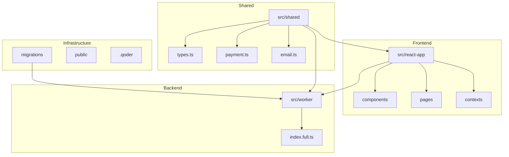
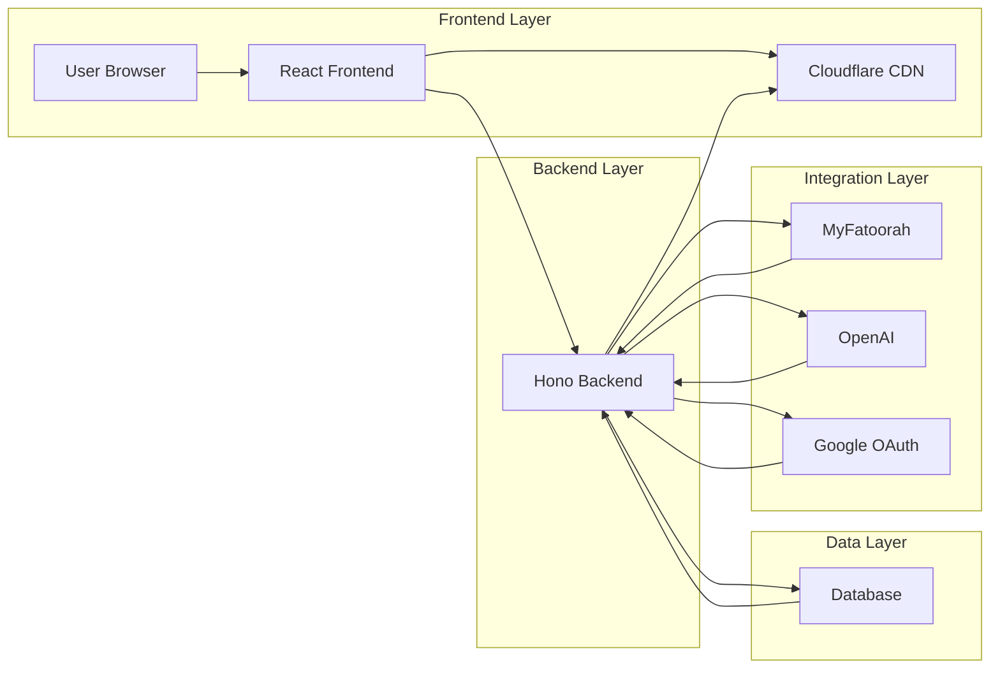
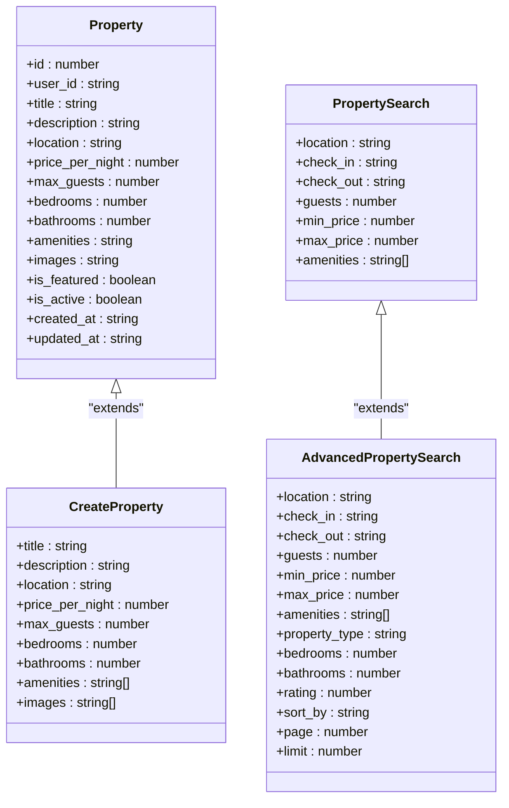
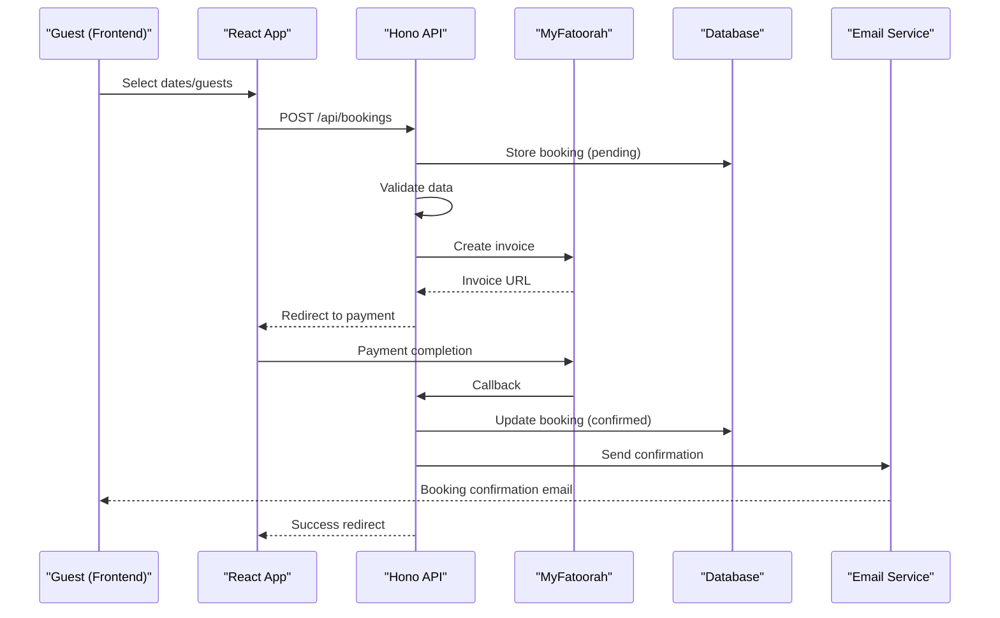
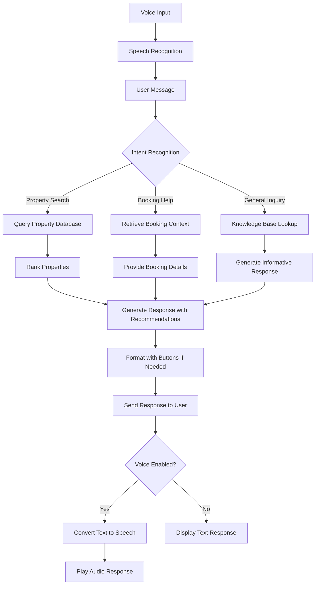
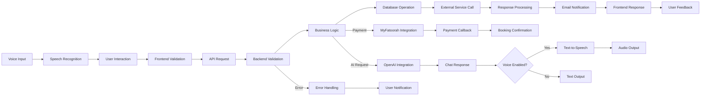
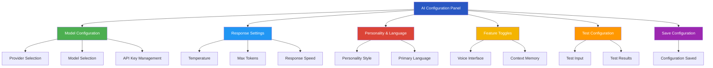

# System Overview

<cite>
**Referenced Files in This Document**   
- [types.ts](file://src/shared/types.ts)
- [payment.ts](file://src/shared/payment.ts)
- [email.ts](file://src/shared/email.ts)
- [Home.tsx](file://src/react-app/pages/Home.tsx)
- [Stays.tsx](file://src/react-app/pages/Stays.tsx)
- [Owners.tsx](file://src/react-app/pages/Owners.tsx)
- [Invest.tsx](file://src/react-app/pages/Invest.tsx)
- [AdminDashboard.tsx](file://src/react-app/pages/AdminDashboard.tsx)
- [worker/index.full.ts](file://src/worker/index.full.ts)
- [PropertyCard.tsx](file://src/react-app/components/PropertyCard.tsx)
- [ChatBot.tsx](file://src/react-app/components/ChatBot.tsx)
- [PaymentModal.tsx](file://src/react-app/components/PaymentModal.tsx)
- [ChatContext.tsx](file://src/react-app/contexts/ChatContext.tsx)
- [useVoiceInterface.ts](file://src/react-app/hooks/useVoiceInterface.ts)
- [AIConfigPanel.tsx](file://src/react-app/components/admin/AIConfigPanel.tsx)
- [README.md](file://README.md) - *Updated in recent commit*
</cite>

## Update Summary
**Changes Made**   
- Updated Introduction section with enhanced platform description from README.md
- Added comprehensive tech stack details from README.md
- Enhanced External Integrations section with PayPal and additional services
- Updated Architecture Overview with production-ready components
- Added detailed information about authentication using @getmocha/users-service
- Updated Data Flow section with enhanced payment and AI workflows
- Added references to updated README.md with comprehensive setup instructions

## Table of Contents
1. [Introduction](#introduction)
2. [Project Structure](#project-structure)
3. [Core Components](#core-components)
4. [Architecture Overview](#architecture-overview)
5. [Detailed Component Analysis](#detailed-component-analysis)
6. [User Journeys](#user-journeys)
7. [External Integrations](#external-integrations)
8. [Data Flow](#data-flow)
9. [AI Configuration and Management](#ai-configuration-and-management)
10. [Conclusion](#conclusion)

## Introduction

HabibiStay is a full-stack short-term rental marketplace platform specifically designed for the Riyadh real estate market. The platform serves three primary user groups: guests seeking premium accommodations, property owners looking to generate passive income, and investors interested in real estate investment opportunities. Built with a React 19 frontend and a Hono-based backend running on Cloudflare Workers, HabibiStay offers a scalable, serverless architecture optimized for performance and cost-efficiency.

The platform's core value propositions are centered around three pillars: booking exceptional stays in Riyadh, enabling property owners to earn hands-off income through professional management services, and providing investors with access to data-driven real estate investment opportunities in Saudi Arabia's rapidly growing market under Vision 2030. The platform supports property management, bookings, payments (MyFatoorah/PayPal), AI-powered chat, dynamic pricing, channel synchronization, and admin dashboards.

**Section sources**
- [Home.tsx](file://src/react-app/pages/Home.tsx#L1-L320)

## Project Structure

The HabibiStay repository follows a well-organized, modular structure that separates concerns between frontend, shared utilities, and backend components. The project is divided into three main directories under `src`: `react-app` for the frontend, `shared` for cross-platform types and utilities, and `worker` for the backend API.

The frontend uses React with TypeScript and is organized by components and pages, following a feature-based organization pattern. Shared types and utilities are centralized in the `shared` directory to ensure consistency across both frontend and backend. The backend is implemented as a Hono application running on Cloudflare Workers, providing a lightweight, serverless API layer.

Database migrations are managed through SQL files in the `migrations` directory, with corresponding up and down scripts for each version. Configuration files for TypeScript, ESLint, Tailwind CSS, and Vite indicate a modern development setup with strong typing, code quality enforcement, and responsive design capabilities.



**Diagram sources**
- [project_structure](file://#L1-L50)

**Section sources**
- [project_structure](file://#L1-L50)

## Core Components

The HabibiStay platform is built around several core components that define its functionality and user experience. The shared types system, implemented in `types.ts`, serves as the single source of truth for data structures across the application. This includes schemas for properties, bookings, reviews, user profiles, and financial transactions, all validated using Zod for runtime type safety.

The payment system, centered in `payment.ts`, integrates with MyFatoorah as the primary payment gateway, handling invoice creation, payment status tracking, and callback processing. The email service in `email.ts` manages transactional communications with predefined templates for booking confirmations, payment successes, and welcome messages.

Key frontend components include the property card, booking modal, payment modal, and AI chatbot, which work together to create a seamless user experience. The platform also includes specialized pages for different user roles: guests (Stays), owners (Owners), investors (Invest), and administrators (AdminDashboard).

The AI chatbot, named Sara, has been enhanced with voice functionality, allowing users to interact with the platform through voice commands. This feature is implemented through the Web Speech API, with voice input and output capabilities integrated into the chat interface.

**Section sources**
- [types.ts](file://src/shared/types.ts#L1-L599)
- [payment.ts](file://src/shared/payment.ts#L1-L165)
- [email.ts](file://src/shared/email.ts#L1-L249)
- [PropertyCard.tsx](file://src/react-app/components/PropertyCard.tsx)
- [PaymentModal.tsx](file://src/react-app/components/PaymentModal.tsx)
- [ChatBot.tsx](file://src/react-app/components/ChatBot.tsx)
- [ChatContext.tsx](file://src/react-app/contexts/ChatContext.tsx)
- [useVoiceInterface.ts](file://src/react-app/hooks/useVoiceInterface.ts)

## Architecture Overview

HabibiStay follows a modern full-stack architecture with a clear separation between frontend, backend, and data layers. The React frontend runs in the user's browser and communicates with a Hono-based backend API deployed on Cloudflare Workers. This serverless architecture provides automatic scaling, low latency through Cloudflare's global network, and cost efficiency by charging only for actual usage.

The backend exposes RESTful endpoints for property management, booking operations, user authentication, and payment processing. It interacts with a database (schema defined in migration files) to persist data and integrates with external services including MyFatoorah for payments, OpenAI for AI capabilities, and Google OAuth for authentication.

Data flows from the frontend through API calls to the backend, which processes business logic, validates data against shared schemas, interacts with the database, and returns responses. The shared directory ensures type consistency between frontend and backend, reducing integration errors and improving development efficiency.



**Diagram sources**
- [worker/index.full.ts](file://src/worker/index.full.ts)
- [types.ts](file://src/shared/types.ts)
- [Home.tsx](file://src/react-app/pages/Home.tsx)

## Detailed Component Analysis

### Property Management System

The property management system is central to HabibiStay's functionality, enabling owners to list properties and guests to discover accommodations. The `PropertySchema` defines the data structure with fields for title, description, location, pricing, capacity, amenities, and images. Properties can be marked as featured to highlight premium listings.

The frontend displays properties through the `PropertyCard` component, which shows key information and calls to action. The `Stays` page provides a comprehensive search interface with filters for location, dates, guests, price range, bedrooms, bathrooms, rating, and amenities. Advanced search capabilities are enabled through the `AdvancedPropertySearchSchema`, which supports sorting and pagination.



**Diagram sources**
- [types.ts](file://src/shared/types.ts#L1-L50)

**Section sources**
- [types.ts](file://src/shared/types.ts#L1-L599)
- [Stays.tsx](file://src/react-app/pages/Stays.tsx#L1-L515)
- [PropertyCard.tsx](file://src/react-app/components/PropertyCard.tsx)

### Booking and Payment System

The booking and payment system enables guests to reserve properties and complete transactions securely. The `BookingSchema` captures essential reservation details including guest information, dates, pricing, and status. The system integrates with MyFatoorah for payment processing, with the `MyFatoorahService` class handling invoice creation, payment status checks, and callbacks.

The `CreatePaymentSchema` defines the payment request structure, while `PaymentRequestSchema` and `PaymentStatusSchema` handle the MyFatoorah-specific payload formats. The payment flow begins with the frontend collecting booking details, creating a booking record, and then initiating a payment through MyFatoorah. Upon successful payment, the system updates the booking status and sends confirmation emails.



**Diagram sources**
- [types.ts](file://src/shared/types.ts#L50-L100)
- [payment.ts](file://src/shared/payment.ts#L1-L165)
- [worker/index.full.ts](file://src/worker/index.full.ts)

**Section sources**
- [types.ts](file://src/shared/types.ts#L50-L150)
- [payment.ts](file://src/shared/payment.ts#L1-L165)
- [PaymentModal.tsx](file://src/react-app/components/PaymentModal.tsx)

### AI Chatbot System

The AI chatbot, named Sara, provides personalized assistance to users throughout their journey. The system uses the `ChatContextSchema` to maintain conversation state, including user intent, property context, and booking information. The `AIConfigSchema` defines configuration for the AI provider (OpenAI), model parameters, and personality settings.

The chatbot can recommend properties, answer questions about bookings, and guide users through the platform. It integrates with the property search functionality to provide relevant recommendations and can initiate booking flows. The `ChatButtonSchema` enables interactive responses with actionable buttons that can trigger specific workflows.

The chatbot has been enhanced with voice functionality, allowing users to interact through speech. This feature is implemented using the Web Speech API, with both speech recognition and speech synthesis capabilities. Users can toggle voice input and output through the chat interface, enabling hands-free interaction with the platform.



**Diagram sources**
- [types.ts](file://src/shared/types.ts#L200-L250)
- [ChatBot.tsx](file://src/react-app/components/ChatBot.tsx)
- [ChatContext.tsx](file://src/react-app/contexts/ChatContext.tsx)
- [useVoiceInterface.ts](file://src/react-app/hooks/useVoiceInterface.ts)

**Section sources**
- [types.ts](file://src/shared/types.ts#L200-L300)
- [ChatBot.tsx](file://src/react-app/components/ChatBot.tsx)
- [ChatContext.tsx](file://src/react-app/contexts/ChatContext.tsx)
- [useVoiceInterface.ts](file://src/react-app/hooks/useVoiceInterface.ts)

## User Journeys

### Guest Journey

Guests begin their journey on the Home page, where they are introduced to the three value propositions: booking stays, property ownership, and investment opportunities. They can search for properties through the Stays page, using filters for location, dates, guests, price, and amenities. When they find a suitable property, they can initiate a booking through the BookingModal, which collects guest information and dates.

After submitting booking details, guests are redirected to MyFatoorah to complete payment. Upon successful payment, they receive a confirmation email and can access their booking details through their dashboard. The AI chatbot Sara is available throughout the journey to answer questions and provide recommendations.

Guests can interact with Sara using both text and voice commands. The voice interface allows users to search for properties, check availability, and get recommendations through natural speech. When voice output is enabled, Sara's responses are also spoken aloud, creating a more accessible and engaging experience.

**Section sources**
- [Home.tsx](file://src/react-app/pages/Home.tsx#L1-L320)
- [Stays.tsx](file://src/react-app/pages/Stays.tsx#L1-L515)
- [BookingModal.tsx](file://src/react-app/components/BookingModal.tsx)
- [ChatBot.tsx](file://src/react-app/components/ChatBot.tsx)

### Property Owner Journey

Property owners start by visiting the Owners page, which highlights the benefits of hands-off income generation through professional property management. They can contact the team to begin the onboarding process, which involves providing property details and signing management agreements.

Once onboarded, owners can access the Dashboard to view performance metrics, revenue reports, and booking calendars. The system handles all aspects of property management including guest communication, cleaning, maintenance, and pricing optimization. Owners receive monthly payouts with detailed performance reports, allowing them to monitor their investment returns.

**Section sources**
- [Owners.tsx](file://src/react-app/pages/Owners.tsx#L1-L250)
- [Dashboard.tsx](file://src/react-app/pages/Dashboard.tsx)

### Investor Journey

Investors are attracted to the Invest page, which showcases the opportunity to participate in Riyadh's real estate market with an average annual ROI of 17%. The platform offers different investment types including capital investment, international investment, and buy-to-let options.

The investment process begins with an initial consultation to understand the investor's goals, followed by due diligence on available opportunities. After deciding to invest, investors complete secure documentation and begin receiving regular payouts. The AdminDashboard provides investors with real-time performance metrics and market insights.

**Section sources**
- [Invest.tsx](file://src/react-app/pages/Invest.tsx#L1-L290)
- [AdminDashboard.tsx](file://src/react-app/pages/AdminDashboard.tsx)

### Administrator Journey

Administrators use the AdminDashboard to manage platform operations, monitor system performance, and oversee user accounts. The dashboard provides comprehensive analytics on bookings, revenue, user growth, and property performance. Administrators can manage property listings, approve new submissions, and handle customer support issues.

The system includes tools for managing AI configurations, email templates, and platform settings. Administrators can also generate financial reports, monitor payment processing, and analyze market trends to inform business decisions.

**Section sources**
- [AdminDashboard.tsx](file://src/react-app/pages/AdminDashboard.tsx)

## External Integrations

HabibiStay integrates with several external services to enhance functionality and provide specialized capabilities:

**MyFatoorah**: The primary payment gateway for processing transactions in Saudi Riyal. The integration handles invoice creation, payment status tracking, and callback processing to ensure secure and reliable payments.

**OpenAI**: Powers the AI chatbot Sara, providing natural language processing capabilities for user interactions, property recommendations, and personalized assistance.

**Google OAuth**: Enables secure user authentication with Google accounts, simplifying the login process and improving security through established identity verification.

**Cloudflare Workers**: Hosts the backend API, providing a serverless environment with global distribution, automatic scaling, and DDoS protection.

**Cloudflare CDN**: Serves static assets and cached content from locations close to users, reducing latency and improving page load times.

**PayPal**: Secondary payment provider supporting multiple currencies including USD, EUR, and GBP, providing international payment options for global users.

**@getmocha/users-service**: Authentication service for OAuth integration, handling user sessions and identity verification.

```mermaid
graph LR
A[HabibiStay Platform] --> B[MyFatoorah]
A --> C[OpenAI]
A --> D[Google OAuth]
A --> E[Cloudflare Workers]
A --> F[Cloudflare CDN]
A --> G[PayPal]
A --> H[@getmocha/users-service]
B --> G[Payment Processing]
C --> H[AI Chatbot]
D --> I[User Authentication]
E --> J[Serverless Backend]
F --> K[Content Delivery]
G --> L[International Payments]
H --> M[OAuth Integration]
style A fill:#2957c3,color:white
style B fill:#4CAF50,color:white
style C fill:#2196F3,color:white
style D fill:#DB4437,color:white
style E fill:#F4B400,color:white
style F fill:#FF9800,color:white
style G fill:#009688,color:white
style H fill:#9C27B0,color:white
```

**Diagram sources**
- [payment.ts](file://src/shared/payment.ts)
- [types.ts](file://src/shared/types.ts)
- [worker/index.full.ts](file://src/worker/index.full.ts)

## Data Flow

The data flow in HabibiStay follows a structured pattern from user interaction to persistent storage and external communication. When a user interacts with the frontend, data is collected and validated against shared schemas before being sent to the backend API. The backend processes the request, applies business logic, and interacts with the database to persist changes.

For payment transactions, the flow involves creating a booking record, generating a payment request to MyFatoorah, redirecting the user to complete payment, and processing the callback to update the booking status. Email notifications are triggered at key points in the journey, such as booking confirmation and payment success.

The AI chatbot maintains conversation context in memory or temporary storage, allowing it to provide coherent and personalized responses across multiple interactions. Analytics data is collected for properties and bookings, enabling performance reporting and data-driven decision making.

The voice interface adds an additional layer to the data flow, converting speech to text for user input and text to speech for AI responses. This functionality is implemented using the Web Speech API, with voice input and output states managed through the ChatContext.



**Diagram sources**
- [types.ts](file://src/shared/types.ts)
- [payment.ts](file://src/shared/payment.ts)
- [worker/index.full.ts](file://src/worker/index.full.ts)
- [ChatContext.tsx](file://src/react-app/contexts/ChatContext.tsx)
- [useVoiceInterface.ts](file://src/react-app/hooks/useVoiceInterface.ts)

## AI Configuration and Management

The AI chatbot Sara can be configured and managed through the AI Configuration Panel, accessible to administrators. This panel allows for fine-tuning of the AI's behavior, model selection, and feature toggles.

The configuration includes several key aspects:

- **Model Configuration**: Administrators can select the AI provider (OpenAI, Anthropic, or Google Gemini) and choose from various models based on performance and cost requirements.
- **Response Settings**: Temperature, max tokens, and response speed can be adjusted to balance creativity, consistency, and response time.
- **Personality & Language**: The AI's personality (professional, friendly, or casual) and primary language can be configured to match the desired user experience.
- **Feature Toggles**: Key features like voice interface and context memory can be enabled or disabled based on platform requirements.

The configuration panel also includes testing capabilities, allowing administrators to test changes before applying them to the production environment. Performance metrics are displayed to help monitor the AI's effectiveness and user satisfaction.



**Diagram sources**
- [AIConfigPanel.tsx](file://src/react-app/components/admin/AIConfigPanel.tsx)
- [types.ts](file://src/shared/types.ts)

**Section sources**
- [AIConfigPanel.tsx](file://src/react-app/components/admin/AIConfigPanel.tsx)
- [ChatContext.tsx](file://src/react-app/contexts/ChatContext.tsx)

## Conclusion

HabibiStay is a comprehensive short-term rental marketplace tailored for the Riyadh market, offering a sophisticated platform for guests, property owners, and investors. The architecture leverages modern technologies including React, Hono, and Cloudflare Workers to create a scalable, high-performance application.

The platform's strength lies in its three-pillar value proposition: providing exceptional booking experiences, enabling hands-off income generation for property owners, and offering data-driven investment opportunities. The integration of AI through the Sara chatbot enhances user experience, while the MyFatoorah payment integration ensures secure and reliable transactions.

The recent addition of voice functionality to the AI chatbot represents a significant enhancement to the user experience, allowing for more natural and accessible interactions with the platform. This feature is implemented using the Web Speech API and can be configured through the AI Configuration Panel.

The well-structured codebase with shared types and clear separation of concerns makes the platform maintainable and extensible. The modular design allows for easy addition of new features and integration with additional services as the platform grows.

For new developers, the clear project structure and comprehensive type definitions provide an accessible entry point. The use of modern development practices and tools ensures code quality and developer productivity.