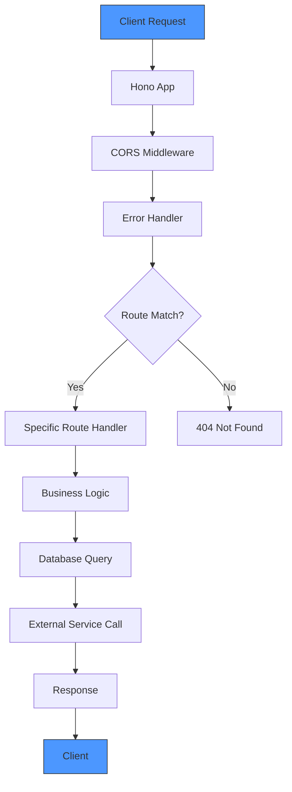
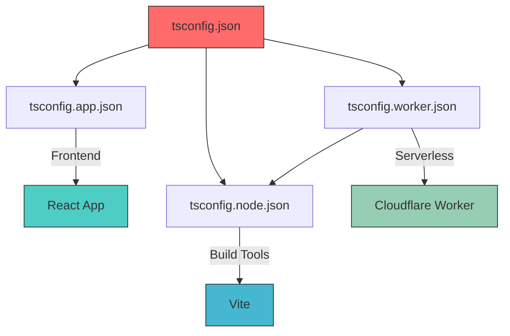

# Technology Stack

<cite>
**Referenced Files in This Document**   
- [package.json](file://package.json)
- [vite.config.ts](file://vite.config.ts)
- [tsconfig.json](file://tsconfig.json)
- [tsconfig.app.json](file://tsconfig.app.json)
- [tsconfig.node.json](file://tsconfig.node.json)
- [tsconfig.worker.json](file://tsconfig.worker.json)
- [src/worker/index.ts](file://src/worker/index.ts)
- [src/shared/types.ts](file://src/shared/types.ts)
- [src/shared/payment.ts](file://src/shared/payment.ts)
- [src/react-app/main.tsx](file://src/react-app/main.tsx)
- [src/react-app/App.tsx](file://src/react-app/App.tsx)
- [tailwind.config.js](file://tailwind.config.js)
- [postcss.config.js](file://postcss.config.js)
- [eslint.config.js](file://eslint.config.js)
</cite>

## Table of Contents
1. [Frontend Development with React and Vite](#frontend-development-with-react-and-vite)
2. [Backend API with Hono on Cloudflare Workers](#backend-api-with-hono-on-cloudflare-workers)
3. [Type Safety with TypeScript](#type-safety-with-typescript)
4. [Styling with Tailwind CSS](#styling-with-tailwind-css)
5. [Runtime Validation with Zod](#runtime-validation-with-zod)
6. [Serverless Deployment on Cloudflare Workers](#serverless-deployment-on-cloudflare-workers)
7. [Multi-Config TypeScript Setup](#multi-config-typescript-setup)
8. [Fast Development with Vite](#fast-development-with-vite)
9. [Linting with ESLint](#linting-with-eslint)
10. [Post-Processing with PostCSS](#post-processing-with-postcss)
11. [Icon Management with Lucide React](#icon-management-with-lucide-react)
12. [Dependency Management with npm](#dependency-management-with-npm)

## Frontend Development with React and Vite

The HabibiStay frontend is built using **React 19**, a modern JavaScript library for building user interfaces using a component-based architecture. React enables the creation of reusable UI components that efficiently update and render when application state changes. The application leverages React Router (v7) for client-side routing, managing navigation between pages such as Home, Property Detail, Dashboard, and Wishlist.

The frontend structure follows a modular organization with dedicated directories for components, contexts, hooks, and pages. Key UI components include:
- **Navbar** and **Footer** for consistent layout
- **PropertyCard** and **PropertyDetail** for property listings
- **BookingModal** and **PaymentModal** for transaction flows
- **ChatBot** for AI-powered guest assistance
- **ReviewModal** and **ReviewForm** for user feedback

State management is handled through React's built-in context API (`ChatContext.tsx`) and custom hooks (`useWishlist.ts`, `useVoiceInterface.ts`), providing a clean separation of concerns and enabling global state access without prop drilling.

**Section sources**
- [src/react-app/App.tsx](file://src/react-app/App.tsx#L1-L68)
- [src/react-app/main.tsx](file://src/react-app/main.tsx#L1-L11)
- [package.json](file://package.json#L4-L7)

## Backend API with Hono on Cloudflare Workers

The backend API is implemented using **Hono**, a lightweight and fast web framework designed specifically for serverless environments like Cloudflare Workers. Hono provides a simple and intuitive API for defining routes, handling requests, and integrating middleware.

The API is defined in `src/worker/index.ts` and exposes a comprehensive set of endpoints for property management, bookings, user profiles, wishlist operations, and AI chat functionality. Key features of the Hono implementation include:

- **Route Definition**: Clean, readable syntax for defining RESTful endpoints with path parameters and query parameters
- **Middleware Support**: Built-in and custom middleware for CORS, authentication, and error handling
- **Validation**: Integration with Zod through `@hono/zod-validator` for runtime request validation
- **TypeScript Support**: First-class TypeScript integration with proper type inference

The API architecture follows a service-oriented pattern, with separate concerns for:
- **Authentication**: Integration with `@getmocha/users-service` for OAuth flow and session management
- **Database Operations**: Direct D1 database queries using Cloudflare's `env.DB.prepare()`
- **External Services**: Integration with OpenAI for AI chat and MyFatoorah for payment processing
- **Email Services**: Template-based email system with logging and fallback mechanisms



**Diagram sources**
- [src/worker/index.ts](file://src/worker/index.ts#L1-L50)

**Section sources**
- [src/worker/index.ts](file://src/worker/index.ts#L1-L2248)
- [package.json](file://package.json#L8-L10)

## Type Safety with TypeScript

TypeScript is used throughout the HabibiStay application to ensure type safety across all layers, from frontend components to backend API routes. The implementation provides several key benefits:

- **Early Error Detection**: Catch type-related errors during development rather than at runtime
- **Improved Developer Experience**: Enhanced IDE support with autocompletion, navigation, and refactoring
- **Self-Documenting Code**: Clear interface definitions that serve as documentation
- **Refactoring Safety**: Confidence when making changes across the codebase

The application defines comprehensive TypeScript interfaces and types in `src/shared/types.ts`, which are shared between frontend and backend. These include:
- **Property**: Structure for property listings with pricing, location, and amenities
- **Booking**: Structure for booking information with dates and guest details
- **User**: Structure for user authentication and profile data
- **ApiResponse**: Standardized response format for API endpoints

The strict TypeScript configuration (`"strict": true`) enforces best practices such as explicit type declarations, preventing implicit `any` types, and ensuring proper null/undefined handling.

**Section sources**
- [src/shared/types.ts](file://src/shared/types.ts#L1-L600)
- [tsconfig.app.json](file://tsconfig.app.json#L25-L30)
- [tsconfig.worker.json](file://tsconfig.worker.json#L1-L11)

## Styling with Tailwind CSS

HabibiStay uses **Tailwind CSS** as its utility-first styling framework, enabling rapid UI development with a consistent design system. Tailwind provides low-level utility classes that can be composed to build custom designs directly in markup.

The Tailwind configuration is minimal, with the default theme extended only as needed. The `tailwind.config.js` file specifies content sources to ensure unused CSS is purged in production:

```javascript
export default {
  content: [
    "./index.html",
    "./src/react-app/**/*.{js,ts,jsx,tsx}",
  ],
  theme: {
    extend: {},
  },
  plugins: [],
};
```

Key benefits of using Tailwind CSS in this project include:
- **Consistent Design**: Enforced spacing, typography, and color scales
- **Responsive Design**: Built-in responsive prefixes (e.g., `md:`, `lg:`) for mobile-first development
- **Development Speed**: No context switching between CSS and component files
- **Small Bundle Size**: Tree-shaking removes unused utility classes

The application uses Tailwind classes extensively for layout (flexbox, grid), spacing (margins, padding), typography (font sizes, weights), colors (brand blue `#2957c3`), and interactive states (hover, focus).

**Section sources**
- [tailwind.config.js](file://tailwind.config.js#L1-L12)
- [src/react-app/components/Navbar.tsx](file://src/react-app/components/Navbar.tsx)
- [src/react-app/pages/Home.tsx](file://src/react-app/pages/Home.tsx)

## Runtime Validation with Zod

**Zod** is used for runtime type validation across the application, particularly for API request validation and data integrity checks. Zod schemas are defined in `src/shared/types.ts` and reused across both frontend and backend.

Key validation schemas include:
- **CreatePropertySchema**: Validates property creation with required fields and constraints
- **CreateBookingSchema**: Validates booking requests with email format and positive integers
- **ChatRequestSchema**: Validates AI chat messages
- **AdvancedPropertySearchSchema**: Validates complex search parameters with defaults

The integration with Hono through `@hono/zod-validator` enables automatic request validation:

```typescript
app.post("/api/properties", authMiddleware, zValidator("json", CreatePropertySchema), async (c) => {
  const data = c.req.valid("json");
  // data is now type-safe
});
```

Zod provides several advantages:
- **Type Inference**: TypeScript types are automatically inferred from Zod schemas using `z.infer<>`
- **Comprehensive Validation**: Built-in validators for strings, numbers, objects, arrays, and custom types
- **Error Handling**: Detailed error messages for invalid input
- **Schema Composition**: Ability to extend and combine schemas

**Section sources**
- [src/shared/types.ts](file://src/shared/types.ts#L1-L100)
- [src/worker/index.ts](file://src/worker/index.ts#L10-L20)
- [package.json](file://package.json#L11-L12)

## Serverless Deployment on Cloudflare Workers

HabibiStay leverages **Cloudflare Workers** for serverless deployment and edge execution, providing significant performance and scalability advantages. Cloudflare Workers run JavaScript/TypeScript code at the edge in Cloudflare's global network of data centers, bringing computation closer to users.

Key benefits of this architecture:
- **Low Latency**: Requests are processed at the nearest edge location, reducing round-trip time
- **High Scalability**: Automatic scaling to handle traffic spikes without provisioning servers
- **Cost Efficiency**: Pay-per-use pricing model with generous free tier
- **Global Distribution**: 300+ locations worldwide ensure consistent performance
- **D1 Database**: Serverless SQLite database with edge replication for low-latency data access

The `wrangler` CLI (included in devDependencies) manages deployment, type generation, and local development. The Vite plugin `@cloudflare/vite-plugin` integrates seamlessly with the build process.

The worker environment is optimized for short-lived, stateless functions that handle HTTP requests, making it ideal for API endpoints, authentication, and server-side logic without the overhead of traditional servers.

**Section sources**
- [package.json](file://package.json#L25-L27)
- [vite.config.ts](file://vite.config.ts#L1-L22)
- [wrangler.toml](file://wrangler.toml) (implied by wrangler usage)

## Multi-Config TypeScript Setup

The project employs a sophisticated multi-config TypeScript setup with separate `tsconfig` files for different environments, enabling optimal compilation settings for each context:

- **tsconfig.json**: Root configuration that references all other configs
- **tsconfig.app.json**: Configuration for the React frontend application
- **tsconfig.node.json**: Configuration for Node.js/Vite build tools
- **tsconfig.worker.json**: Configuration for Cloudflare Worker environment

This approach provides several advantages:
- **Environment-Specific Settings**: Different `lib` and `target` configurations for browser vs. worker environments
- **Isolated Type Checking**: Prevents frontend types from leaking into worker code and vice versa
- **Faster Compilation**: Incremental builds with `references` and `tsBuildInfoFile`
- **Path Aliases**: Consistent `@/*` imports across all environments

The `tsconfig.app.json` targets ES2020 for broad browser compatibility, while `tsconfig.node.json` targets ES2022 for the latest Vite features. The worker config extends the node config but includes worker-specific types.



**Diagram sources**
- [tsconfig.json](file://tsconfig.json#L1-L7)
- [tsconfig.app.json](file://tsconfig.app.json#L1-L30)
- [tsconfig.node.json](file://tsconfig.node.json#L1-L23)
- [tsconfig.worker.json](file://tsconfig.worker.json#L1-L11)

**Section sources**
- [tsconfig.json](file://tsconfig.json#L1-L7)
- [tsconfig.app.json](file://tsconfig.app.json#L1-L30)
- [tsconfig.node.json](file://tsconfig.node.json#L1-L23)
- [tsconfig.worker.json](file://tsconfig.worker.json#L1-L11)

## Fast Development with Vite

**Vite** serves as the frontend build tool and development server, providing an exceptional developer experience with near-instant startup and hot module replacement (HMR). Vite leverages native ES modules and esbuild for dramatically faster builds compared to traditional bundlers.

Key features of the Vite configuration:
- **Instant Server Start**: No waiting for bundling on startup
- **Hot Module Replacement**: Updates modules in the browser without full reload
- **TypeScript Support**: Native TypeScript compilation without additional configuration
- **JSX Support**: React JSX compilation out of the box
- **Alias Support**: `@/*` imports resolved to `src/` directory

The `vite.config.ts` file configures essential plugins:
- **@vitejs/plugin-react**: React integration with Fast Refresh
- **@cloudflare/vite-plugin**: Cloudflare Workers integration
- **@getmocha/vite-plugins**: Custom Mocha plugins for additional functionality

Development scripts in `package.json` streamline the workflow:
```json
"scripts": {
  "dev": "vite",
  "build": "tsc -b && vite build",
  "check": "tsc && vite build && wrangler deploy --dry-run"
}
```

Vite's development server enables rapid iteration, with changes reflected in the browser within milliseconds, significantly improving developer productivity.

**Section sources**
- [vite.config.ts](file://vite.config.ts#L1-L22)
- [package.json](file://package.json#L40-L44)
- [src/react-app/vite-env.d.ts](file://src/react-app/vite-env.d.ts#L1)

## Linting with ESLint

The project uses **ESLint** with TypeScript support for code quality enforcement and consistency. The configuration in `eslint.config.js` extends recommended rules from both JavaScript and TypeScript ecosystems.

Key linting rules include:
- **React Hooks**: Enforces proper use of React hooks with `eslint-plugin-react-hooks`
- **TypeScript Rules**: Enforces TypeScript best practices from `typescript-eslint`
- **Code Quality**: Prevents common JavaScript pitfalls and enforces style consistency
- **React Refresh**: Integrates with Vite's HMR for better development experience

The configuration targets modern ECMAScript (2020) and browser environments, with specific rules for React development. The `react-refresh/only-export-components` rule ensures proper HMR functionality.

```javascript
export default tseslint.config(
  { ignores: ["dist", "./worker-configuration.d.ts"] },
  {
    extends: [js.configs.recommended, ...tseslint.configs.recommended],
    files: ["**/*.{ts,tsx}"],
    languageOptions: {
      ecmaVersion: 2020,
      globals: globals.browser,
    },
    plugins: {
      "react-hooks": reactHooks,
      "react-refresh": reactRefresh,
    },
    rules: {
      ...reactHooks.configs.recommended.rules,
      "react-refresh/only-export-components": [
        "warn",
        { allowConstantExport: true },
      ],
    },
  }
);
```

Linting is integrated into the development workflow with the `lint` script, allowing developers to catch issues early.

**Section sources**
- [eslint.config.js](file://eslint.config.js#L1-L29)
- [package.json](file://package.json#L28-L30)

## Post-Processing with PostCSS

**PostCSS** is used in conjunction with Tailwind CSS for CSS processing and transformation. The `postcss.config.js` file configures the PostCSS pipeline with two essential plugins:

- **tailwindcss**: Processes Tailwind directives and generates utility classes
- **autoprefixer**: Automatically adds vendor prefixes for cross-browser compatibility

```javascript
export default {
  plugins: {
    tailwindcss: {},
    autoprefixer: {},
  },
};
```

This setup enables:
- **Modern CSS Features**: Use of cutting-edge CSS features with automatic fallbacks
- **Browser Compatibility**: Ensures consistent rendering across different browsers
- **Optimized Output**: Removes unused CSS and optimizes file size
- **Seamless Integration**: Works automatically with Vite's build process

PostCSS runs during both development and production builds, transforming CSS with Tailwind's JIT engine and ensuring vendor prefixes are applied correctly.

**Section sources**
- [postcss.config.js](file://postcss.config.js#L1-L7)
- [tailwind.config.js](file://tailwind.config.js#L1-L12)

## Icon Management with Lucide React

The application uses **Lucide React** for icon management, providing a consistent and accessible icon system. Lucide is a community-driven fork of Feather Icons with a comprehensive collection of high-quality SVG icons.

Key benefits of Lucide React:
- **Tree Shaking**: Only imported icons are included in the bundle
- **Type Safety**: Full TypeScript support with proper props typing
- **Consistent Styling**: Uniform stroke width and design language
- **Accessibility**: Proper SVG attributes for screen readers
- **Customization**: Easy size, color, and stroke adjustments via props

Icons are used throughout the application for:
- Navigation (Home, MessageSquare, Calendar)
- Actions (Mail, Shield, User)
- UI elements (Chevron, X, Menu)

The component-based approach allows icons to be treated like any other React component, with props for size, color, and other attributes.

**Section sources**
- [package.json](file://package.json#L13)
- [src/react-app/components/Navbar.tsx](file://src/react-app/components/Navbar.tsx)
- [src/react-app/pages/PaymentSuccess.tsx](file://src/react-app/pages/PaymentSuccess.tsx#L88-L114)

## Dependency Management with npm

The project uses **npm** for dependency management, with a clear separation between production dependencies and development dependencies in `package.json`.

**Production Dependencies** include:
- **React and React DOM**: Core UI library
- **Hono**: Backend framework for Cloudflare Workers
- **Zod**: Runtime validation
- **Tailwind CSS utilities**: `clsx` and `tailwind-merge`
- **Lucide React**: Icon library
- **OpenAI**: AI chat integration
- **Radix UI**: Accessible UI primitives

**Development Dependencies** include:
- **Vite and plugins**: Build tool and integrations
- **TypeScript**: Type checking
- **ESLint**: Code quality
- **PostCSS**: CSS processing
- **Wrangler**: Cloudflare Workers CLI

The versioning strategy uses caret ranges (`^`) for most dependencies to allow minor and patch updates while preventing breaking changes. Specific versions are pinned for critical dependencies like React (19.0.0) to ensure stability.

The build process is orchestrated through npm scripts, providing a consistent interface for development, building, and checking:
```json
"scripts": {
  "dev": "vite",
  "build": "tsc -b && vite build",
  "check": "tsc && vite build && wrangler deploy --dry-run",
  "lint": "eslint ."
}
```

This approach ensures reproducible builds and a consistent development environment across team members.

**Section sources**
- [package.json](file://package.json#L1-L54)
- [vite.config.ts](file://vite.config.ts#L1-L22)
- [tsconfig.json](file://tsconfig.json#L1-L7)