# User Journeys

<cite>
**Referenced Files in This Document**   
- [Home.tsx](file://src/react-app/pages/Home.tsx)
- [Stays.tsx](file://src/react-app/pages/Stays.tsx)
- [PropertyCard.tsx](file://src/react-app/components/PropertyCard.tsx)
- [PropertyDetail.tsx](file://src/react-app/pages/PropertyDetail.tsx)
- [BookingModal.tsx](file://src/react-app/components/BookingModal.tsx)
- [PaymentModal.tsx](file://src/react-app/components/PaymentModal.tsx)
- [ReviewModal.tsx](file://src/react-app/components/ReviewModal.tsx)
- [Owners.tsx](file://src/react-app/pages/Owners.tsx)
- [PropertyForm.tsx](file://src/react-app/pages/PropertyForm.tsx)
- [Dashboard.tsx](file://src/react-app/pages/Dashboard.tsx)
- [Invest.tsx](file://src/react-app/pages/Invest.tsx)
- [AdminDashboard.tsx](file://src/react-app/pages/AdminDashboard.tsx)
- [AIConfigPanel.tsx](file://src/react-app/components/admin/AIConfigPanel.tsx)
- [ChannelManagerDashboard.tsx](file://src/react-app/components/admin/ChannelManagerDashboard.tsx)
- [DynamicPricingDashboard.tsx](file://src/react-app/components/admin/DynamicPricingDashboard.tsx)
- [FinancialReporting.tsx](file://src/react-app/components/admin/FinancialReporting.tsx)
</cite>

## Table of Contents
1. [Guest Journey](#guest-journey)  
2. [Property Owner Journey](#property-owner-journey)  
3. [Investor Journey](#investor-journey)  
4. [Admin Journey](#admin-journey)

## Guest Journey

The guest journey begins at the Home page and progresses through browsing, booking, payment, and review. The interface is designed to be intuitive, with clear calls to action and visual cues guiding users through each step.

### Path: Home → Browse Stays → Check Availability → Book → Pay → Review

#### 1. Landing on Home Page
Guests arrive at the **Home.tsx** page, which features a hero section with three primary CTAs: "Book a Stay", "List Property", and "Invest Now". The page displays featured properties fetched from `/api/properties/featured`.

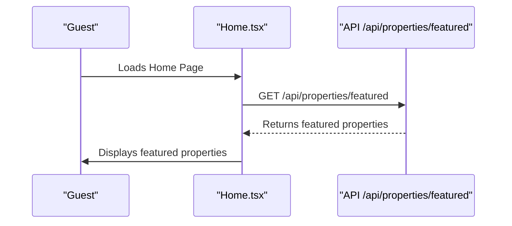

**Diagram sources**  
- [Home.tsx](file://src/react-app/pages/Home.tsx#L15-L35)

**Section sources**  
- [Home.tsx](file://src/react-app/pages/Home.tsx#L1-L226)

#### 2. Browsing Stays
Guests can browse all properties via the **Stays.tsx** page. The search form allows filtering by location, dates, guests, and amenities. Results are fetched from `/api/properties` with query parameters.

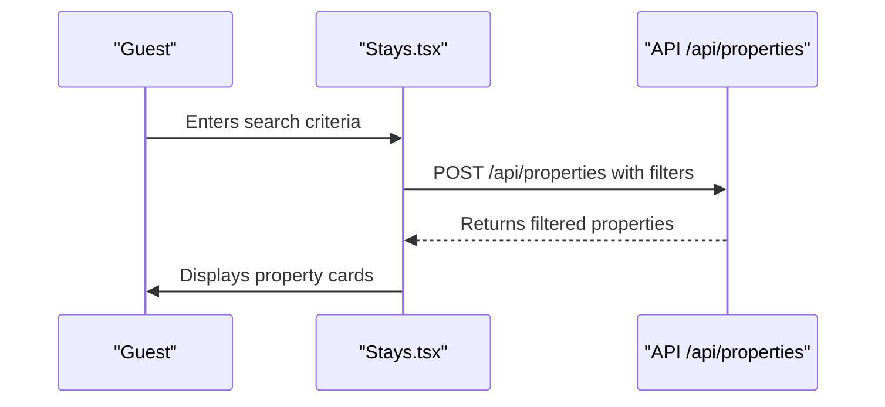

**Diagram sources**  
- [Stays.tsx](file://src/react-app/pages/Stays.tsx#L50-L100)

**Section sources**  
- [Stays.tsx](file://src/react-app/pages/Stays.tsx#L1-L516)

#### 3. Property Card Interaction
Each property is displayed using **PropertyCard.tsx**, which shows images, title, location, price, and amenities. Guests can view details, check availability, or add to wishlist.

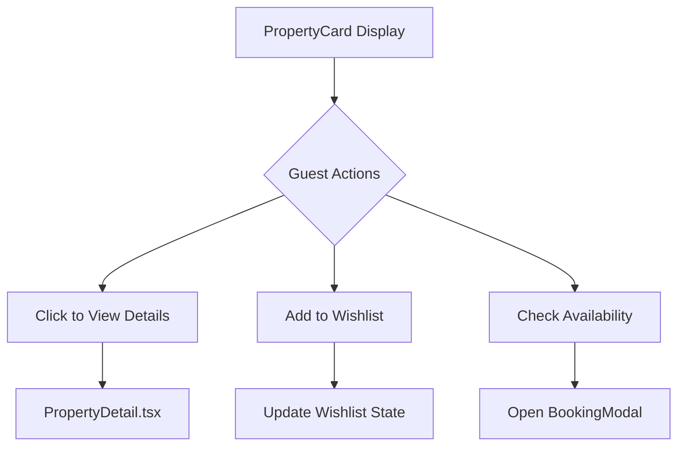

**Diagram sources**  
- [PropertyCard.tsx](file://src/react-app/components/PropertyCard.tsx#L1-L426)

**Section sources**  
- [PropertyCard.tsx](file://src/react-app/components/PropertyCard.tsx#L1-L426)

#### 4. Booking Process
From **PropertyDetail.tsx**, guests can initiate booking. The **BookingModal.tsx** component collects guest details, validates input, and creates a booking record.

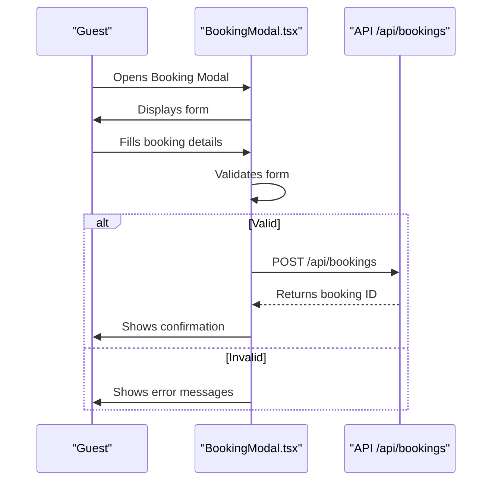

**Diagram sources**  
- [BookingModal.tsx](file://src/react-app/components/BookingModal.tsx#L50-L150)

**Section sources**  
- [BookingModal.tsx](file://src/react-app/components/BookingModal.tsx#L1-L474)
- [PropertyDetail.tsx](file://src/react-app/pages/PropertyDetail.tsx#L1-L562)

#### 5. Payment Flow
After booking confirmation, the **PaymentModal.tsx** opens, showing booking summary and redirecting to MyFatoorah payment gateway.

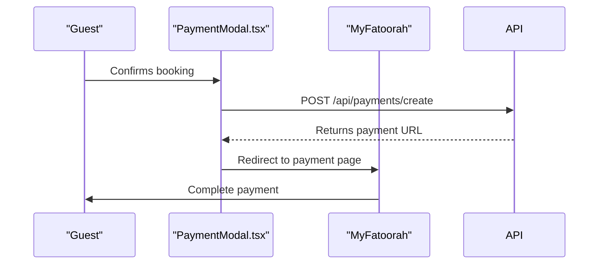

**Diagram sources**  
- [PaymentModal.tsx](file://src/react-app/components/PaymentModal.tsx#L20-L80)

**Section sources**  
- [PaymentModal.tsx](file://src/react-app/components/PaymentModal.tsx#L1-L168)

#### 6. Review Submission
After stay completion, guests can submit reviews via **ReviewModal.tsx**, which sends data to `/api/reviews`.

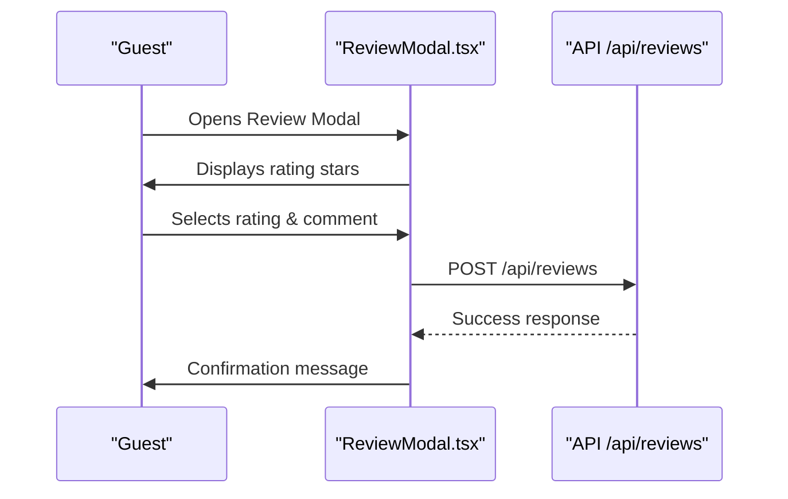

**Diagram sources**  
- [ReviewModal.tsx](file://src/react-app/components/ReviewModal.tsx#L30-L80)

**Section sources**  
- [ReviewModal.tsx](file://src/react-app/components/ReviewModal.tsx#L1-L187)

## Property Owner Journey

Property owners manage their listings, bookings, and earnings through the Dashboard. The journey includes onboarding, listing, management, and payout.

### Path: Owners Page → PropertyForm → Dashboard → Analytics → Payouts

#### 1. Onboarding via Owners Page
The **Owners.tsx** page presents benefits and a 3-step process: Sign Up, We Manage, You Earn. CTAs lead to contact or stories.

```mermaid
flowchart TD
A[Visit Owners Page] --> B{Owner Type}
B --> C[New Owner]
B --> D[Existing Owner]
C --> E[Click "Start Earning"]
D --> F[Sign In → Dashboard]
E --> G[Contact Form]
```

**Section sources**  
- [Owners.tsx](file://src/react-app/pages/Owners.tsx#L1-L251)

#### 2. Property Listing via PropertyForm
Owners list properties using a form that captures details, images, pricing, and availability. Data is submitted to `/api/properties`.

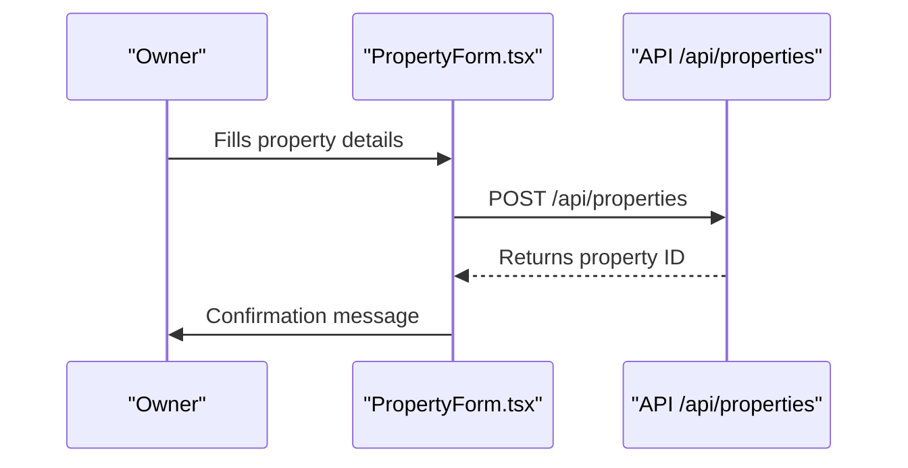

**Section sources**  
- [PropertyForm.tsx](file://src/react-app/pages/PropertyForm.tsx)

#### 3. Dashboard Management
The **Dashboard.tsx** page provides an overview of properties, bookings, and earnings. Owners can view recent bookings and top properties.

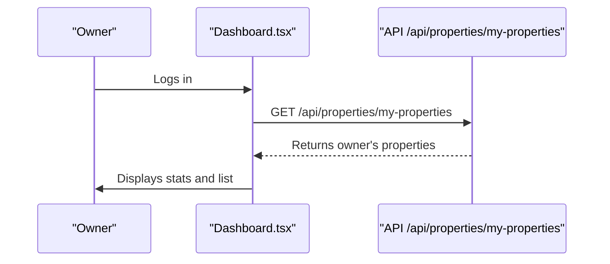

**Diagram sources**  
- [Dashboard.tsx](file://src/react-app/pages/Dashboard.tsx#L30-L60)

**Section sources**  
- [Dashboard.tsx](file://src/react-app/pages/Dashboard.tsx#L1-L485)

#### 4. Analytics and Payouts
Owners view performance metrics like total earnings, completed bookings, and average rating. Payouts are processed monthly with detailed reports.

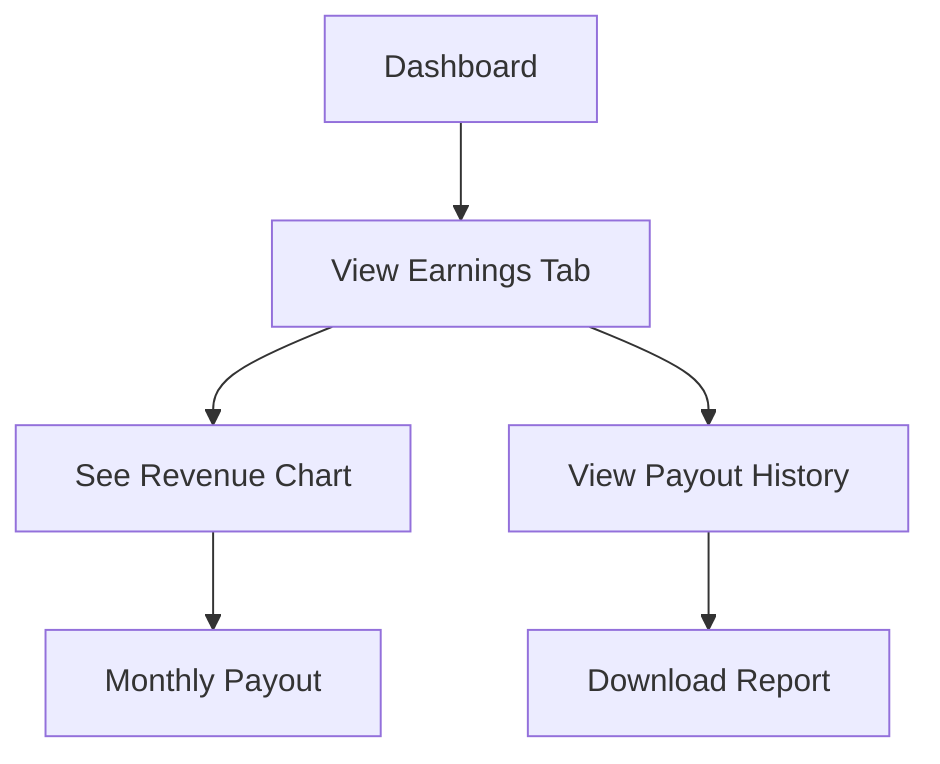

**Section sources**  
- [Dashboard.tsx](file://src/react-app/pages/Dashboard.tsx#L1-L485)

## Investor Journey

Investors learn about opportunities through the **Invest.tsx** page, which highlights ROI, AUM, and investor satisfaction. The journey focuses on lead conversion via contact submission.

### Path: Invest Page → Learn → Contact → Follow-up

#### 1. Investment Overview
The Invest page categorizes investors into Capital, International, and Buy-to-Let types, each with tailored benefits.

```mermaid
flowchart TD
A[Visit Invest Page] --> B{Investor Type}
B --> C[Capital Investor]
B --> D[International Investor]
B --> E[Buy-to-Let Investor]
C --> F[View Benefits]
D --> F
E --> F
F --> G[Click "Request Investor Deck"]
```

**Section sources**  
- [Invest.tsx](file://src/react-app/pages/Invest.tsx#L1-L291)

#### 2. Lead Conversion
Clicking "Request Investor Deck" navigates to the Contact page, where investors submit their information for follow-up.

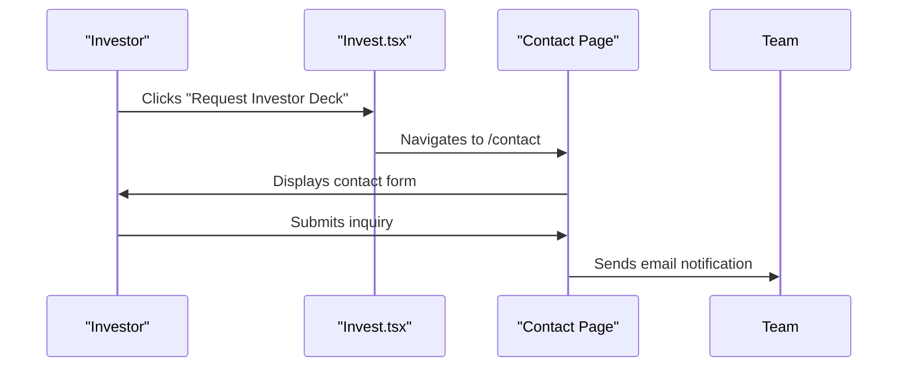

**Section sources**  
- [Invest.tsx](file://src/react-app/pages/Invest.tsx#L1-L291)
- [Contact.tsx](file://src/react-app/pages/Contact.tsx)

## Admin Journey

Admins access **AdminDashboard.tsx** to monitor platform metrics, manage content, and configure settings. The dashboard includes AI, channel, pricing, and financial modules.

### Path: AdminDashboard → Monitor → Manage → Configure

#### 1. Platform Monitoring
The admin dashboard displays key metrics: total users, properties, bookings, revenue, and occupancy rate.

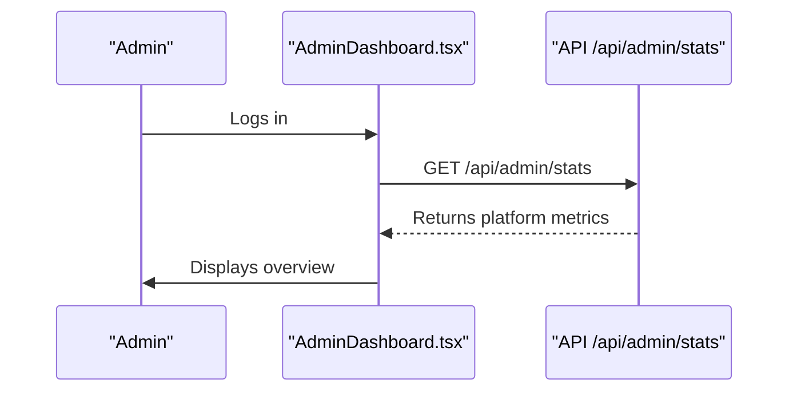

**Diagram sources**  
- [AdminDashboard.tsx](file://src/react-app/pages/AdminDashboard.tsx#L30-L60)

**Section sources**  
- [AdminDashboard.tsx](file://src/react-app/pages/AdminDashboard.tsx#L1-L579)

#### 2. AI Configuration
Admins configure the AI assistant (Sara) via **AIConfigPanel.tsx**, adjusting model, personality, and system prompts.

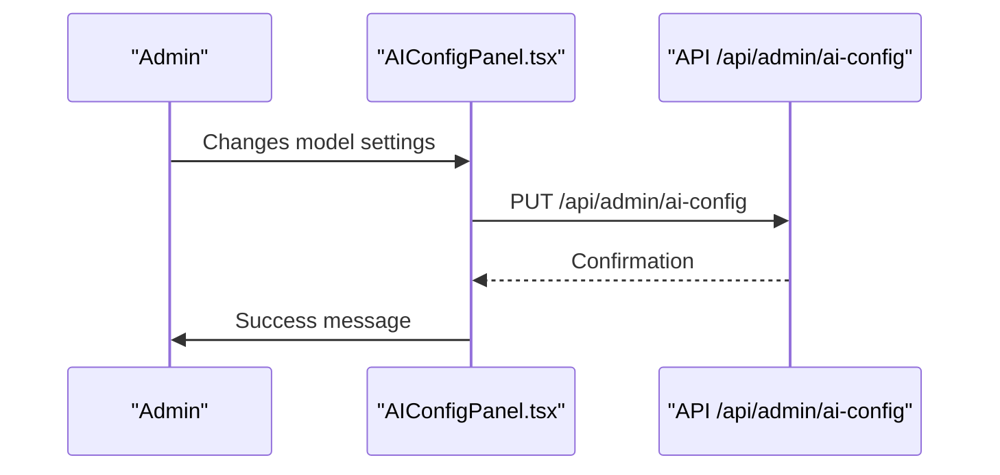

**Diagram sources**  
- [AIConfigPanel.tsx](file://src/react-app/components/admin/AIConfigPanel.tsx#L100-L130)

**Section sources**  
- [AIConfigPanel.tsx](file://src/react-app/components/admin/AIConfigPanel.tsx#L1-L575)

#### 3. Channel Management
The **ChannelManagerDashboard.tsx** allows syncing with external platforms like Airbnb and Booking.com.

```mermaid
sequenceDiagram
participant Admin as "Admin"
participant Channel as "ChannelManagerDashboard.tsx"
partner External as "External Platform"
Admin->>Channel : Clicks "Sync All"
Channel->>API : POST /api/admin/channels/sync-all
API->>External : Sync property data
External-->>API : Confirmation
API-->>Channel : Sync success
```

**Diagram sources**  
- [ChannelManagerDashboard.tsx](file://src/react-app/components/admin/ChannelManagerDashboard.tsx#L80-L110)

**Section sources**  
- [ChannelManagerDashboard.tsx](file://src/react-app/components/admin/ChannelManagerDashboard.tsx#L1-L483)

#### 4. Dynamic Pricing & Financial Reporting
Admins use **DynamicPricingDashboard.tsx** to set rules and **FinancialReporting.tsx** to analyze revenue trends.

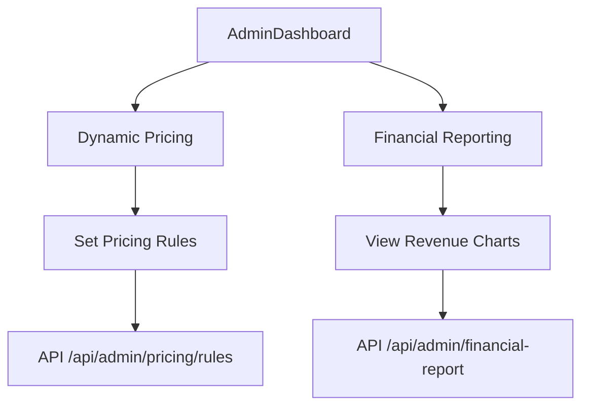

**Section sources**  
- [DynamicPricingDashboard.tsx](file://src/react-app/components/admin/DynamicPricingDashboard.tsx#L1-L520)
- [FinancialReporting.tsx](file://src/react-app/components/admin/FinancialReporting.tsx)