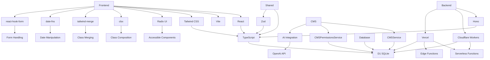
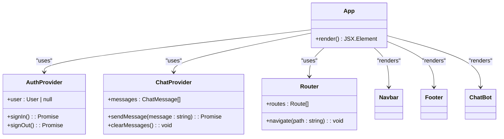
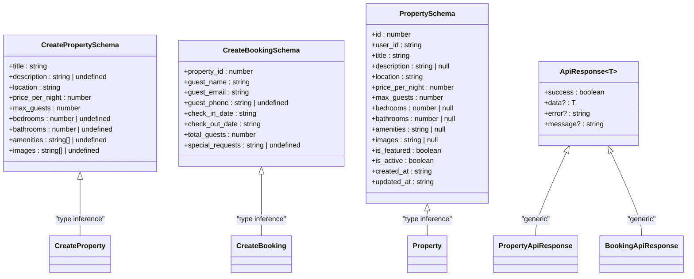
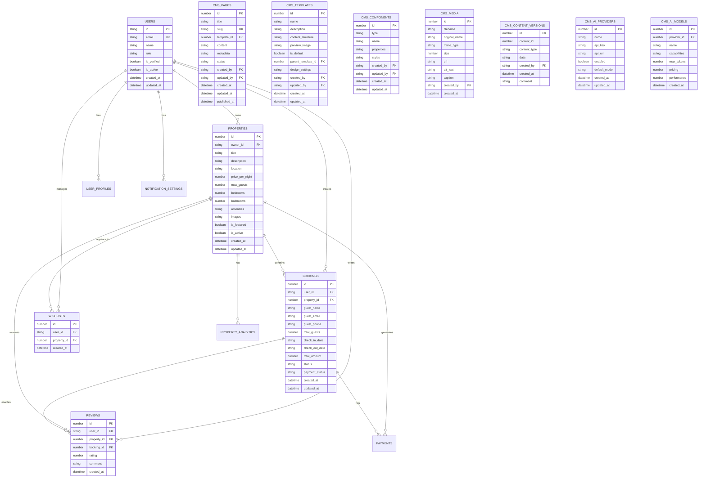
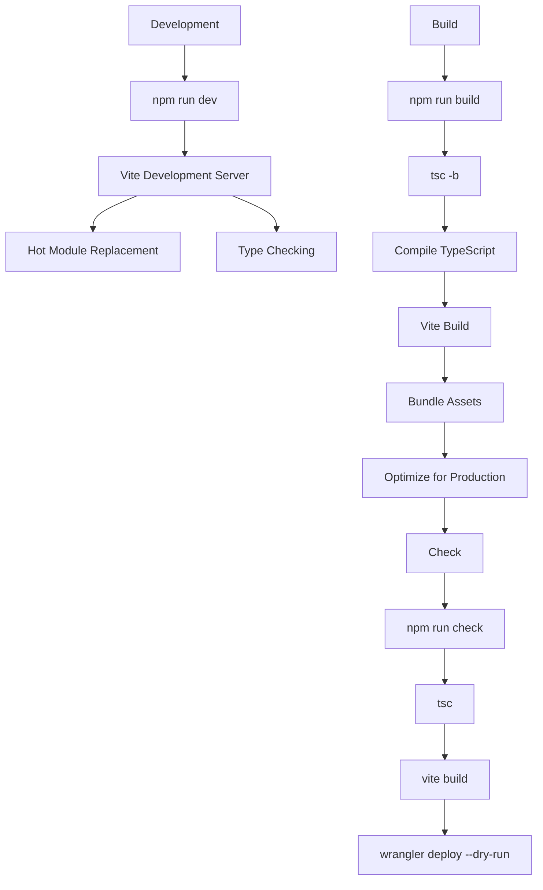
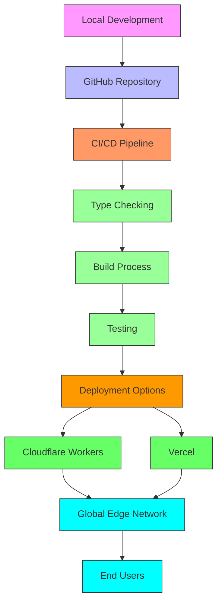
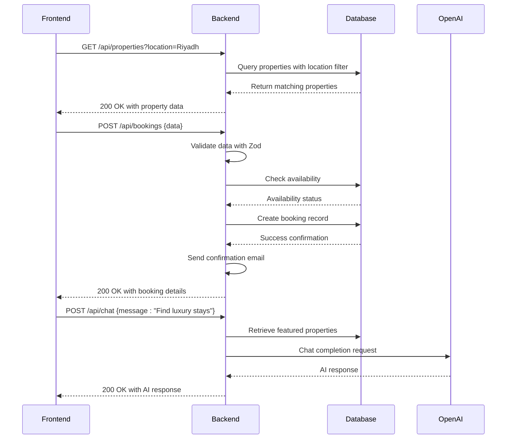
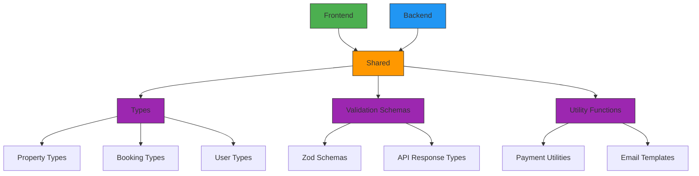
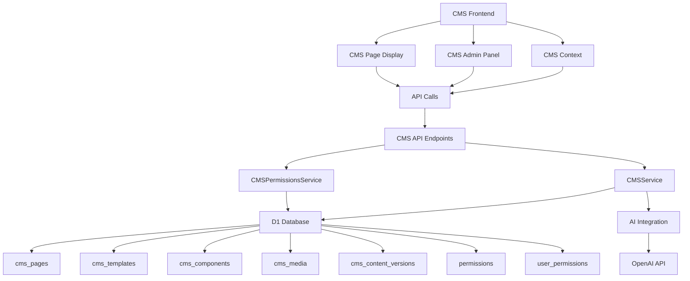

# Technology Stack

<cite>
**Referenced Files in This Document**   
- [package.json](file://package.json) - *Updated with new deployment options in commit d5a3816*
- [vercel.json](file://vercel.json) - *Added Vercel deployment configuration in commit d5a3816*
- [vite.config.ts](file://vite.config.ts)
- [tailwind.config.js](file://tailwind.config.js)
- [tsconfig.json](file://tsconfig.json)
- [tsconfig.app.json](file://tsconfig.app.json)
- [tsconfig.worker.json](file://tsconfig.worker.json)
- [src/worker/index.ts](file://src/worker/index.ts)
- [src/shared/types.ts](file://src/shared/types.ts)
- [src/shared/payment.ts](file://src/shared/payment.ts)
- [src/react-app/main.tsx](file://src/react-app/main.tsx)
- [src/react-app/App.tsx](file://src/react-app/App.tsx)
- [src/react-app/utils/responsive.ts](file://src/react-app/utils/responsive.ts) - *Contains cn utility implementation*
- [migrations/1.sql](file://migrations/1.sql)
- [migrations/2.sql](file://migrations/2.sql)
- [wrangler.toml](file://wrangler.toml) - *Cloudflare Workers configuration*
- [README.md](file://README.md) - *Updated with Vercel deployment instructions*
- [src/shared/cms-service.ts](file://src/shared/cms-service.ts) - *Added in CMS implementation*
- [src/shared/cms-permissions-service.ts](file://src/shared/cms-permissions-service.ts) - *Added in CMS implementation*
- [migrations/11.sql](file://migrations/11.sql) - *CMS database schema*
- [src/react-app/components/admin/CMSAdminPanel.tsx](file://src/react-app/components/admin/CMSAdminPanel.tsx) - *CMS admin interface*
- [src/react-app/pages/CMSPage.tsx](file://src/react-app/pages/CMSPage.tsx) - *CMS public page display*
- [src/worker/index.ts](file://src/worker/index.ts) - *Updated with CMS API endpoints*
- [src/shared/README_CMS.md](file://src/shared/README_CMS.md) - *CMS module documentation*
</cite>

## Update Summary
**Changes Made**   
- Added new section on CMS implementation with detailed architecture and components
- Updated Core Technology Stack to include CMS-related dependencies
- Enhanced Backend Architecture with CMS API endpoints and services
- Added Shared Modules section for CMS types and services
- Updated Database and Persistence section with CMS schema details
- Added new diagram for CMS architecture
- Updated package.json references to reflect CMS implementation
- Added documentation for CMS permissions and role-based access control

## Table of Contents
1. [Introduction](#introduction)
2. [Core Technology Stack](#core-technology-stack)
3. [Frontend Architecture](#frontend-architecture)
4. [Backend Architecture](#backend-architecture)
5. [Shared Modules and Type Safety](#shared-modules-and-type-safety)
6. [Database and Persistence](#database-and-persistence)
7. [Development Tooling and Build Process](#development-tooling-and-build-process)
8. [Environment and Deployment Configuration](#environment-and-deployment-configuration)
9. [System Integration Overview](#system-integration-overview)
10. [UI and Utility Libraries](#ui-and-utility-libraries)
11. [Content Management System](#content-management-system)

## Introduction
HabibiStay is a modern full-stack application built with a carefully selected technology stack that emphasizes type safety, performance, and developer experience. The architecture leverages TypeScript across all layers, React with Vite for the frontend, Hono for Cloudflare Worker-compatible backend APIs, Tailwind CSS for styling, and Zod for runtime validation. This document provides a comprehensive analysis of the technology choices, their integration, and the rationale behind the architectural decisions that enable serverless deployment on multiple platforms including Cloudflare Workers and Vercel, with D1 SQLite database.

**Section sources**
- [package.json](file://package.json)
- [README.md](file://README.md)

## Core Technology Stack

The HabibiStay application employs a modern, type-safe technology stack designed for full-stack development with seamless integration between frontend and backend components. The core technologies include:

- **TypeScript**: Provides full-stack type safety across frontend, backend, and shared modules
- **React**: Component-based UI library for building interactive user interfaces
- **Vite**: Next-generation frontend build tool offering fast development server and optimized builds
- **Hono**: Web framework optimized for Cloudflare Workers and other serverless environments
- **Tailwind CSS**: Utility-first CSS framework enabling rapid UI development
- **Zod**: TypeScript-first schema declaration and validation library for runtime type checking
- **Radix UI**: Unstyled, accessible UI components for building custom design systems
- **clsx**: Utility for constructing className strings conditionally
- **date-fns**: Modern JavaScript date utility library for date manipulation
- **react-hook-form**: Performant, flexible, and extensible forms library for React
- **tailwind-merge**: Utility for merging Tailwind CSS classes without style conflicts
- **OpenAI**: AI platform for content generation and chatbot functionality (v5.20.2)

These technologies work in concert to create a robust, maintainable, and performant application architecture that supports both development efficiency and production reliability.



**Diagram sources**
- [package.json](file://package.json)
- [tsconfig.json](file://tsconfig.json)

**Section sources**
- [package.json](file://package.json)
- [tsconfig.json](file://tsconfig.json)

## Frontend Architecture

### React with Vite Implementation
The frontend of HabibiStay is built using React 19 with Vite as the build tool, providing a modern development experience with fast hot module replacement and optimized production builds. The Vite configuration includes essential plugins for React development and includes proxy settings for local API development.

```typescript
// vite.config.ts
import path from "path";
import { defineConfig } from "vite";
import react from "@vitejs/plugin-react";

export default defineConfig({
  plugins: [
    react({
      include: "**/*.{jsx,tsx}",
    })
  ],
  server: {
    allowedHosts: true,
    proxy: {
      '/api': {
        target: 'http://localhost:8080',
        changeOrigin: true,
        secure: false,
      },
    },
  },
  build: {
    chunkSizeWarningLimit: 5000,
  },
});
```

The application structure follows a component-based architecture with clear separation of concerns:
- **Components**: Reusable UI elements in `src/react-app/components/`
- **Pages**: Route-level components in `src/react-app/pages/`
- **Contexts**: State management using React Context API
- **Hooks**: Custom hooks for reusable logic

### Entry Point and Application Structure
The frontend application is initialized through the standard React entry point, which renders the main App component with necessary providers.

```typescript
// src/react-app/main.tsx
import { StrictMode } from "react";
import { createRoot } from "react-dom/client";
import "@/react-app/index.css";
import App from "@/react-app/App.tsx";

createRoot(document.getElementById("root")!).render(
  <StrictMode>
    <App />
  </StrictMode>
);
```

The App component sets up the routing structure and wraps the application with essential context providers for authentication and chat functionality.



**Diagram sources**
- [src/react-app/main.tsx](file://src/react-app/main.tsx#L1-L11)
- [src/react-app/App.tsx](file://src/react-app/App.tsx#L1-L68)

**Section sources**
- [vite.config.ts](file://vite.config.ts#L1-L25)
- [src/react-app/main.tsx](file://src/react-app/main.tsx#L1-L11)
- [src/react-app/App.tsx](file://src/react-app/App.tsx#L1-L68)

## Backend Architecture

### Hono Framework Implementation
The backend of HabibiStay is built using Hono, a lightweight web framework specifically designed for serverless environments like Cloudflare Workers. Hono provides a simple and efficient way to define routes and handle HTTP requests with middleware support.

```typescript
// src/worker/index.ts
import { Hono } from "hono";
import { cors } from "hono/cors";
import { zValidator } from "@hono/zod-validator";

const app = new Hono<{ Bindings: Env }>();

// CORS middleware
app.use("*", cors({
  origin: "*",
  allowMethods: ["GET", "POST", "PUT", "DELETE", "OPTIONS"],
  allowHeaders: ["Content-Type", "Authorization"],
}));
```

The backend implements a comprehensive API with routes for:
- Authentication and user management
- Property search and management
- Booking creation and management
- Wishlist operations
- AI-powered chat functionality
- Payment processing

### API Route Structure
The API follows RESTful principles with clear endpoint organization and consistent response patterns. Each route uses Zod validation for request data and returns standardized response formats.

```mermaid
graph TD
A[/api] --> B[/api/properties]
A --> C[/api/bookings]
A --> D[/api/wishlist]
A --> E[/api/chat]
A --> F[/api/users]
A --> G[/api/sessions]
A --> H[/api/cms]
B --> B1[GET /api/properties]
B --> B2[GET /api/properties/:id]
B --> B3[POST /api/properties]
B --> B4[GET /api/properties/my-properties]
C --> C1[POST /api/bookings]
C --> C2[GET /api/bookings/my-bookings]
D --> D1[GET /api/wishlist]
D --> D2[POST /api/wishlist/:propertyId]
D --> D3[DELETE /api/wishlist/:propertyId]
E --> E1[POST /api/chat]
F --> F1[GET /api/users/me]
F --> F2[GET /api/users/profile]
F --> F3[PUT /api/users/profile]
G --> G1[POST /api/sessions]
G --> G2[GET /api/logout]
H --> H1[GET /api/cms/pages]
H --> H2[GET /api/cms/templates]
H --> H3[GET /api/cms/components]
H --> H4[GET /api/cms/media]
H --> H5[GET /api/cms/permissions]
```

**Diagram sources**
- [src/worker/index.ts](file://src/worker/index.ts#L1-L799)

**Section sources**
- [src/worker/index.ts](file://src/worker/index.ts#L1-L799)

## Shared Modules and Type Safety

### TypeScript Configuration
The project employs a multi-config TypeScript setup to support different environments within the same codebase. The root `tsconfig.json` references three separate configuration files for different parts of the application.

```json
// tsconfig.json
{
  "files": [],
  "references": [
    { "path": "./tsconfig.app.json" },
    { "path": "./tsconfig.node.json" },
    { "path": "./tsconfig.worker.json" }
  ]
}
```

Each configuration is tailored to its specific environment:
- **tsconfig.app.json**: Configuration for the React frontend application
- **tsconfig.worker.json**: Configuration for the Cloudflare Worker backend
- **tsconfig.node.json**: Base configuration for Node.js environment

The frontend configuration enforces strict type checking and enables modern JavaScript features:

```json
// tsconfig.app.json
{
  "compilerOptions": {
    "target": "ES2020",
    "lib": ["ES2020", "DOM", "DOM.Iterable"],
    "module": "ESNext",
    "strict": true,
    "noUnusedLocals": true,
    "noUnusedParameters": true,
    "noFallthroughCasesInSwitch": true,
    "jsx": "react-jsx"
  },
  "include": ["src/react-app"]
}
```

### Shared Types and Validation
The application uses Zod for runtime type validation and type inference across both frontend and backend. Shared types are defined in `src/shared/types.ts` and used throughout the application.

```typescript
// src/shared/types.ts
import { z } from "zod";

export const CreatePropertySchema = z.object({
  title: z.string().min(1),
  description: z.string().optional(),
  location: z.string().min(1),
  price_per_night: z.number().positive(),
  max_guests: z.number().int().positive(),
  bedrooms: z.number().int().positive().optional(),
  bathrooms: z.number().int().positive().optional(),
  amenities: z.array(z.string()).optional(),
  images: z.array(z.string()).optional(),
});

export type CreateProperty = z.infer<typeof CreatePropertySchema>;
```

The backend uses Hono's Zod validator middleware to automatically validate request data against these schemas:

```typescript
// src/worker/index.ts
app.post("/api/properties", authMiddleware, zValidator("json", CreatePropertySchema), async (c) => {
  const data = c.req.valid("json");
  // Process validated data
});
```

This approach ensures type safety from the frontend through the API layer to the database, reducing runtime errors and improving developer experience.



**Diagram sources**
- [src/shared/types.ts](file://src/shared/types.ts#L1-L599)
- [src/worker/index.ts](file://src/worker/index.ts#L1-L799)

**Section sources**
- [tsconfig.app.json](file://tsconfig.app.json#L1-L32)
- [tsconfig.worker.json](file://tsconfig.worker.json#L1-L13)
- [src/shared/types.ts](file://src/shared/types.ts#L1-L599)

## Database and Persistence

### D1 SQLite Database Implementation
HabibiStay uses Cloudflare D1, a SQLite database for Workers, to store application data. The database schema is defined through migration files that evolve over time, ensuring data integrity and version control.

The initial migration (`migrations/1.sql`) creates core tables for the application:

```sql
-- migrations/1.sql
CREATE TABLE users (
  id TEXT PRIMARY KEY,
  email TEXT UNIQUE NOT NULL,
  name TEXT NOT NULL,
  role TEXT DEFAULT 'guest' CHECK (role IN ('guest', 'host', 'admin')),
  is_verified BOOLEAN DEFAULT 0,
  is_active BOOLEAN DEFAULT 1,
  created_at DATETIME DEFAULT CURRENT_TIMESTAMP,
  updated_at DATETIME DEFAULT CURRENT_TIMESTAMP
);

CREATE TABLE properties (
  id INTEGER PRIMARY KEY AUTOINCREMENT,
  owner_id TEXT NOT NULL,
  title TEXT NOT NULL,
  description TEXT,
  location TEXT NOT NULL,
  price_per_night REAL NOT NULL,
  max_guests INTEGER NOT NULL,
  bedrooms INTEGER DEFAULT 1,
  bathrooms INTEGER DEFAULT 1,
  amenities TEXT, -- JSON array
  images TEXT, -- JSON array
  is_featured BOOLEAN DEFAULT 0,
  is_active BOOLEAN DEFAULT 1,
  created_at DATETIME DEFAULT CURRENT_TIMESTAMP,
  updated_at DATETIME DEFAULT CURRENT_TIMESTAMP,
  FOREIGN KEY (owner_id) REFERENCES users(id)
);
```

Additional tables support key application features:
- **Bookings**: Manages reservation data with status tracking
- **Wishlists**: Allows users to save properties for later
- **Reviews**: Stores guest feedback and ratings
- **Payments**: Tracks payment transactions and status
- **AI Configuration**: Stores settings for the AI chatbot
- **Analytics**: Captures user interaction and property performance data
- **CMS**: Stores content management system data including pages, templates, components, and media

### CMS Database Schema
The CMS implementation includes a comprehensive database schema defined in `migrations/11.sql`:

```sql
-- migrations/11.sql
CREATE TABLE cms_pages (
  id INTEGER PRIMARY KEY AUTOINCREMENT,
  title TEXT NOT NULL,
  slug TEXT UNIQUE NOT NULL,
  template_id INTEGER,
  content TEXT, -- JSON structure
  metadata TEXT, -- JSON metadata
  status TEXT DEFAULT 'draft' CHECK (status IN ('draft', 'published', 'archived')),
  created_by TEXT,
  updated_by TEXT,
  created_at DATETIME DEFAULT CURRENT_TIMESTAMP,
  updated_at DATETIME DEFAULT CURRENT_TIMESTAMP,
  published_at DATETIME,
  FOREIGN KEY (template_id) REFERENCES cms_templates(id)
);

CREATE TABLE cms_templates (
  id INTEGER PRIMARY KEY AUTOINCREMENT,
  name TEXT NOT NULL,
  description TEXT,
  content_structure TEXT, -- JSON structure
  preview_image TEXT,
  is_default BOOLEAN DEFAULT 0,
  parent_template_id INTEGER,
  design_settings TEXT, -- JSON design settings
  created_by TEXT,
  updated_by TEXT,
  created_at DATETIME DEFAULT CURRENT_TIMESTAMP,
  updated_at DATETIME DEFAULT CURRENT_TIMESTAMP,
  FOREIGN KEY (parent_template_id) REFERENCES cms_templates(id)
);

CREATE TABLE cms_components (
  id INTEGER PRIMARY KEY AUTOINCREMENT,
  type TEXT NOT NULL,
  name TEXT NOT NULL,
  properties TEXT, -- JSON properties
  styles TEXT, -- JSON styles
  created_by TEXT,
  updated_by TEXT,
  created_at DATETIME DEFAULT CURRENT_TIMESTAMP,
  updated_at DATETIME DEFAULT CURRENT_TIMESTAMP
);

CREATE TABLE cms_media (
  id INTEGER PRIMARY KEY AUTOINCREMENT,
  filename TEXT NOT NULL,
  original_name TEXT NOT NULL,
  mime_type TEXT NOT NULL,
  size INTEGER NOT NULL,
  url TEXT NOT NULL,
  alt_text TEXT,
  caption TEXT,
  created_by TEXT,
  created_at DATETIME DEFAULT CURRENT_TIMESTAMP
);

CREATE TABLE cms_content_versions (
  id INTEGER PRIMARY KEY AUTOINCREMENT,
  content_id INTEGER NOT NULL,
  content_type TEXT NOT NULL CHECK (content_type IN ('page', 'template', 'component')),
  data TEXT, -- JSON data
  created_by TEXT,
  created_at DATETIME DEFAULT CURRENT_TIMESTAMP,
  comment TEXT
);

CREATE TABLE cms_ai_providers (
  id INTEGER PRIMARY KEY AUTOINCREMENT,
  name TEXT NOT NULL,
  api_key TEXT,
  api_url TEXT,
  enabled BOOLEAN DEFAULT 1,
  default_model TEXT,
  created_at DATETIME DEFAULT CURRENT_TIMESTAMP,
  updated_at DATETIME DEFAULT CURRENT_TIMESTAMP
);

CREATE TABLE cms_ai_models (
  id INTEGER PRIMARY KEY AUTOINCREMENT,
  provider_id INTEGER NOT NULL,
  name TEXT NOT NULL,
  capabilities TEXT, -- JSON array
  max_tokens INTEGER,
  pricing REAL,
  performance REAL,
  created_at DATETIME DEFAULT CURRENT_TIMESTAMP,
  FOREIGN KEY (provider_id) REFERENCES cms_ai_providers(id)
);
```

### Database Integration with Cloudflare Workers
The backend accesses the D1 database through the Worker environment bindings. The Hono application is configured with a Bindings interface that defines the available environment variables:

```typescript
const app = new Hono<{ Bindings: Env }>();
```

Database operations are performed using the D1 API's prepare and bind methods:

```typescript
// src/worker/index.ts
const { results } = await c.env.DB.prepare(
  "SELECT * FROM properties WHERE is_featured = 1 AND is_active = 1 ORDER BY created_at DESC LIMIT 2"
).all();
```

The application uses parameterized queries to prevent SQL injection and ensure data safety. Complex operations often use Promise.all() to execute multiple queries concurrently for improved performance:

```typescript
const [property, reviews] = await Promise.all([
  c.env.DB.prepare(`
    SELECT p.*, AVG(r.rating) as avg_rating, COUNT(r.id) as review_count
    FROM properties p 
    LEFT JOIN reviews r ON p.id = r.property_id 
    WHERE p.id = ? AND p.is_active = 1
    GROUP BY p.id
  `).bind(id).first(),
  c.env.DB.prepare(`
    SELECT r.*, up.full_name as reviewer_name
    FROM reviews r
    LEFT JOIN user_profiles up ON r.user_id = up.user_id
    WHERE r.property_id = ?
    ORDER BY r.created_at DESC
    LIMIT 10
  `).bind(id).all()
]);
```



**Diagram sources**
- [migrations/1.sql](file://migrations/1.sql#L1-L261)
- [migrations/2.sql](file://migrations/2.sql#L1-L13)
- [migrations/11.sql](file://migrations/11.sql#L1-L200)
- [src/worker/index.ts](file://src/worker/index.ts#L1-L799)

**Section sources**
- [migrations/1.sql](file://migrations/1.sql#L1-L261)
- [migrations/2.sql](file://migrations/2.sql#L1-L13)
- [migrations/11.sql](file://migrations/11.sql#L1-L200)
- [src/worker/index.ts](file://src/worker/index.ts#L1-L799)

## Development Tooling and Build Process

### ESLint and Code Quality
The project includes a comprehensive linting configuration to maintain code quality and consistency across the codebase. The devDependencies in package.json include ESLint and related plugins:

```json
"devDependencies": {
  "@eslint/js": "9.25.1",
  "eslint": "9.25.1",
  "eslint-plugin-react-hooks": "5.2.0",
  "eslint-plugin-react-refresh": "0.4.19",
  "typescript-eslint": "8.31.0"
}
```

The linting script is defined in package.json:
```json
"scripts": {
  "lint": "eslint ."
}
```

### PostCSS and Tailwind CSS Configuration
The styling system is built on Tailwind CSS with PostCSS for processing. The configuration is minimal, focusing on the application's content structure:

```javascript
// tailwind.config.js
export default {
  content: [
    "./index.html",
    "./src/react-app/**/*.{js,ts,jsx,tsx}",
  ],
  theme: {
    extend: {},
  },
  plugins: [],
};
```

This configuration enables Tailwind's Just-In-Time (JIT) compiler to scan the specified files and generate only the CSS classes that are actually used in the application, resulting in highly optimized production builds.

### Build Process and Scripts
The build process is orchestrated through npm scripts defined in package.json:

```json
"scripts": {
  "build": "tsc -b && vite build",
  "check": "tsc && vite build && wrangler deploy --dry-run",
  "dev": "vite",
  "lint": "eslint ."
}
```

The build process follows these steps:
1. **TypeScript compilation**: Uses `tsc -b` to compile all TypeScript projects based on the references in tsconfig.json
2. **Vite build**: Processes the frontend assets, bundles JavaScript, and optimizes for production
3. **Wrangler deployment**: The dry-run check script validates the deployment configuration before actual deployment

The Vite configuration includes optimizations for production builds:

```typescript
// vite.config.ts
export default defineConfig({
  build: {
    chunkSizeWarningLimit: 5000,
  },
});
```

This sets a higher chunk size warning limit to accommodate the application's dependencies while still alerting to potential performance issues.



**Diagram sources**
- [package.json](file://package.json#L1-L53)
- [vite.config.ts](file://vite.config.ts#L1-L25)
- [tailwind.config.js](file://tailwind.config.js#L1-L12)

**Section sources**
- [package.json](file://package.json#L1-L53)
- [vite.config.ts](file://vite.config.ts#L1-L25)
- [tailwind.config.js](file://tailwind.config.js#L1-L12)

## Environment and Deployment Configuration

### Multi-Platform Deployment Strategy
HabibiStay supports deployment on multiple serverless platforms, including Cloudflare Workers and Vercel, providing flexibility for different deployment requirements and regional considerations.

#### Cloudflare Workers Integration
The application is configured for deployment on Cloudflare Workers, a serverless platform that enables running code at the edge. The wrangler.toml configuration defines the Worker settings:

```toml
# wrangler.toml
name = "habibistay"
main = "src/worker/index.full.ts"
compatibility_date = "2024-03-06"

[assets]
directory = "./public"

[[d1_databases]]
binding = "DB"
database_name = "habibistay"
database_id = "51730f7d-5c64-44e6-8ffa-c67557de8762"
```

#### Vercel Deployment Configuration
The application now includes Vercel deployment configuration through vercel.json, enabling deployment to Vercel's serverless platform:

```json
// vercel.json
{
  "version": 2,
  "builds": [
    {
      "src": "package.json",
      "use": "@vercel/node",
      "config": {
        "includeFiles": ["dist/**"]
      }
    }
  ],
  "routes": [
    {
      "src": "/api/(.*)",
      "dest": "/src/worker/index.ts"
    },
    {
      "src": "/(.*)",
      "dest": "/dist/$1"
    }
  ],
  "buildCommand": "npm run build",
  "outputDirectory": "dist",
  "installCommand": "npm install",
  "devCommand": "npm run dev",
  "framework": "vite"
}
```

The Vercel configuration specifies:
- **Build settings**: Uses the package.json as source with @vercel/node builder
- **Routing**: API requests are routed to the Hono worker, while static assets are served from the dist directory
- **Build process**: Uses the standard npm run build command
- **Output**: Specifies dist as the output directory for built assets
- **Framework detection**: Explicitly identifies Vite as the framework

### Environment Variables and Bindings
The application uses environment variables for configuration, which are accessed through the Worker's Bindings interface. Key environment variables include:

- **OPENAI_API_KEY**: For AI chatbot functionality
- **MYFATOORAH_API_KEY**: For payment processing
- **MOCHA_USERS_SERVICE_API_URL**: For authentication service
- **MOCHA_USERS_SERVICE_API_KEY**: For authentication service access
- **DB**: D1 database binding

These variables are referenced in the code as `c.env.VARIABLE_NAME` where `c` is the Hono context object.

### Deployment Workflow
The deployment workflow supports multiple platforms:

1. **Development**: Run `npm run dev` to start the Vite development server
2. **Building**: Run `npm run build` to compile TypeScript and bundle assets
3. **Validation**: Run `npm run check` to perform type checking, build, and dry-run deployment
4. **Deployment**: Use either Wrangler for Cloudflare Workers or Vercel CLI for Vercel deployment

The multi-platform deployment strategy provides several advantages:
- **Flexibility**: Ability to choose the most suitable platform based on requirements
- **Global distribution**: Both platforms offer edge execution with low latency
- **Serverless architecture**: No infrastructure management required on either platform
- **Cost efficiency**: Pay only for execution time and resources used
- **Scalability**: Automatic scaling to handle traffic spikes on both platforms



**Diagram sources**
- [vercel.json](file://vercel.json#L1-L26)
- [wrangler.toml](file://wrangler.toml#L1-L12)
- [package.json](file://package.json#L1-L53)

**Section sources**
- [vercel.json](file://vercel.json#L1-L26)
- [wrangler.toml](file://wrangler.toml#L1-L12)
- [package.json](file://package.json#L1-L53)

## System Integration Overview

### Frontend-Backend Communication
The frontend and backend communicate through a well-defined API contract using standard HTTP methods and JSON payloads. The integration follows these patterns:

1. **RESTful API calls**: The frontend makes HTTP requests to the Hono backend endpoints
2. **Type-safe interfaces**: Shared Zod schemas ensure data consistency between client and server
3. **Authentication**: JWT-based authentication with secure cookie storage
4. **Error handling**: Standardized error responses for consistent client-side handling



**Diagram sources**
- [src/worker/index.ts](file://src/worker/index.ts#L1-L799)
- [src/react-app/App.tsx](file://src/react-app/App.tsx#L1-L68)

**Section sources**
- [src/worker/index.ts](file://src/worker/index.ts#L1-L799)
- [src/react-app/App.tsx](file://src/react-app/App.tsx#L1-L68)

### Shared Module Architecture
The application uses a shared module architecture to maximize code reuse and maintain consistency across frontend and backend:



The shared modules include:
- **Type definitions**: TypeScript interfaces and types used across the application
- **Validation schemas**: Zod schemas for runtime validation
- **Utility functions**: Common functions for payment processing, email templating, and other cross-cutting concerns

This architecture ensures that data structures and validation rules are consistent throughout the application, reducing bugs and improving maintainability.

**Diagram sources**
- [src/shared/types.ts](file://src/shared/types.ts#L1-L599)
- [src/shared/payment.ts](file://src/shared/payment.ts#L1-L165)

**Section sources**
- [src/shared/types.ts](file://src/shared/types.ts#L1-L599)
- [src/shared/payment.ts](file://src/shared/payment.ts#L1-L165)

## UI and Utility Libraries

### Radix UI Components
HabibiStay leverages Radix UI for building accessible, unstyled UI components that can be customized with Tailwind CSS. The library provides primitive components for common UI patterns while maintaining full accessibility compliance.

The application uses several Radix UI components:
- **Dialog**: For modal dialogs and confirmation prompts
- **Dropdown Menu**: For context menus and navigation dropdowns
- **Select**: For enhanced select input components
- **Toast**: For user notifications and feedback messages

```typescript
// Example usage of Radix UI Dialog
import { Dialog, DialogContent, DialogTrigger } from "@radix-ui/react-dialog";

function BookingModal() {
  return (
    <Dialog>
      <DialogTrigger asChild>
        <button className="bg-blue-600 text-white px-4 py-2 rounded">
          Book Now
        </button>
      </DialogTrigger>
      <DialogContent className="bg-white p-6 rounded-lg shadow-lg">
        <h3 className="text-lg font-bold mb-4">Complete Booking</h3>
        {/* Booking form content */}
      </DialogContent>
    </Dialog>
  );
}
```

Radix UI components are integrated with the application's design system through Tailwind CSS classes, allowing for consistent styling while maintaining accessibility features like keyboard navigation and screen reader support.

**Section sources**
- [package.json](file://package.json#L5-L15)
- [src/react-app/components/BookingModal.tsx](file://src/react-app/components/BookingModal.tsx#L1-L100)

### Class Composition Utilities
The application uses multiple utilities for managing and composing Tailwind CSS classes efficiently.

#### clsx for Conditional Class Names
The `clsx` library provides a simple way to conditionally construct className strings:

```typescript
import clsx from 'clsx';

// Usage example
const buttonClass = clsx(
  'px-4 py-2 rounded font-medium',
  isPrimary && 'bg-blue-600 text-white',
  isSecondary && 'bg-gray-200 text-gray-800',
  isDisabled && 'opacity-50 cursor-not-allowed'
);
```

#### tailwind-merge for Class Merging
The `tailwind-merge` utility intelligently merges Tailwind CSS classes, resolving conflicts and ensuring the most specific classes take precedence:

```typescript
import { twMerge } from 'tailwind-merge';

// Safely merge classes without style conflicts
const mergedClasses = twMerge(
  'p-4 bg-blue-500 text-white',
  'p-6 bg-red-500' // This will override conflicting classes
);
// Result: 'p-6 bg-red-500 text-white'
```

#### Custom cn Utility Function
The application implements a custom `cn` utility function in `src/react-app/utils/responsive.ts` that combines both clsx and tailwind-merge for optimal class composition:

```typescript
// src/react-app/utils/responsive.ts
export const cn = (...classes: (string | undefined | null | false)[]): string => {
  return twMerge(clsx(classes));
};

// Usage throughout components
const button = <button className={cn('px-4 py-2', isActive && 'bg-blue-600')}>
  Click me
</button>;
```

This approach ensures that class names are properly merged while eliminating duplicates and resolving conflicts according to Tailwind's specificity rules.

**Section sources**
- [package.json](file://package.json#L5-L15)
- [src/react-app/utils/responsive.ts](file://src/react-app/utils/responsive.ts#L185-L188)

### Date Manipulation with date-fns
The application uses date-fns for all date and time manipulation, providing a modern, functional approach to working with dates:

```typescript
import { format, isFuture, addDays, differenceInDays } from 'date-fns';

// Format dates for display
const formattedDate = format(new Date(), 'MMM d, yyyy');

// Check if a date is in the future
const isUpcoming = isFuture(new Date('2024-12-25'));

// Calculate duration between dates
const nights = differenceInDays(checkOut, checkIn);

// Add days to a date
const lateCheckout = addDays(checkOut, 1);
```

date-fns is tree-shakable, meaning only the functions that are imported are included in the final bundle, helping to keep bundle sizes minimal.

**Section sources**
- [package.json](file://package.json#L5-L15)
- [src/react-app/components/BookingFlow.tsx](file://src/react-app/components/BookingFlow.tsx#L50-L100)

### Form Handling with react-hook-form
The application uses react-hook-form for efficient form handling, validation, and state management:

```typescript
import { useForm } from 'react-hook-form';
import { zodResolver } from '@hookform/resolvers/zod';
import { CreatePropertySchema } from '@/shared/types';

function PropertyForm() {
  const { register, handleSubmit, formState: { errors } } = useForm({
    resolver: zodResolver(CreatePropertySchema)
  });

  const onSubmit = (data) => {
    // Handle form submission
  };

  return (
    <form onSubmit={handleSubmit(onSubmit)}>
      <input {...register('title')} />
      {errors.title && <span>{errors.title.message}</span>}
      
      <input type="number" {...register('price_per_night')} />
      {errors.price_per_night && <span>{errors.price_per_night.message}</span>}
      
      <button type="submit">Submit</button>
    </form>
  );
}
```

react-hook-form provides excellent performance by minimizing re-renders and offers seamless integration with Zod for type-safe form validation.

**Section sources**
- [package.json](file://package.json#L5-L15)
- [src/react-app/components/PropertyForm.tsx](file://src/react-app/components/PropertyForm.tsx#L1-L150)

## Content Management System

### CMS Architecture and Components
The HabibiStay platform includes a comprehensive Content Management System (CMS) that enables administrators to manage website content, templates, components, and media through a user-friendly interface. The CMS is built as a modular system with clear separation of concerns between frontend, backend, and shared components.

The CMS architecture consists of:
- **Backend Services**: `CMSService` and `CMSPermissionsService` classes that handle all data operations
- **API Endpoints**: RESTful endpoints in `src/worker/index.ts` for all CMS operations
- **Database Schema**: Comprehensive schema in `migrations/11.sql` with tables for pages, templates, components, media, and AI integration
- **Frontend Components**: React components including `CMSAdminPanel` and `CMSPage` for administration and display
- **Shared Types**: TypeScript interfaces and Zod schemas in `src/shared/types.ts` for type safety

### Backend Services
The CMS implementation includes two primary backend services:

#### CMSService
The `CMSService` class provides comprehensive methods for managing all CMS entities:

```typescript
// src/shared/cms-service.ts
export class CMSService {
  private db: D1Database;

  constructor(db: D1Database) {
    this.db = db;
  }

  // Page management
  async getAllPages(): Promise<Page[]> { /* implementation */ }
  async getPageById(id: number): Promise<Page | null> { /* implementation */ }
  async createPage(page: Omit<Page, 'id' | 'created_at' | 'updated_at'>): Promise<Page> { /* implementation */ }
  
  // Template management
  async getAllTemplates(): Promise<Template[]> { /* implementation */ }
  async createTemplate(template: Omit<Template, 'id' | 'created_at' | 'updated_at'>): Promise<Template> { /* implementation */ }
  
  // Component management
  async getAllComponents(): Promise<Component[]> { /* implementation */ }
  async createComponent(component: Omit<Component, 'id' | 'created_at' | 'updated_at'>): Promise<Component> { /* implementation */ }
  
  // Media management
  async getAllMedia(): Promise<Media[]> { /* implementation */ }
  async createMedia(media: Omit<Media, 'id' | 'created_at'>): Promise<Media> { /* implementation */ }
  
  // Content versioning
  async getContentVersions(contentId: number, contentType: string): Promise<ContentVersion[]> { /* implementation */ }
  async createContentVersion(version: Omit<ContentVersion, 'id' | 'created_at'>): Promise<ContentVersion> { /* implementation */ }
}
```

#### CMSPermissionsService
The `CMSPermissionsService` class handles user permission management for CMS functionality:

```typescript
// src/shared/cms-permissions-service.ts
export class CMSPermissionsService {
  private db: D1Database;

  constructor(db: D1Database) {
    this.db = db;
  }

  /**
   * Check if user has specific CMS permission
   */
  async userHasCMSPermission(userId: string, permission: string): Promise<boolean> {
    try {
      const result = await this.db.prepare(`
        SELECT COUNT(*) as count
        FROM user_permissions up
        JOIN permissions p ON up.permission_id = p.id
        WHERE up.user_id = ? AND p.permission_name = ? AND p.category = 'cms'
      `).bind(userId, permission).first();

      return result?.count === 1;
    } catch (error) {
      console.error('Error checking CMS permissions:', error);
      return false;
    }
  }

  /**
   * Grant CMS permission to user
   */
  async grantCMSPermission(userId: string, permission: string): Promise<void> {
    try {
      // Check if permission exists and is a CMS permission
      const permissionRecord = await this.db.prepare(`
        SELECT id FROM permissions WHERE permission_name = ? AND category = 'cms'
      `).bind(permission).first();

      if (!permissionRecord) {
        throw new Error(`CMS Permission ${permission} not found`);
      }

      // Grant permission
      await this.db.prepare(`
        INSERT OR IGNORE INTO user_permissions (user_id, permission_id)
        VALUES (?, ?)
      `).bind(userId, permissionRecord.id).run();
    } catch (error) {
      console.error('Error granting CMS permission:', error);
      throw error;
    }
  }

  /**
   * Revoke CMS permission from user
   */
  async revokeCMSPermission(userId: string, permission: string): Promise<void> {
    try {
      await this.db.prepare(`
        DELETE FROM user_permissions
        WHERE user_id = ? AND permission_id = (
          SELECT id FROM permissions WHERE permission_name = ? AND category = 'cms'
        )
      `).bind(userId, permission).run();
    } catch (error) {
      console.error('Error revoking CMS permission:', error);
      throw error;
    }
  }

  /**
   * Get all available CMS permissions
   */
  async getAllCMSPermissions(): Promise<{name: string, description: string}[]> {
    try {
      const result = await this.db.prepare(`
        SELECT permission_name as name, description
        FROM permissions
        WHERE category = 'cms'
        ORDER BY permission_name
      `).all();

      return result.results || [];
    } catch (error) {
      console.error('Error fetching CMS permissions:', error);
      return [];
    }
  }
}
```

### API Endpoints
The CMS functionality is exposed through a comprehensive set of RESTful API endpoints in `src/worker/index.ts`:

```typescript
// Pages
app.get("/api/cms/pages", authMiddleware, requireRole(['admin']), async (c) => { /* implementation */ });
app.get("/api/cms/pages/:id", authMiddleware, requireRole(['admin']), async (c) => { /* implementation */ });
app.post("/api/cms/pages", authMiddleware, requireRole(['admin']), async (c) => { /* implementation */ });
app.put("/api/cms/pages/:id", authMiddleware, requireRole(['admin']), async (c) => { /* implementation */ });
app.delete("/api/cms/pages/:id", authMiddleware, requireRole(['admin']), async (c) => { /* implementation */ });

// Templates
app.get("/api/cms/templates", authMiddleware, requireRole(['admin']), async (c) => { /* implementation */ });
app.get("/api/cms/templates/:id", authMiddleware, requireRole(['admin']), async (c) => { /* implementation */ });
app.post("/api/cms/templates", authMiddleware, requireRole(['admin']), async (c) => { /* implementation */ });
app.delete("/api/cms/templates/:id", authMiddleware, requireRole(['admin']), async (c) => { /* implementation */ });

// Components
app.get("/api/cms/components", authMiddleware, requireRole(['admin']), async (c) => { /* implementation */ });
app.get("/api/cms/components/:id", authMiddleware, requireRole(['admin']), async (c) => { /* implementation */ });
app.post("/api/cms/components", authMiddleware, requireRole(['admin']), async (c) => { /* implementation */ });
app.delete("/api/cms/components/:id", authMiddleware, requireRole(['admin']), async (c) => { /* implementation */ });

// Media
app.get("/api/cms/media", authMiddleware, requireRole(['admin']), async (c) => { /* implementation */ });
app.post("/api/cms/media", authMiddleware, requireRole(['admin']), async (c) => { /* implementation */ });
app.delete("/api/cms/media/:id", authMiddleware, requireRole(['admin']), async (c) => { /* implementation */ });

// Content Versioning
app.get("/api/cms/content-versions/:contentId/:contentType", authMiddleware, requireRole(['admin']), async (c) => { /* implementation */ });

// CMS Permissions Management
app.get("/api/cms/permissions", authMiddleware, requireRole(['admin']), async (c) => { /* implementation */ });
app.get("/api/cms/permissions/all", authMiddleware, requireRole(['admin']), async (c) => { /* implementation */ });
app.get("/api/cms/permissions/check/:permission", authMiddleware, requireRole(['admin']), async (c) => { /* implementation */ });
app.post("/api/cms/permissions/grant", authMiddleware, requireRole(['admin']), async (c) => { /* implementation */ });
app.post("/api/cms/permissions/revoke", authMiddleware, requireRole(['admin']), async (c) => { /* implementation */ });
```

### Frontend Implementation
The CMS includes a comprehensive frontend implementation with React components and context management:

#### CMS Context
The `CMSContext` provides state management for CMS functionality:

```typescript
// src/react-app/contexts/CMSContext.tsx
import { createContext, useContext, useState, useEffect } from 'react';
import { CMSService } from '../shared/cms-service';

interface CMSContextType {
  pages: Page[];
  templates: Template[];
  components: Component[];
  media: Media[];
  loading: boolean;
  error: string | null;
  createPage: (page: Omit<Page, 'id' | 'created_at' | 'updated_at'>) => Promise<void>;
  updatePage: (id: number, page: Partial<Page>) => Promise<void>;
  deletePage: (id: number) => Promise<void>;
  // ... other methods
}

const CMSContext = createContext<CMSContextType | undefined>(undefined);

export function CMSProvider({ children }: { children: React.ReactNode }) {
  const [pages, setPages] = useState<Page[]>([]);
  const [templates, setTemplates] = useState<Template[]>([]);
  const [components, setComponents] = useState<Component[]>([]);
  const [media, setMedia] = useState<Media[]>([]);
  const [loading, setLoading] = useState(true);
  const [error, setError] = useState<string | null>(null);

  useEffect(() => {
    const fetchCMSData = async () => {
      try {
        const cmsService = new CMSService(/* DB binding */);
        const [fetchedPages, fetchedTemplates, fetchedComponents, fetchedMedia] = await Promise.all([
          cmsService.getAllPages(),
          cmsService.getAllTemplates(),
          cmsService.getAllComponents(),
          cmsService.getAllMedia()
        ]);
        
        setPages(fetchedPages);
        setTemplates(fetchedTemplates);
        setComponents(fetchedComponents);
        setMedia(fetchedMedia);
      } catch (err) {
        setError(err instanceof Error ? err.message : 'Failed to fetch CMS data');
      } finally {
        setLoading(false);
      }
    };

    fetchCMSData();
  }, []);

  const createPage = async (page: Omit<Page, 'id' | 'created_at' | 'updated_at'>) => {
    // Implementation
  };

  // ... other method implementations

  return (
    <CMSContext.Provider value={{
      pages,
      templates,
      components,
      media,
      loading,
      error,
      createPage,
      updatePage,
      deletePage,
      // ... other values
    }}>
      {children}
    </CMSContext.Provider>
  );
}

export function useCMS() {
  const context = useContext(CMSContext);
  if (context === undefined) {
    throw new Error('useCMS must be used within a CMSProvider');
  }
  return context;
}
```

#### CMS Admin Panel
The `CMSAdminPanel` component provides the administrative interface for managing CMS content:

```typescript
// src/react-app/components/admin/CMSAdminPanel.tsx
import { useState } from 'react';
import { useCMS } from '../../contexts/CMSContext';
import { Tabs, TabsContent, TabsList, TabsTrigger } from '@radix-ui/react-tabs';
import { Button } from '@radix-ui/react-button';
import { Input } from '@radix-ui/react-input';
import { Textarea } from '@radix-ui/react-textarea';

function CMSAdminPanel() {
  const { pages, templates, components, media, createPage, updatePage, deletePage } = useCMS();
  const [activeTab, setActiveTab] = useState('pages');
  const [newPage, setNewPage] = useState({
    title: '',
    slug: '',
    content: '',
    status: 'draft'
  });

  const handleCreatePage = async () => {
    await createPage(newPage);
    setNewPage({ title: '', slug: '', content: '', status: 'draft' });
  };

  return (
    <div className="p-6">
      <h1 className="text-2xl font-bold mb-6">Content Management System</h1>
      
      <Tabs value={activeTab} onValueChange={setActiveTab}>
        <TabsList className="grid w-full grid-cols-5 mb-6">
          <TabsTrigger value="pages">Pages</TabsTrigger>
          <TabsTrigger value="templates">Templates</TabsTrigger>
          <TabsTrigger value="components">Components</TabsTrigger>
          <TabsTrigger value="media">Media</TabsTrigger>
          <TabsTrigger value="settings">Settings</TabsTrigger>
        </TabsList>

        <TabsContent value="pages">
          <div className="space-y-6">
            <div className="bg-white p-6 rounded-lg shadow">
              <h2 className="text-xl font-semibold mb-4">Create New Page</h2>
              <div className="space-y-4">
                <div>
                  <label className="block text-sm font-medium text-gray-700">Title</label>
                  <Input 
                    value={newPage.title}
                    onChange={(e) => setNewPage({...newPage, title: e.target.value})}
                    className="mt-1 block w-full"
                  />
                </div>
                <div>
                  <label className="block text-sm font-medium text-gray-700">Slug</label>
                  <Input 
                    value={newPage.slug}
                    onChange={(e) => setNewPage({...newPage, slug: e.target.value})}
                    className="mt-1 block w-full"
                  />
                </div>
                <div>
                  <label className="block text-sm font-medium text-gray-700">Content</label>
                  <Textarea 
                    value={newPage.content}
                    onChange={(e) => setNewPage({...newPage, content: e.target.value})}
                    rows={6}
                    className="mt-1 block w-full"
                  />
                </div>
                <div>
                  <label className="block text-sm font-medium text-gray-700">Status</label>
                  <select 
                    value={newPage.status}
                    onChange={(e) => setNewPage({...newPage, status: e.target.value})}
                    className="mt-1 block w-full border-gray-300 rounded-md shadow-sm"
                  >
                    <option value="draft">Draft</option>
                    <option value="published">Published</option>
                    <option value="archived">Archived</option>
                  </select>
                </div>
                <Button onClick={handleCreatePage} className="bg-blue-600 text-white px-4 py-2 rounded">
                  Create Page
                </Button>
              </div>
            </div>

            <div className="bg-white p-6 rounded-lg shadow">
              <h2 className="text-xl font-semibold mb-4">Existing Pages</h2>
              <div className="space-y-2">
                {pages.map(page => (
                  <div key={page.id} className="flex items-center justify-between p-3 border rounded">
                    <div>
                      <h3 className="font-medium">{page.title}</h3>
                      <p className="text-sm text-gray-500">/{page.slug}</p>
                    </div>
                    <div className="flex space-x-2">
                      <Button className="bg-green-600 text-white px-3 py-1 rounded text-sm">
                        Edit
                      </Button>
                      <Button 
                        onClick={() => deletePage(page.id)}
                        className="bg-red-600 text-white px-3 py-1 rounded text-sm"
                      >
                        Delete
                      </Button>
                    </div>
                  </div>
                ))}
              </div>
            </div>
          </div>
        </TabsContent>

        {/* Other tab content */}
      </Tabs>
    </div>
  );
}

export default CMSAdminPanel;
```

### Security and Access Control
The CMS implementation includes comprehensive security measures:

- **Authentication**: All admin endpoints require authentication via JWT tokens
- **Role-based Access Control**: Only users with 'admin' role can access CMS functionality
- **Input Validation**: All data is validated using Zod schemas before processing
- **SQL Injection Protection**: Parameterized queries prevent SQL injection attacks
- **Permission Management**: Fine-grained permissions control access to specific CMS features

```typescript
// Example of role-based access control
function requireRole(roles: string[]) {
  return async (c: Context, next: Function) => {
    const user = c.get('user');
    if (!user || !roles.includes(user.role)) {
      return c.json({ success: false, error: 'Unauthorized' }, 403);
    }
    await next();
  };
}

// Usage in API routes
app.get("/api/cms/pages", authMiddleware, requireRole(['admin']), async (c) => {
  // Only accessible to admin users
});
```

### CMS Architecture Diagram


**Diagram sources**
- [src/shared/cms-service.ts](file://src/shared/cms-service.ts#L1-L589)
- [src/shared/cms-permissions-service.ts](file://src/shared/cms-permissions-service.ts#L1-L172)
- [src/worker/index.ts](file://src/worker/index.ts#L828-L1607)
- [migrations/11.sql](file://migrations/11.sql#L1-L200)

**Section sources**
- [src/shared/cms-service.ts](file://src/shared/cms-service.ts#L1-L589)
- [src/shared/cms-permissions-service.ts](file://src/shared/cms-permissions-service.ts#L1-L172)
- [src/worker/index.ts](file://src/worker/index.ts#L828-L1607)
- [migrations/11.sql](file://migrations/11.sql#L1-L200)
- [src/react-app/components/admin/CMSAdminPanel.tsx](file://src/react-app/components/admin/CMSAdminPanel.tsx#L1-L300)
- [src/react-app/contexts/CMSContext.tsx](file://src/react-app/contexts/CMSContext.tsx#L1-L200)
- [src/shared/README_CMS.md](file://src/shared/README_CMS.md#L1-L133)